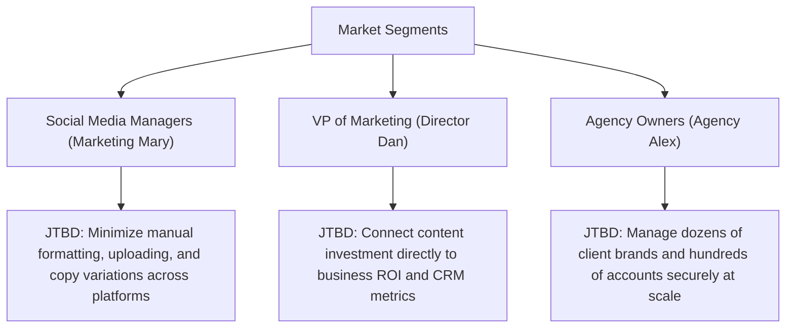

# Product Strategy Canvas - Fluxora: Social Media Blast

This document outlines the comprehensive product strategy for **Fluxora: Social Media Blast (Enterprise Digital Omnichannel Engine)**, detailing our strategy to compete, win, and grow in the modern digital distribution space.

---

## 1. Vision

### Inward Aspiration (The "Why")
To build the nervous system of modern brand distribution, collapsing the friction between content creation, asset optimization, and multi-network publishing into a single, autonomous, and intelligent plane. 

### Outward Inspiration (The Impact)
Empower brands, agencies, and creators to amplify their digital presence at infinite scale and zero manual overhead, enabling them to focus entirely on storytelling rather than pipelines.

### Core Values
1. **Frictionless Autonomy**: Automate the mundane, orchestrate the complex, and deliver a zero-touch publishing loop.
2. **Absolute Multi-Tenant Isolation**: Treat tenant data privacy and security boundaries as sacred.
3. **Data-Driven Coherence**: Every piece of content, scheduling stagger, and recycling rule must lead to quantifiable, optimized engagement ROI.

---

## 2. Market Segments

We define our market not by demographics, but by the Job-To-Be-Done (JTBD) of teams facing severe content-distribution friction.



### Segment 1: SMB Marketing Teams
* **Job-To-Be-Done**: "When running multi-channel campaigns, I want to publish and format content across all platforms with a single click, so that I can maintain brand presence without spending hours manual copying, resizing, and pasting."
* **Desired Outcomes**: 
  - Save $\ge 80\%$ time on manual copy-pasting.
  - Zero accidental cross-posting errors.
* **Constraints**: Tight budgets, minimal technical expertise, high reliance on self-serve tools.

### Segment 2: Marketing Agencies
* **Job-To-Be-Done**: "When managing social distribution for multiple clients, I want a secure, multi-tenant workspace with granular approval gates and client-specific styling, so that my team can collaborate safely without risking client data leakage."
* **Desired Outcomes**:
  - Secure management of hundreds of social profiles.
  - White-labeled interface for client reviews.
* **Constraints**: Strict compliance/security requirements, need for robust approval workflows.

### Segment 3: Mid-Market & Enterprise Brands
* **Job-To-Be-Done**: "When launching programmatic content campaigns, I want to automatically transcode media, stagger scheduling offsets to prevent platform bot flagging, and track closed-loop ROI, so that I can safely scale my volume and justify content spend."
* **Desired Outcomes**:
  - Zero platform security bans/throttlings due to automated posting.
  - Direct CRM integration and time-decaying performance metrics.
* **Constraints**: Large teams, complex IT governance (SOC2, ISO 27001), legacy CRM/ERP integration requirements.

### Target Entry Segment (Beachhead)
Our beachhead segment is **Marketing Agencies**. 
* **Why**: Agencies have the highest concentration of pain: they manage multiple client brands (multi-tenancy constraint), handle high-volume publishing (volume/transcoding pain), and require approval loops (governance pain). Winning them gives us immediate access to hundreds of underlying brands, creating a high-velocity referral loop.

---

## 3. Relative Costs

Fluxora does not compete on price; we optimize for **Unique Value Delivery** (Premium Value Differentiation). 

* **Our Cost Position**: We leverage server-side Rust/Node.js orchestration and containerized FFmpeg workers to keep infrastructure costs highly predictable. However, our investment in custom generative AI agents, multi-LLM routing, and a zero-downtime, high-availability architecture means our pricing is positioned at a premium relative to basic schedulers (e.g., Buffer).
* **Cost Advantage**: While our subscription price is higher, our automated asset processing (resizing, aspect-ratio correction, AI copy variations) eliminates the need for expensive third-party asset editing tools and manual designer hours. This delivers an overall cost reduction of over **$50,000/year** for typical mid-market customers.

---

## 4. Value Proposition

| Target Segment | Before (Situation & Pain) | How Fluxora Delivers | After (Desired Outcome) | Alternatives Today |
| :--- | :--- | :--- | :--- | :--- |
| **Social Media Managers** | Trapped in high-friction manual pipelines. Relying on separate tools for copy writing, video resizing, and platform-specific formatting. | **Unified Workspace & Asset Pipeline**: Automatic image/video resizing, aspect-ratio adaptation, and AI copy variation generation in-platform. | Sleek, fast publishing. Zero manual resizing or copy-pasting. $\ge 80\%$ time reduction. | Buffer, Hootsuite + manual Canva edits. |
| **Marketing Agencies** | Constant risk of account mixing, messy approval workflows via emails/spreadsheets, and client data leaks. | **Multi-Tenant Engine & Approval Workflow**: Logical tenant data isolation, granular RBAC, and native client review panels. | Flawless, secure agency operations with custom role-based permissions and zero leak risk. | Sprout Social (expensive), email/Spreadsheets + Slack. |
| **Enterprise Brands** | Siloed data streams, difficulty measuring actual content ROI, and fear of getting shadow-banned by social networks. | **Algorithmic Offset & Analytics Engine**: Staggered schedule offsets to bypass spam filters, Relational + Time-series database for analytics. | Safe, high-volume programmatic distribution with clear attribution models and zero rate-limit blocks. | Sprinklr (complex/expensive), custom in-house scripts. |

---

## 5. Trade-offs

Saying "no" creates focus and enables us to build a premium product. For Phase 1 and 2, we enforce the following trade-offs:

1. **No Paid Advertising Management**: We will NOT support paid social ad campaign management (Facebook Ads, Google Ads). We focus exclusively on organic content distribution pipelines.
2. **No Direct Community Engagement Inbox**: We will NOT build a unified inbox to reply to social comments, direct messages, or customer support queries. We focus on publishing, orchestration, and performance analytics. 
3. **No Legacy Social Platforms**: We will NOT support legacy or low-traction platforms (e.g., Mastodon, Tumblr). We focus strictly on high-impact business endpoints (Meta Graph API, LinkedIn API, TikTok API, X API).

---

## 6. Key Metrics

### North Star Metric (NSM)
* **Weekly Active Posts Dispatched (WAPD)**: The total number of unique posts successfully processed, transcoded, and published across all networks.
* **Why**: It is the ultimate measure of our value delivery. If clients are scheduling and publishing high volumes of posts, it proves they have shifted their core distribution pipelines to Fluxora and are receiving value.

### One Metric That Matters (OMTM) - Q3 2026
* **Post Ingestion-to-Queue Speed**: Time from client click/RSS trigger to active queue state confirmation ($\le 2$ seconds).
* **Why**: In Phase 1 (Foundation & Core Publishing), establishing trust in the speed and reliability of our publishing pipeline is critical to driver retention and prevent early churn.

---

## 7. Growth Strategy

We utilize a hybrid **Product-Led Growth (PLG) + Sales-Led Growth** model.

```
                  ┌─────────────────────────────────────┐
                  │      Product-Led Growth (PLG)       │
                  │  SMBs / Solo Creators / Freelancers │
                  │  Self-serve, 14-day trial, Starter  │
                  └──────────────────┬──────────────────┘
                                     │
                                     ▼ Upsell Loop
                  ┌─────────────────────────────────────┐
                  │       Sales-Led / Account-Based     │
                  │     Agencies & Enterprise Brands     │
                  │   Direct sales, custom onboarding   │
                  └─────────────────────────────────────┘
```

### Primary Acquisition Channels
1. **Product-Led Loops (Viral CTAs)**: Every post dispatched through a free or starter tier can optionally include a subtle "Scheduled via Fluxora" link, driving organic creator traffic.
2. **Account-Based Marketing (ABM)**: Target mid-market agencies with direct outbound campaigns showing a custom "Friction Audit" report of their current social footprints.
3. **Integration Marketplace**: Launch plugins in CRM/CMS marketplaces (e.g., HubSpot App Marketplace, WordPress Directory) to capture inbound users looking for multi-network sync.

### Unit Economics Assumptions
* **Target CAC**: $250 (Starter/Pro), $3,000 (Enterprise/Agency).
* **LTV/CAC Ratio**: $\ge 3.5x$.
* **Payback Period**: 6 months.

---

## 8. Capabilities (Build vs. Partner)

| Core Competency | Build or Partner? | Rationale |
| :--- | :--- | :--- |
| **Multi-Network Distribution Pipeline** | **Build** | Core proprietary asset. Requires decoupled protocol translators and custom backoff handling to guarantee reliability. |
| **Video & Image Transcoding Engine** | **Build** | Core backend capability. Containerized FFmpeg workers are built in-house for low latency ($\le 45$ seconds per video) and cost control. |
| **Generative AI Core** | **Partner** | Use OpenAI API (GPT-4o) and Stable Diffusion/Replicate APIs via a custom LLM Orchestrator layer. Building foundation models is out of scope. |
| **Identity & Vault Management** | **Partner** | Integrate HashiCorp Vault for credential/OAuth token storage. Partnering ensures enterprise-grade compliance (SOC2) and security. |
| **Durable Execution Engine** | **Partner** | Leverage Temporal/BullMQ to handle long-running workflows instead of writing a custom state machine. |

---

## 9. Defensibility (Can't/Won't)

Why competitors cannot easily copy Fluxora:

1. **Decoupled Agentic Mesh (Architectural Advantage)**: Our architecture relies on 20 autonomous agents communicating via a high-throughput event mesh (Apache Kafka). This lets us easily add new automation, compliance, and optimization behaviors without refactoring the core codebase—something legacy monolithic platforms (like Hootsuite) struggle to replicate.
2. **Algorithmic Timing Engine (System Defensibility)**: Our proprietary staggering logic engine computes dynamic micro-delays between consecutive channel posts. This prevents platform bot detection and shields customer accounts from bans. Competitors who post simultaneously will trigger platform rate-limit blocks and account suspension.
3. **High Switching Costs (Data Lock-in)**: Once an agency integrates their clients' social profiles, schedules months of evergreen recycle campaigns, and maps their approval workflows in Fluxora, the operational friction of switching to another tool is extremely high.

---

## 10. Coherence Check & Strategic Alignment

Our strategy is cohesive because our choices reinforce each other:
* *Beachhead Focus (Agencies)* directly aligns with our *Value Proposition (Multi-tenancy and data isolation)* and our *Pricing (Premium Agency Tiers)*.
* *Trade-off (No legacy networks)* allows engineering to focus exclusively on *Pipeline Efficiency (latency $\le$ 2s)* for the core high-value APIs.
* *Partnering on Security Vault (HashiCorp)* allows us to achieve *SOC2/ISO Compliance* rapidly, proving our *Core Value of Tenant Isolation*.

---

## 11. Critical Hypotheses

For this strategy to succeed, the following hypotheses must be true:
1. **The Automation Hypothesis**: Social Media Managers are willing to trust autonomous agents to generate copy and schedule staggers, rather than insisting on manually editing every post.
2. **The Security Hypothesis**: Enterprise clients and agencies will trust a multi-tenant cloud engine with their direct API tokens and credentials, provided it is backed by a secure encryption vault (HashiCorp Vault) and isolated database schemas.
3. **The Multi-Network ROI Hypothesis**: Increasing publishing volume across multiple channels leads to a non-linear growth in audience reach and brand value, justifying the premium pricing of Fluxora.

---

## 12. Low-Effort Validation Experiments

We will run these validation experiments before committing heavy engineering resources to advanced phases:

```
  Hypothesis 1: Automation Trust
  [Concierge MVP] ──> Manually draft & queue posts using AI tools for 10 beta agencies ──> Measure acceptance rate (>75%)
  
  Hypothesis 2: Security Vault Trust
  [Technical Validation] ──> Create a SOC2-compliant security brief ──> Pitch to 5 Enterprise CISOs ──> Collect feedback
```

1. **AI Copy Acceptability (Concierge Experiment)**:
   - *Test*: Deliver AI-suggested posts and staggers manually via a shared spreadsheet to 10 early beta agency partners.
   - *Success Metric*: If $\ge 75\%$ of the suggestions are approved and published without manual editing, we validate the "Generative AI Quality" hypothesis.
2. **Security Compliance Pitch (Smoke Test)**:
   - *Test*: Create a one-page security architecture brief detailing the HashiCorp Vault integration and relational data isolation. Pitch this to five mid-market security directors.
   - *Success Metric*: If at least four of them confirm this architecture meets their basic onboarding compliance criteria, we validate the "Security Hypothesis".
