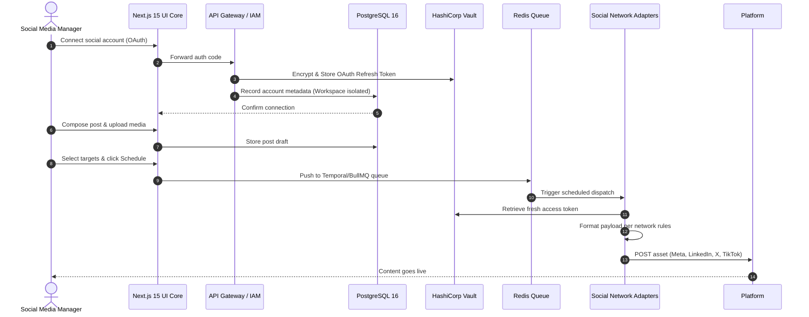

# Product Requirements Document (PRD)
## Fluxora: Social Media Blast (Phase 1 — Foundation & Core Publishing)

---

## 1. Summary

This document specifies the product requirements for **Phase 1 (Foundation & Core Publishing)** of **Fluxora: Social Media Blast**. Phase 1 establishes the core omnichannel engine, allowing creators, agencies, and brands to connect multiple social accounts, upload and organize media, build scheduling queues, and publish assets simultaneously across supported social ecosystems from a single, unified workspace.

---

## 2. Contacts

The key stakeholders for the implementation of Phase 1 are:

| Name | Role | Primary Responsibility | Comment / SLA |
| :--- | :--- | :--- | :--- |
| **Raja Jeevan** | Product Lead (PM) | Product strategy, feature definition, backlog prioritization, and requirements sign-off. | Owner |
| **Engineering Lead** | Tech Lead (Eng) | Core backend system architecture, API gateway routing, and protocol adapter development. | 24h response |
| **DevSecOps Lead** | Security & DevOps | HashiCorp Vault credential rotation, tenant logical database separation, and CI/CD pipelines. | High severity pager |
| **QA Lead** | Quality Assurance | Test scenario validation, end-to-end browser testing (Playwright), and Vitest execution. | Zero bugs on core flow |

---

## 3. Background

Modern digital marketing is trapped in a **fragmentation crisis**. Marketing teams and social media managers waste hours every week switching between accounts, formatting copy to fit platform restrictions (e.g., character limits on X vs. LinkedIn), resizing images and video ratios manually, and coordinating scheduling calendars across isolated tools. 

Furthermore, agencies managing multiple client brands face a constant security risk of cross-account leaking. Data is siloed, making centralized reporting impossible, and high-frequency volume is constrained by arbitrary software-enforced caps in legacy systems. 

Fluxora Phase 1 collapses these separate operations into a unified distribution plane, laying the foundation for autonomous, high-throughput agentic publishing.

---

## 4. Objective

### Strategic Alignment
Phase 1 directly supports the company strategy of building a high-velocity organic growth loop by delivering a reliable, frictionless omnichannel distribution experience. It is the baseline operating system upon which Phase 2 (Automation) and Phase 3 (Generative AI) will be built.

### Key Results (SMART OKRs)
* **KR 1 (Reliability)**: Achieve a **$\ge 99.9\%$ successful publishing rate** across connected Meta Graph, LinkedIn, TikTok, and X APIs during the beta.
* **KR 2 (Latency)**: Ensure post ingestion-to-queue time is **$\le 2.0$ seconds** from UI submission to database queue confirmation.
* **KR 3 (Efficiency)**: Reduce the time required to format and schedule an omnichannel post from an average of 10 minutes (manual) to **under 60 seconds** (using Posting Presets and Unified Composer).
* **KR 4 (Security)**: Achieve **zero cross-tenant database leaks** or OAuth token exposure incidents during security audit validation.

---

## 5. Market Segment(s)

For Phase 1, we build for:

1. **Digital Marketing Agencies**:
   * *Profile*: Manage 10 to 50+ clients, each with multiple social profiles.
   * *Problem*: Switching accounts is slow and risky; need strict organizational boundaries.
   * *Constraints*: Must keep client data, queues, and credentials completely isolated.
2. **SMB Marketing Teams & Content Networks**:
   * *Profile*: High-volume organic content publishers (publishing 10+ posts/day).
   * *Problem*: High friction in resizing assets and formatting text for each network.
   * *Constraints*: Limited budget and design support; need to operate fast.

---

## 6. Value Proposition(s)

* **Single Source of Truth**: Social media managers operate all publishing workflows without switching accounts or tools.
* **Aspect-Ratio & Formatting Auto-Adaptation**: The workspace automatically flags character limit violations and validates aspect ratios per network during composition.
* **Secure Client Separation**: Agencies get logically separated workspaces, ensuring zero chance of posting client content to another client's feeds.

---

## 7. Solution

### 7.1 User Workflows & UX Concepts



### 7.2 Key Features (Phase 1 Scope)

#### 1. Unified Workspace & OAuth Connection
* *Description*: A secure console where users connect Meta (Instagram/Facebook), LinkedIn, X (Twitter), and TikTok profiles via OAuth 2.0.
* *Functional Requirements*:
  - Support OAuth token exchange and automatic background token rotation.
  - Separate connections by Workspace (multi-tenancy isolation).
  - Display connected account statuses and profile pictures.

#### 2. Omnichannel Unified Composer
* *Description*: A single interface to write copy and attach media, with network-specific preview side-panels.
* *Functional Requirements*:
  - Real-time character count tracking (e.g., warning at 280 characters for X).
  - Validation of file size and file format before upload (JPEG, PNG, MP4).
  - Network checkboxes to select target channels for a single compose action.

#### 3. Media Upload & Asset Management
* *Description*: A centralized media library where users upload, store, and retrieve assets.
* *Functional Requirements*:
  - Direct integration with MinIO/S3 object storage.
  - File tags and search functionality for easy asset reuse.
  - Image Editor Engine (via Sharp backend) for basic resizing, cropping, and aspect-ratio validation (e.g., forcing 9:16 for TikTok/Reels).

#### 4. Content Scheduling & Queue Engine
* *Description*: A durable queue scheduler to future-date posts.
* *Functional Requirements*:
  - Queue management allowing users to view Draft, Scheduled, In-Flight, and Dispatched posts.
  - Ability to cancel or edit posts before they enter the In-Flight state.
  - BullMQ/Redis or Temporal integration to guarantee zero dropped scheduled jobs.

#### 5. Calendar & Timeline Views
* *Description*: A visual planner board showing scheduled and published content.
* *Functional Requirements*:
  - Weekly and monthly calendar views.
  - Drag-and-drop capability to reschedule a post (updates queue database timestamp).
  - Color-coded indicators representing platform destination icons.

#### 6. Posting Presets & Brand Signatures
* *Description*: Reusable templates and auto-appended signatures.
* *Functional Requirements*:
  - "Preset Groups": Define a targeted group of channels (e.g., "Client A - Organic B2B").
  - "Signatures & Footers": Automatically append standard disclosures, CTAs, or hashtag groups to the end of copy based on target network rules.

#### 7. Theme Personalization
* *Description*: Workspace visual settings.
* *Functional Requirements*:
  - Dark/Light mode toggle.
  - Workspace naming and branding personalization.

### 7.3 Technical Architecture Overview
To realize Phase 1, the following tech stack enablers will be implemented:
* **Frontend**: Next.js 15 (React 19), Tailwind CSS + Zustand.
* **Backend Core**: Node.js (TypeScript) + NestJS.
* **Database**: PostgreSQL 16 (for workspaces, users, credentials metadata, and schedules).
* **Caching & Queue**: Redis Stack + BullMQ (to manage schedules).
* **Asset Storage**: MinIO (S3-compatible local development object store).
* **Asset Manipulation**: Sharp (image sizing and compression in backend worker).
* **Credential Vault**: HashiCorp Vault (to encrypt/decrypt OAuth access and refresh tokens).

### 7.4 Key Assumptions & Hypotheses

| Assumption / Hypothesis | Risk Level | Validation / Mitigation |
| :--- | :--- | :--- |
| We assume third-party social APIs (Meta, LinkedIn, X, TikTok) will remain stable and will not implement breaking changes to publishing endpoints in Q3 2026. | High | **Mitigation**: Decouple the integration layer into "Protocol Translators" mapping internal unified schemas to endpoint payloads, allowing hotfixes. |
| We assume users will adopt a unified composer instead of wanting custom per-platform copy blocks. | Medium | **Mitigation**: Enable "customize per network" overrides inside the composer so users can fine-tune text for specific platforms. |
| We assume that local development utilizing MinIO and Redis can scale to AWS S3 and AWS ElastiCache seamlessly. | Low | **Mitigation**: Rely strictly on standard S3 and Redis client SDKs to ensure environment parity. |

---

## 8. Release Plan

Phase 1 rollout follows a relative timeline to manage risks and gather feedback:

```
  T0 (Start) ────────> T+4 Weeks ────────> T+6 Weeks ────────> T+8 Weeks
  [Internal Alpha]    [Private Beta]     [Public Release]   [Analytics Prep]
  Sandbox only        10 Target Agencies  GA Core Launch     Phase 2 Triggers
```

### Milestone 1: Internal Alpha (Weeks 1-4)
* *Scope*: API Gateway, logical multi-tenancy, HashiCorp Vault connection, and Meta + LinkedIn posting via CLI/simple API calls.
* *Goal*: Verify token rotation stability and database isolation parameters.

### Milestone 2: Private Beta (Weeks 5-6)
* *Scope*: Next.js UI Composer dashboard, Calendar view, Media worker, and X + TikTok adapters enabled.
* *Target*: 10 selected Digital Agency partners.
* *Exit Criteria*: Zero token leaks, queue latencies under 2s, and $\ge 99.5\%$ API dispatch success.

### Milestone 3: General Availability Core Launch (Weeks 7-8)
* *Scope*: Full public release of Phase 1: Unified Workspace, Composer, Schedulers, Presets, and dark/light UI.
* *Goal*: Shift early adopters into active paying cohorts, setting up the customer base for Phase 2 automation features.
