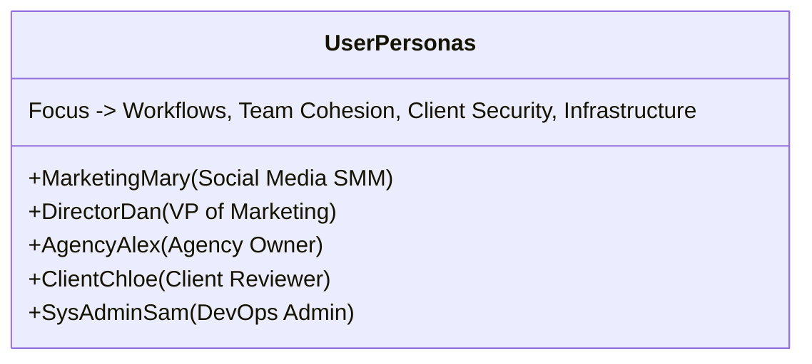

# User Personas and Customer Journey Map
## Fluxora: Social Media Blast

This document defines the primary user personas and maps out their end-to-end journey within **Fluxora: Social Media Blast (Phase 1)**, ensuring our system design and workflows directly address their core problems and motivations.

---

## Part 1: User Personas

### 1. Marketing Mary (The Social Media Manager)

* **Role**: Social Media Manager / SMM Lead
* **Company Profile**: SMB Marketing Team or Digital Agency (5–20 employees)
* **Demographics**: Age 26F, based in Chicago, US. Tech-savvy, active social poster.
* **Current Situation**: Mary manages the daily organic social channels for four distinct brands. She is highly creative and excels at matching brand tones, but she feels bogged down by administrative task overhead (password switching, manual resizing, copy-pasting).

#### Persona Profile (Cognitive Walkthrough Schema)
* **Search Context**:
  * **Google Query**: `multi account social media scheduler with crop tool` or `how to schedule instagram and linkedin posts together`
  * **Arrival Source**: Google Organic / Search Results
  * **Sites Seen Before**: Buffer, Hootsuite, Later
  * **Device**: Mobile iPhone 14 (390x844 viewport)
* **Psychology**:
  * **Familiarity Level**: High (expert with social channels, Canva, Figma)
  * **Urgency**: Days (actively looking for a new tool to start next month's campaign)
  * **Primary Fears**: Accidentally posting the wrong draft to the wrong client account (cross-client leak); clunky UI slowing down scheduling flow.
  * **Trust Triggers**: Real screenshots of composer, side-by-side platform previews, free trial without credit card.
  * **Decision Style**: Quick decider (wants to try it immediately and see if it works).
  * **Attachment Tendency**: Anxious (needs visual reassurance at every step, e.g. green checkmarks on connected account status).
* **Goal & Threshold**:
  * **What Success Looks Like**: Seamlessly compose one post, auto-crop images for Instagram/LinkedIn, and schedule them in a single calendar view.
  * **Contact Threshold**: The moment she sees a side-by-side preview showing exactly how the post will look on X vs. LinkedIn.

#### Pain Points & Frustrations
* **The Format Shuffle**: Manually cropping images for Instagram grid (1:1), Stories (9:16), and LinkedIn (4:5) in Canva.
* **The Copy-Paste Loop**: Copying text, adding hashtags, adjusting character counts, and posting across four browser tabs.
* **Account Switching**: Constantly logging in and out of different brand profiles on a single mobile device.

#### Preferred Channels & Tech Stack
* Canva, Figma, Slack, Buffer, Notion, iPhone.

#### Success Metrics
* Time saved per week (target: save 10+ hours).
* Weekly organic reach and engagement rate.

---

### 2. Director Dan (The VP of Marketing)

* **Role**: VP of Marketing / CMO
* **Company Profile**: Mid-Market Enterprise Brand (100–500 employees)
* **Demographics**: Age 42M, based in London, UK. Results-oriented, business-focused.
* **Current Situation**: Dan oversees a team of five marketers and three external agencies. He is under constant pressure from executive leadership to prove that organic social media drives actual business value, and worries about brand reputation, compliance, and getting the brand's profiles flagged due to spammy automated behaviors.

#### Persona Profile (Cognitive Walkthrough Schema)
* **Search Context**:
  * **Google Query**: `enterprise social media approval workflow compliance`
  * **Arrival Source**: Google Ads / LinkedIn Referral
  * **Sites Seen Before**: Sprinklr, Sprout Social
  * **Device**: Desktop / iPad
* **Psychology**:
  * **Familiarity Level**: Medium (understands social channels but doesn't schedule posts himself)
  * **Urgency**: Weeks (evaluating enterprise solutions for next quarter)
  * **Primary Fears**: Account hacking, brand reputation damage from unapproved posts, compliance issues (lacking audit logs).
  * **Trust Triggers**: Security certifications, Keycloak SSO integration details, HashiCorp Vault vaulting documentation, enterprise SLAs.
  * **Decision Style**: Extensive researcher (requires technical deep-dives, reports, and team consensus).
  * **Attachment Tendency**: Avoidant (skeptical of marketing fluff; wants concrete features, security architectures, and analytics metrics).
* **Goal & Threshold**:
  * **What Success Looks Like**: Establish strict approval gates where agencies draft posts but internal managers must approve them, with all credentials vaulted securely.
  * **Contact Threshold**: Finding a "Security & Tenancy Guide" detailing Row-Level Security and HashiCorp Vault integration.

#### Pain Points & Frustrations
* **Siloed Performance Data**: Receiving manual PDF reports from different agencies with mismatched metrics.
* **Lack of Visibility**: No single dashboard showing all scheduled campaign assets across all regions and brands.
* **API Insecurity**: Worrying about sharing primary corporate credentials or losing access due to legacy token expirations.

#### Preferred Channels & Tech Stack
* Salesforce, HubSpot, Jira, Slack, Microsoft Teams, Tableau.

#### Success Metrics
* Customer Acquisition Cost (CAC) reduction.
* Customer Lifetime Value (LTV) growth.
* Closed-loop ROI attribution of social traffic.

---

### 3. Agency Alex (The Agency Owner)

* **Role**: Agency Owner / Founder
* **Company Profile**: Boutique Digital Marketing Agency (25 clients, 150+ social accounts)
* **Demographics**: Age 35M, based in Austin, US. Scaling-focused, entrepreneurial.
* **Current Situation**: Alex founded his agency three years ago and has grown rapidly. His main bottleneck is operational efficiency. As client counts scale, the complexity of managing permissions, onboarding client accounts securely, and coordinating approvals increases exponentially.

#### Persona Profile (Cognitive Walkthrough Schema)
* **Search Context**:
  * **Google Query**: `white label social media approval tool for agencies`
  * **Arrival Source**: Word of mouth / Twitter recommendations
  * **Sites Seen Before**: Planoly, Loomly, Sendible
  * **Device**: Mobile iPhone 15 Pro / Desktop
* **Psychology**:
  * **Familiarity Level**: High (experienced agency operator)
  * **Urgency**: Days (needs to scale operations as 5 new clients were signed this week)
  * **Primary Fears**: Client credentials expiring causing emergency phone calls; team members posting Client A's image to Client B's account.
  * **Trust Triggers**: Client portal screenshots, white-label options, simple workspace isolation definitions.
  * **Decision Style**: Quick decider but ROI-focused (compares price per client/workspace).
  * **Attachment Tendency**: Secure (willing to trust the platform if the basic security isolation features are clearly demonstrated).
* **Goal & Threshold**:
  * **What Success Looks Like**: Set up logical workspaces for each client, securely connect profiles, and send client-specific approval links that don't require clients to log in.
  * **Contact Threshold**: Seeing a demo of the white-labeled approval portal with commenting features.

#### Pain Points & Frustrations
* **The "Token Nightmare"**: Client social profiles disconnecting unexpectedly, requiring emergency client phone calls to re-authenticate.
* **Security Risk**: A team member accidentally posting client A's image to client B's account.
* **Client Approvals Friction**: Sending clients Google Slides containing draft posts and waiting for email replies.

#### Preferred Channels & Tech Stack
* Google Workspace, Basecamp, Slack, Harvest, HubSpot.

#### Success Metrics
* Number of clients managed per manager.
* Client retention rate (Churn $\le 2\%$).
* Net Margin per client.

---

### 4. Client Chloe (The Client Reviewer/Approver)

* **Role**: Client / Approver / Reviewer
* **Company Profile**: E-commerce Brand Client of Agency Alex (DTC Apparel Brand)
* **Demographics**: Age 31F, based in Vancouver, Canada. Active but busy entrepreneur.
* **Current Situation**: Chloe is busy managing inventory, sales, and operations. She delegates social media creation to Agency Alex, but needs to review and approve post drafts quickly before they go live to ensure brand alignment.

#### Persona Profile (Cognitive Walkthrough Schema)
* **Search Context**:
  * **Google Query**: (No search; arrives via a direct link like `https://portal.fluxora.com/approve?token=...`)
  * **Arrival Source**: Direct JWT link sent by email/Slack from Agency Alex
  * **Sites Seen Before**: None (doesn't actively search for publishing tools)
  * **Device**: Mobile phone (browses on the go)
* **Psychology**:
  * **Familiarity Level**: Low (uses personal social media, but doesn't use professional publishing dashboards)
  * **Urgency**: Urgent (needs to review and approve posts before the holiday campaign launch tomorrow)
  * **Primary Fears**: Typo in the copy, wrong branding elements, or incorrect product price listed in post text.
  * **Trust Triggers**: A clean, professional, white-labeled page with the agency's logo, showing exactly how the posts will look when live, with a clear "Approve" button and a feedback comment box.
  * **Decision Style**: Quick decider (scans copy, looks at visual preview, and clicks approve/reject).
  * **Attachment Tendency**: Anxious (wants to double-check text formatting and image cropping on mobile grid before approving).
* **Goal & Threshold**:
  * **What Success Looks Like**: Approve tomorrow's posts in under 2 minutes from her phone without needing to create an account, log in, or remember passwords.
  * **Contact Threshold**: The simplicity of the single-click approval screen without account registration.

#### Pain Points & Frustrations
* **Approvals Bottleneck**: Getting messy email chains or PDF decks with draft posts that are hard to visualize on mobile screens.
* **Wasted Time**: Being forced to create accounts and learn complex UIs just to approve a few posts a week.
* **Lack of Context**: Reviewing copy without seeing the final image/video format side-by-side.

#### Preferred Channels & Tech Stack
* Instagram, Shopify, Slack, Gmail, iPhone.

#### Success Metrics
* Time spent on approvals per week ($\le 10$ minutes).
* Brand alignment and zero published errors.

---

### 5. SysAdmin Sam (The DevOps/Security Admin)

* **Role**: DevSecOps Engineer / Platform Administrator
* **Company Profile**: Fluxora Core Operations Team or mid-to-large Enterprise Partner
* **Demographics**: Age 38M, based in Berlin, DE. Highly analytical and meticulous.
* **Current Situation**: Sam is responsible for managing realm variables in Keycloak, HashiCorp Vault secrets policies, PostgreSQL Row-Level Security, ClickHouse analytics scoping, and monitoring multi-tenant isolation.

#### Persona Profile (Cognitive Walkthrough Schema)
* **Search Context**:
  * **Google Query**: `Keycloak multi tenancy workspace mapping oidc claims`
  * **Arrival Source**: GitHub / Technical Forums / Documentation
  * **Sites Seen Before**: Auth0, Keycloak documentation, Vault documentation
  * **Device**: High-resolution desktop monitor / CLI terminal
* **Psychology**:
  * **Familiarity Level**: High (expert in cloud-native infrastructure, IAM, and databases)
  * **Urgency**: Days (implementing security compliance rules before beta launch)
  * **Primary Fears**: Cross-tenant data leaks (due to missing database row-level security parameters), exposed API credentials in git, or database connection pool exhaust.
  * **Trust Triggers**: Technical architecture blueprints, explicit policy code snippets, docker-compose configurations, and API documentation.
  * **Decision Style**: Extremely methodical and analytical (needs to review security configurations line-by-line).
  * **Attachment Tendency**: Avoidant (wants zero marketing hype, just direct technical specs, configurations, and API schemas).
* **Goal & Threshold**:
  * **What Success Looks Like**: Establish zero-trust infrastructure where database queries are strictly bounded by Keycloak-derived tenant scopes and all social media tokens are encrypted inside Vault.
  * **Contact Threshold**: Accessing a comprehensive Admin/Dev guide explaining Kong API Gateway routing headers and PostgreSQL Row-Level Security.

#### Pain Points & Frustrations
* **Configuration Drift**: Managing dev, staging, and prod environment differences.
* **Rate Limits**: Third-party social API rate limit failures affecting scheduled posts.
* **Data Security Audits**: Confirming that database users cannot accidentally bypass RLS constraints during raw SQL executions.

#### Preferred Channels & Tech Stack
* Kubernetes, Docker, Keycloak, HashiCorp Vault, PostgreSQL, ClickHouse, Prometheus, Grafana.

#### Success Metrics
* Zero cross-tenant data leaks.
* 100% uptime of the credentials rotation vault.
* Mean Time to Detect (MTTD) anomalies and API errors $\le 5$ minutes.

---

## Part 2: Customer Journey Map (Phase 1 Focus)

This journey map follows **Marketing Mary** (SMM at Alex's Agency) as she sets up a new client brand, connects social profiles, and schedules their first omnichannel campaign.

| Stage | 1. Discovery & Evaluation | 2. Onboarding & Setup | 3. Workspace Config | 4. Content Composition | 5. Queue Scheduling | 6. Validation & Monitor |
| :--- | :--- | :--- | :--- | :--- | :--- | :--- |
| **User Action** | Learns about Fluxora's multi-tenant separation; signs up for the 14-day Pro trial. | Creates her profile; sets up the first Client Workspace ("Client A - B2B"). | Connects Client A's Facebook Page, LinkedIn page, and X handle via OAuth. | Composes a campaign post; uploads a high-res image. | Applies a posting preset group; schedules the post for Friday at 9:00 AM. | Checks the timeline view to verify the post is queued and correctly formatted. |
| **User Thoughts** | *"Can this tool really isolate my client data? Will it save me from manual copy-pasting?"* | *"I hope setting up workspaces is simple and doesn't require technical engineering knowledge."* | *"OAuth screens are easy. Glad I don't need to ask the client for their actual passwords."* | *"Let's see if it handles the character limit on X while keeping my long text on LinkedIn."* | *"I want to stagger this post by 5 minutes on X to avoid getting flagged by bot filters."* | *"Looks perfect in the preview. I hope the queue fires exactly at 9:00 AM."* |
| **User Feelings** | Skeptical but hopeful for relief from manual work. | Relieved by the clean, modern, dark-mode workspace wizard. | Reassured by the secure OAuth integration and instant profile connection status. | Excited by the side-by-side previews for LinkedIn and X. | Confident in the scheduling rules and stagger options. | Reassured and satisfied. Ready to log off for the day. |
| **Pain Points** | Hard to tell if the tool supports all 4 core networks out-of-the-box. | Fear of misconfiguring a workspace and mixing client details. | Social profiles sometimes fail to authenticate due to browser ad-blockers. | Image doesn't meet the target platform's required aspect ratio (e.g., too wide). | Manual date/time pickers are clunky on mobile screens. | No instant validation to guarantee the API token is fresh and won't fail at launch. |
| **Fluxora Opportunities** | Display clear platform support icons on landing page. | Implement a step-by-step setup wizard with workspace templates. | Provide clear error troubleshooting messages if OAuth fails. | **Sharp Engine Auto-Crop**: Add in-composer image cropping presets (1:1, 16:9, 9:16). | Implement drag-and-drop calendar slots and click-to-stagger presets. | **Token Freshness Verification**: Show a green checkmark indicating "Tokens Valid and Ready." |

---

## Part 3: Holistic Role-Based Access Control (RBAC) Table

This matrix maps access controls for user roles in Keycloak/IAM to system operations across the Fluxora platform's workspaces.

| Capability / Resource | SuperAdmin | WorkspaceAdmin | WorkspaceCreator | ClientReviewer | Viewer |
| :--- | :---: | :---: | :---: | :---: | :---: |
| **IAM & System Config (Keycloak)** | ✅ Yes | ❌ No | ❌ No | ❌ No | ❌ No |
| **Secrets Engine & Vault Policies** | ✅ Yes | ❌ No | ❌ No | ❌ No | ❌ No |
| **Global Audit Logs & System Telemetry** | ✅ Yes | ❌ No | ❌ No | ❌ No | ❌ No |
| **Workspace Creation & Deletion** | ✅ Yes | ❌ No | ❌ No | ❌ No | ❌ No |
| **Billing & Plan Management** | ✅ Yes | ✅ Yes (Own) | ❌ No | ❌ No | ❌ No |
| **User Access & Role Assignment** | ✅ Yes | ✅ Yes (Own WS) | ❌ No | ❌ No | ❌ No |
| **Workspace Custom Theme & Brand** | ✅ Yes | ✅ Yes (Own WS) | ❌ No | ❌ No | ❌ No |
| **Connect/Disconnect Social Profiles** | ✅ Yes | ✅ Yes (Own WS) | ❌ No | ❌ No | ❌ No |
| **Compose & Edit Post Drafts** | ✅ Yes | ✅ Yes (Own WS) | ✅ Yes (Own WS) | ❌ No | ❌ No |
| **Media Library Upload & Crop (Sharp)** | ✅ Yes | ✅ Yes (Own WS) | ✅ Yes (Own WS) | ❌ No | ❌ No |
| **Queue Scheduling & Rescheduling** | ✅ Yes | ✅ Yes (Own WS) | ✅ Yes (Own WS) | ❌ No | ❌ No |
| **View Analytics & ClickHouse Reports** | ✅ Yes | ✅ Yes (Own WS) | ✅ Yes (Own WS) | ❌ No | ✅ Yes (Own WS) |
| **Access Client Review Portal** | ✅ Yes | ✅ Yes (Own WS) | ✅ Yes (Own WS) | ✅ Yes (Secure URL) | ❌ No |
| **Approve/Reject Content Drafts** | ✅ Yes | ✅ Yes (Own WS) | ❌ No | ✅ Yes (Secure URL) | ❌ No |
| **Submit Draft Feedback Comments** | ✅ Yes | ✅ Yes (Own WS) | ✅ Yes (Own WS) | ✅ Yes (Secure URL) | ❌ No |

### Role Definitions & Scope Boundaries
* **SuperAdmin**: Platform-wide administrator with full read/write rights over Keycloak configurations, HashiCorp Vault secrets policies, multi-tenant databases, global settings, and audit metrics.
* **WorkspaceAdmin**: The administrator of a specific workspace/tenant (e.g. **Agency Alex** or **Director Dan**). Can manage their own billing, invite users, assign workspace roles (`WorkspaceAdmin`, `WorkspaceCreator`, `Viewer`), and connect or disconnect brand social profiles via OAuth.
* **WorkspaceCreator**: The editor/publisher workspace role (e.g. **Marketing Mary**). Can compose posts, manage draft versions, upload/crop files in the asset library, schedule posts to the publishing queue, and comment on drafts. Cannot modify workspace settings, billing, user roles, or connect accounts.
* **ClientReviewer**: An external client reviewer role (e.g. **Client Chloe**). Can access only the white-labeled approval portal using a secure workspace-scoped JWT token link. Can view draft posts, approve or reject them, and post review comments. Cannot access the general dashboard, media library, analytics, or settings.
* **Viewer**: A read-only member of the workspace who can view scheduled calendar timelines and ClickHouse analytics dashboards. Cannot compose drafts, modify schedules, or edit any configuration.
