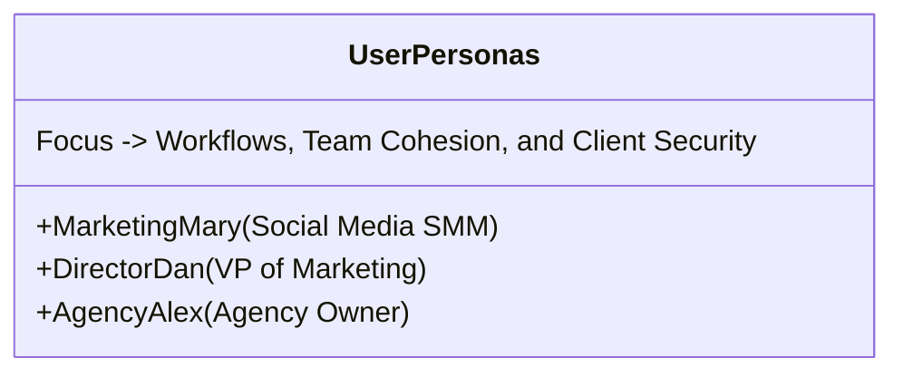

# User Personas and Customer Journey Map
## Fluxora: Social Media Blast

This document defines the primary user personas and maps out their end-to-end journey within **Fluxora: Social Media Blast (Phase 1)**, ensuring our system design and workflows directly address their core problems and motivations.

---

## Part 1: User Personas

### 1. Marketing Mary (The Social Media Manager)

* **Role**: Social Media Manager / SMM Lead
* **Company Profile**: SMB Marketing Team or Digital Agency (5–20 employees)
* **Demographics**: Age 26, based in Chicago, US. Tech-savvy, active social poster.
* **Core Focus**: Content creation, daily scheduling, platform formatting, and community engagement.

#### Bio & Background
Mary manages the daily organic social channels for four distinct brands. She is highly creative and excels at matching brand tones. However, she feels bogged down by administrative task overhead. She spends more time managing passwords, resizing images, and copy-pasting than she does on strategic writing.

#### Goals & Motivations
* Maintain a consistent daily posting schedule across Meta, LinkedIn, X, and TikTok.
* Minimize the time spent resizing videos and images for different platform formats.
* Create eye-catching posts that drive high organic engagement.
* Eliminate the stress of accidentally posting the wrong content to the wrong account.

#### Pain Points & Frustrations
* **The Format Shuffle**: Manually cropping images for Instagram grid (1:1), Stories (9:16), and LinkedIn (4:5) in Canva.
* **The Copy-Paste Loop**: Copying text, adding hashtags, adjusting character counts, and posting across four browser tabs.
* **Account Switching**: Constantly logging in and out of different brand profiles on a single mobile device.

#### Preferred Channels & Tech Stack
* Canva, Figma, Slack, Buffer, Notion, iPhone.

#### Success Metrics
* Time saved per week (target: save 10+ hours).
* Weekly organic reach and engagement rate.

---

### 2. Director Dan (The VP of Marketing)

* **Role**: VP of Marketing / CMO
* **Company Profile**: Mid-Market Enterprise Brand (100–500 employees)
* **Demographics**: Age 42, based in London, UK. Results-oriented, business-focused.
* **Core Focus**: Brand protection, campaign ROI, lead generation, and team resource allocation.

#### Bio & Background
Dan oversees a team of five marketers and three external agencies. He is under constant pressure from executive leadership to prove that organic social media drives actual business value. He worries about brand reputation, compliance, and getting the brand's profiles flagged or shadow-banned due to spammy automated behaviors.

#### Goals & Motivations
* Maximize the ROI of content creation investments.
* Establish clear, automated approval workflows to protect brand reputation.
* Connect social campaigns directly to CRM leads and sales opportunities.
* Expand the brand's footprint securely onto new platforms (e.g., TikTok).

#### Pain Points & Frustrations
* **Siloed Performance Data**: Receiving manual PDF reports from different agencies with mismatched metrics.
* **Lack of Visibility**: No single dashboard showing all scheduled campaign assets across all regions and brands.
* **API Insecurity**: Worrying about sharing primary corporate credentials or losing access due to legacy token expirations.

#### Preferred Channels & Tech Stack
* Salesforce, HubSpot, Jira, Slack, Microsoft Teams, Tableau.

#### Success Metrics
* Customer Acquisition Cost (CAC) reduction.
* Customer Lifetime Value (LTV) growth.
* Closed-loop ROI attribution of social traffic.

---

### 3. Agency Alex (The Agency Owner)

* **Role**: Agency Owner / Founder
* **Company Profile**: Boutique Digital Marketing Agency (25 clients, 150+ social accounts)
* **Demographics**: Age 35, based in Austin, US. Scaling-focused, entrepreneurial.
* **Core Focus**: Scaling client counts, team productivity, margins, and client retention.

#### Bio & Background
Alex founded his agency three years ago and has grown rapidly. His main bottleneck is operational efficiency. As client counts scale, the complexity of managing permissions, onboarding client accounts securely, and coordinating approvals increases exponentially. He needs a tool that lets him scale without adding headcount linearly.

#### Goals & Motivations
* Manage multiple client brands seamlessly without hiring a massive operations team.
* Keep client data, asset folders, and credential tokens completely isolated.
* Provide a white-labeled experience to clients for easy, professional approvals.
* Maximize staff billable hours by automating routine formatting and scheduling.

#### Pain Points & Frustrations
* **The "Token Nightmare"**: Client social profiles disconnecting unexpectedly, requiring emergency client phone calls to re-authenticate.
* **Security Risk**: A team member accidentally posting client A's image to client B's account.
* **Client Approvals Friction**: Sending clients Google Slides containing draft posts and waiting for email replies.

#### Preferred Channels & Tech Stack
* Google Workspace, Basecamp, Slack, Harvest, HubSpot.

#### Success Metrics
* Number of clients managed per manager.
* Client retention rate (Churn $\le 2\%$).
* Net Margin per client.

---

## Part 2: Customer Journey Map (Phase 1 Focus)

This journey map follows **Marketing Mary** (SMM at Alex's Agency) as she sets up a new client brand, connects social profiles, and schedules their first omnichannel campaign.

| Stage | 1. Discovery & Evaluation | 2. Onboarding & Setup | 3. Workspace Config | 4. Content Composition | 5. Queue Scheduling | 6. Validation & Monitor |
| :--- | :--- | :--- | :--- | :--- | :--- | :--- |
| **User Action** | Learns about Fluxora's multi-tenant separation; signs up for the 14-day Pro trial. | Creates her profile; sets up the first Client Workspace ("Client A - B2B"). | Connects Client A's Facebook Page, LinkedIn page, and X handle via OAuth. | Composes a campaign post; uploads a high-res image. | Applies a posting preset group; schedules the post for Friday at 9:00 AM. | Checks the timeline view to verify the post is queued and correctly formatted. |
| **User Thoughts** | *"Can this tool really isolate my client data? Will it save me from manual copy-pasting?"* | *"I hope setting up workspaces is simple and doesn't require technical engineering knowledge."* | *"OAuth screens are easy. Glad I don't need to ask the client for their actual passwords."* | *"Let's see if it handles the character limit on X while keeping my long text on LinkedIn."* | *"I want to stagger this post by 5 minutes on X to avoid getting flagged by bot filters."* | *"Looks perfect in the preview. I hope the queue fires exactly at 9:00 AM."* |
| **User Feelings** | Skeptical but hopeful for relief from manual work. | Relieved by the clean, modern, dark-mode workspace wizard. | Reassured by the secure OAuth integration and instant profile connection status. | Excited by the side-by-side previews for LinkedIn and X. | Confident in the scheduling rules and stagger options. | Reassured and satisfied. Ready to log off for the day. |
| **Pain Points** | Hard to tell if the tool supports all 4 core networks out-of-the-box. | Fear of misconfiguring a workspace and mixing client details. | Social profiles sometimes fail to authenticate due to browser ad-blockers. | Image doesn't meet the target platform's required aspect ratio (e.g., too wide). | Manual date/time pickers are clunky on mobile screens. | No instant validation to guarantee the API token is fresh and won't fail at launch. |
| **Fluxora Opportunities** | Display clear platform support icons on landing page. | Implement a step-by-step setup wizard with workspace templates. | Provide clear error troubleshooting messages if OAuth fails. | **Sharp Engine Auto-Crop**: Add in-composer image cropping presets (1:1, 16:9, 9:16). | Implement drag-and-drop calendar slots and click-to-stagger presets. | **Token Freshness Verification**: Show a green checkmark indicating "Tokens Valid and Ready." |
