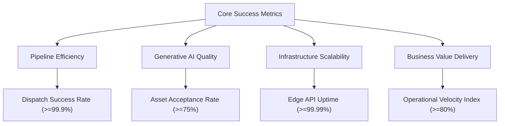

# Product Metrics & Telemetry Dashboard
## Fluxora: Social Media Blast

This document specifies the metrics dashboard, key success parameters, and telemetry tracking requirements for **Fluxora: Social Media Blast**, aligning business value with engineering observability.

---

## 1. Core Success Metrics Framework

Our metrics are categorized into four critical performance vectors to ensure alignment across product, engineering, and sales.



### 1.1 Pipeline Efficiency

These metrics monitor the speed and stability of the core scheduling and dispatch pipeline.

| Metric | Target Benchmark | Measurement Method | Responsible Component |
| :--- | :--- | :--- | :--- |
| **Dispatch Success Rate** | $\ge 99.9\%$ successful API deliveries | `(Successful dispatches / Total attempted dispatches) * 100` calculated daily. | Temporal Distribution Agent & Social Adapters. |
| **Media Transcoding Latency** | $\le 45$ seconds for a standard short video | Time difference between start of transcoding worker job and asset ready confirmation. | Media Workers (FFmpeg / Sharp). |
| **Post Ingestion-to-Queue Speed** | $\le 2.0$ seconds | Time from user clicking "Schedule/Publish" in UI to database queue confirmation. | Next.js API route + Redis Ingestion. |
| **Queue Processing Overhead** | Zero stuck jobs in dead-letter queues over 24h | Monitor BullMQ/Temporal failed job structures. Alert if retry count exceeds 3. | Temporal Job Scheduler. |

### 1.2 Generative AI Quality

These metrics evaluate the precision, utility, and speed of our AI creation components (Phase 3).

| Metric | Target Benchmark | Measurement Method | Responsible Component |
| :--- | :--- | :--- | :--- |
| **Asset Acceptance Rate** | $\ge 75\%$ of AI copy/graphics used without edits | `(AI assets published without modification / Total AI assets generated) * 100` | Semantic Copywriter & Asset Synthesis Agents. |
| **Media Synthesis Latency** | $\le 15$ seconds per high-res graphic | Time from image prompt submission to S3 upload confirmation. | Stable Diffusion / Replicate API connector. |
| **Compliance Score** | $100\%$ zero trademark/policy violations | Auto-scan drafts before queueing. Flag and block any score below 98%. | Brand & IP Compliance Agent. |

### 1.3 Infrastructure Scalability

These metrics monitor safety, security boundaries, and uptime.

| Metric | Target Benchmark | Measurement Method | Responsible Component |
| :--- | :--- | :--- | :--- |
| **Token Freshness Rate** | $100\%$ zero-downtime token rotation | Monitor token expiration logs. Auto-refresh tokens $\ge 24$ hours before expiration. | OAuth Token Manager & HashiCorp Vault. |
| **Data Isolation Violations** | Zero leaks or cross-tenant exposures | Automated penetration tests and daily IAM token validation audits. | Multi-Tenant Engine & Ingress Gateway. |
| **Edge API Availability** | $\ge 99.99\%$ uptime | Uptime ping tests on core API Gateway endpoints. | Global API Gateway. |
| **API Rate-Limit Violations** | Zero automated blocks by external platforms | Monitor error codes returned from third-party social endpoints (e.g., HTTP 429). | Post Delay Coordinator (Staggering Engine). |

### 1.4 Business Value Delivery

These metrics quantify the actual economic impact of Fluxora for our customers.

| Metric | Target Benchmark | Measurement Method | Responsible Component |
| :--- | :--- | :--- | :--- |
| **Operational Velocity Index** | $\ge 80\%$ time reduction vs. manual posting | Customer surveys + inside telemetry tracking average session active composition hours. | Product Management / Analytics. |
| **Evergreen Loop Adoption** | $\ge 30\%$ automation adoption via Evergreen loops | Percentage of active workspaces with at least 1 active Evergreen campaign. | Evergreen Optimization Agent. |
| **Multi-Account Churn** | $\le 2.0\%$ monthly tenant churn | `(Cancelled subscriptions in month / Active subscriptions at start) * 100` | Finance & GTM Teams. |

---

## 2. Telemetry and Event Ingestion Requirements

To power the analytics engine and the dashboard, the system must emit structured telemetry events to our message bus (Apache Kafka) upon every state transition.

### 2.1 Event Schema Standards

Every telemetry event must include:
* `event_id` (UUIDv4)
* `event_name` (e.g., `post.scheduled`)
* `timestamp` (ISO 8601 UTC format)
* `tenant_id` (Workspace UUID)
* `user_id` (User UUID)
* `payload` (JSON object containing specific context)

#### Example 1: `post.scheduled` Event
```json
{
  "event_id": "8f3b2072-c516-419b-a010-ee765d1d6402",
  "event_name": "post.scheduled",
  "timestamp": "2026-06-15T00:07:25Z",
  "tenant_id": "ws_991823ab-2023",
  "user_id": "usr_776152bc-4432",
  "payload": {
    "post_id": "pst_887162bc-9011",
    "channels": ["linkedin", "twitter"],
    "asset_count": 2,
    "scheduled_time": "2026-06-19T09:00:00Z",
    "stagger_interval_seconds": 300,
    "composer_mode": "unified"
  }
}
```

#### Example 2: `post.dispatched` Event
```json
{
  "event_id": "41c8f1aa-c211-482a-ab77-091a0ccf2604",
  "event_name": "post.dispatched",
  "timestamp": "2026-06-19T09:00:15Z",
  "tenant_id": "ws_991823ab-2023",
  "user_id": "usr_776152bc-4432",
  "payload": {
    "post_id": "pst_887162bc-9011",
    "channel": "linkedin",
    "api_response_ms": 450,
    "status": "success",
    "external_post_id": "urn:li:share:123456789"
  }
}
```

---

## 3. Data Storage Strategy

To handle high-volume analytics without impacting core transactional performance, Fluxora utilizes a **Polyglot Database Architecture**:

```
                              ┌────────────────────────┐
                              │  Ingress Event Mesh    │
                              │     (Apache Kafka)     │
                              └───────────┬────────────┘
                                          │
                  ┌───────────────────────┴───────────────────────┐
                  ▼                                               ▼
     ┌────────────────────────┐                      ┌────────────────────────┐
     │  PostgreSQL 16 DB      │                      │  ClickHouse DB         │
     │  - Workspace Configs   │                      │  - Telemetry Logs      │
     │  - User Profiles       │                      │  - Engagement Stats    │
     │  - Queue States        │                      │  - Time-Decay Metrics  │
     └────────────────────────┘                      └────────────────────────┘
```

1. **Transactional Database (PostgreSQL 16)**:
   * Stores user records, tenant configurations, token reference IDs, and scheduling dates.
   * Optimized for strong consistency, row-level locking, and relational integrity.
2. **Analytics Compute Engine (ClickHouse)**:
   * Optimized for time-series analysis and high-velocity aggregation.
   * Stores raw event logs and daily engagement counters (likes, shares, views).
   * Generates campaign reports and feeds the frontend Next.js 15 analytics dashboard in under **100ms** query response time.
