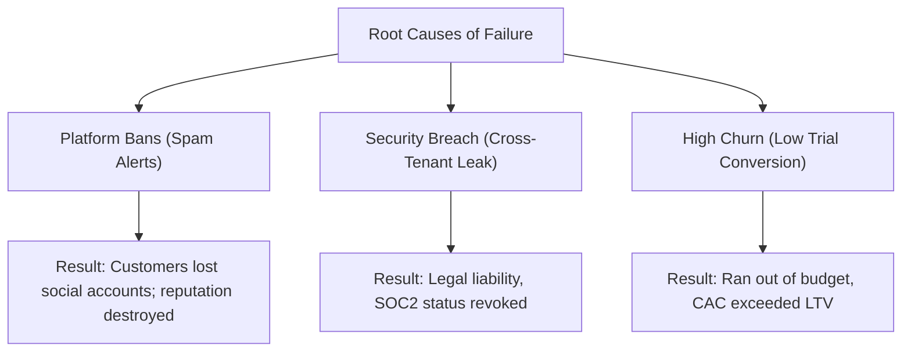

# Pre-Mortem & Risk Register
## Fluxora: Social Media Blast

This document contains a proactive **Pre-Mortem Analysis** and a comprehensive **Risk Register** to identify, evaluate, and mitigate potential points of failure for **Fluxora: Social Media Blast**.

---

## Part 1: Pre-Mortem Exercise

### Scenario: "It is June 15, 2027. Fluxora has failed. The project is shut down. Why?"

### Key Retrospective Post-Mortem Points
1. **The Platform Ban Incident (August 2026)**: We launched Phase 1 without solid staggered scheduling rules. Several high-volume agencies pushed thousands of automated posts simultaneously. Meta and LinkedIn flagged the client accounts as spam bots, resulting in temporary bans for 50+ clients. We immediately lost their trust and saw an immediate wave of cancellations.
2. **The Multi-Tenant Cross-Contamination (November 2026)**: An edge case in our API Gateway validation logic allowed a developer's token update script to overwrite Workspace references. For 3 hours, posts scheduled by Agency A were dispatched using credentials linked to Agency B, resulting in mixed client postings. The legal fallout forced us to halt operations and spend months in compliance audits.
3. **The AI Copy Rejection Crisis (February 2027)**: When we launched Phase 3, we assumed users would trust the AI Writing Assistant automatically. However, the copy lacked brand-specific compliance filters. The "Asset Acceptance Rate" dropped below 30%, meaning copywriters had to rewrite almost everything manually. Clients felt the AI value did not justify the premium $199/month pricing and downgraded to cheaper schedulers.
4. **Integration Bottlenecks and Delayed Roadmap (April 2027)**: Setting up a custom Kafka event mesh and Temporal clusters in our dev stack was easy, but we underestimated the operational complexity in production. The infrastructure cost ran over budget, and engineers spent all their time debugging distributed state machines instead of shipping integrations.

---

## Part 2: Comprehensive Risk Register

The following register tracks critical product, technical, regulatory, and commercial risks, mapping out our mitigation and contingency strategies.

| Risk ID | Risk Description | Category | Probability | Impact | Severity | Mitigation Plan | Contingency Plan | Owner | Status |
| :--- | :--- | :--- | :--- | :--- | :--- | :--- | :--- | :--- | :--- |
| **R-01** | **API Rate Limit & Bot Bans**: Throttling or account suspension by social platforms during bulk posting. | Technical | Medium | High | **High** | **Algorithmic Offset Engine**: Calculate micro-delays (e.g., 2–5 mins) between consecutive posts. Restrict concurrent dispatches per token. | **Queuing Fallback**: Pause the queue, alert the user, and automatically reschedule with a 1-hour backoff. | Tech Lead | Open |
| **R-02** | **Regulatory Compliance (GDPR DPA delays)**: Delays in signing Data Processing Addendums with enterprise client legal teams. | Regulatory | Low | High | **Medium** | **Legal Standard Templates**: Draft standard, pre-approved DPAs and post them publicly on the Trust Center. | **Regional Rollout**: Limit initial onboarding access to US-only tenants until legal reviews clear. | Legal Lead | In Progress |
| **R-03** | **Low Trial Conversion**: Users sign up for trials but fail to convert to paid subscriptions due to high learning curve. | Commercial | Medium | Medium | **Medium** | **Interactive Onboarding**: Build a 3-step setup guide with pre-configured templates. Measure activation milestones. | **Extended Trials**: Offer a 7-day trial extension via automated emails to users who connected accounts but did not post. | Growth PM | Open |
| **R-04** | **Competitor First-Mover Advantage**: Competitors launch similar advanced AI-agent orchestration before Fluxora Phase 3. | Strategic | High | High | **High** | **Roadmap Acceleration**: Partner with OpenAI API (GPT-4o) directly for immediate agent logic instead of building in-house models. | **Niche Focus**: Shift messaging to focus heavily on agency multi-tenancy and secure vaulting as our primary differentiator. | Product Lead | Open |
| **R-05** | **Cross-Tenant Data Leak**: Client credentials or draft media assets become exposed across workspaces. | Technical | Low | Critical | **High** | **Logical Database Separation**: Enforce relational foreign keys on Workspace ID at the db tier. Implement strict JWT verification in Ingress Gateway. | **Emergency Revocation**: Trigger automatic rotation and revocation of all active OAuth tokens from HashiCorp Vault. | DevSecOps Lead | In Progress |
| **R-06** | **FFmpeg Transcoding Latency**: Heavy video file queues stall the worker nodes, exceeding the 45s SLA. | Technical | Medium | Medium | **Medium** | **Horizontal Auto-scaling**: Deploy containerized FFmpeg workers on Kubernetes (K8s) that scale based on queue depth. | **Transcoding Fallback**: Transcode lower-resolution previews first for the user, and process high-res formats in the background. | Tech Lead | Open |
| **R-07** | **OAuth Token De-authorization**: Customer social tokens expire or get revoked unexpectedly, causing scheduled dispatches to fail. | Technical | High | Medium | **Medium** | **Active Token Monitor**: Fetch token metadata status daily. Automatically prompt the user to re-authenticate 3 days before expiry. | **Grace Period Queue**: Hold the scheduled post in a "Paused" state and send a push notification to the workspace admin. | DevSecOps Lead | Open |
