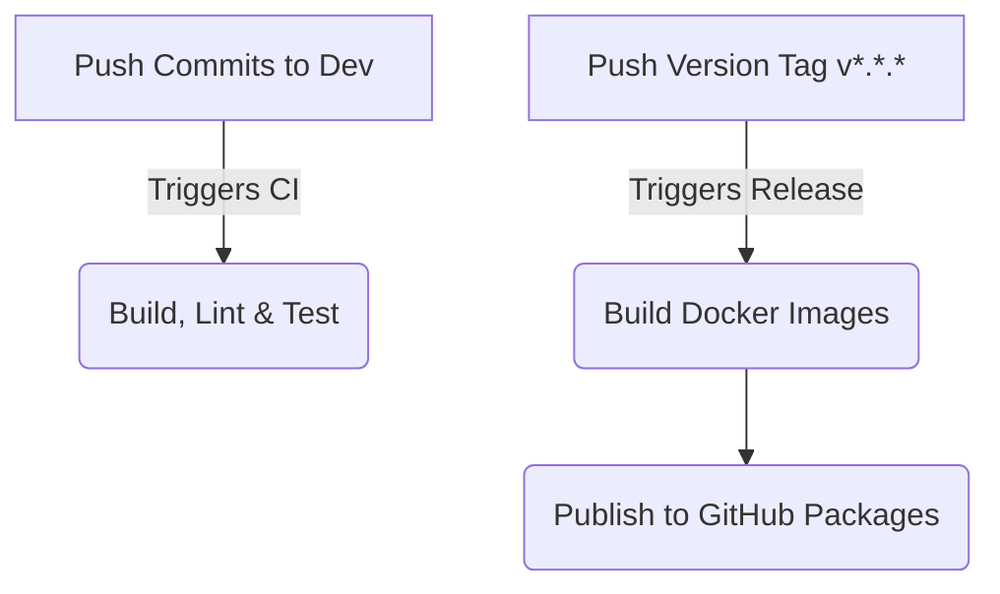

# Release Engineering & Publishing Process

This document defines the release engineering pipeline, branching workflows, container tagging schemas, and deployment patterns.

---

## 🌳 Branching Rules

We maintain three primary code channels:

1. **`main` / `master`:** Stores highly stable, production-ready source code. Directly deploys tag changes.
2. **`dev`:** Active integration branch. Developers merge feature updates here first.
3. **`feature/`:** Local topic branches created for specific tasks (e.g. `feature/connected-accounts`).

---

## 🏷️ Commit Standards & Versioning

Fluxora uses **Semantic Versioning** (`MAJOR.MINOR.PATCH`).

* Bumping MAJOR: Breaking schema or API changes.
* Bumping MINOR: Adding backwards-compatible features (e.g., new social network adapters).
* Bumping PATCH: Backwards-compatible bug fixes.

Create tags to trigger automated release workflows:
```bash
git tag -a v1.2.0 -m "Release version 1.2.0"
git push origin v1.2.0
```

---

## ⚙️ Automated Pipeline Triggers

GitHub Actions orchestrate validation and publishing cycles automatically:



1. **CI Pipeline (`ci.yml`):** Runs on every PR/push to `main` or `dev`. Performs linting, checks code formatting, generates the Prisma schema, and runs backend Jest unit tests.
2. **Release Pipeline (`release.yml`):** Runs only when a version tag (`v*.*.*`) is pushed. Builds the backend and frontend Docker images and publishes them to the registry (`ghcr.io`).
3. **Security Audit (`security.yml`):** Runs on PRs and weekly in the background. Detects hardcoded secrets via Gitleaks and scans dependencies for high-severity vulnerabilities.

---

## 🚀 Deployment Strategy (Rolling Deployments)

To guarantee zero-downtime transitions:

* **Kubernetes rolling updates:** Configure deployment limits to maintain application availability during new version rollouts:
  ```yaml
  strategy:
    type: RollingUpdate
    rollingUpdate:
      maxSurge: 1       # Spin up 1 new Pod first
      maxUnavailable: 0 # Keep all existing Pods running until the new one is healthy
  ```
* **Database migrations:** Ensure database migrations are backwards-compatible (never delete columns directly; use a deprecate-then-remove phase).
