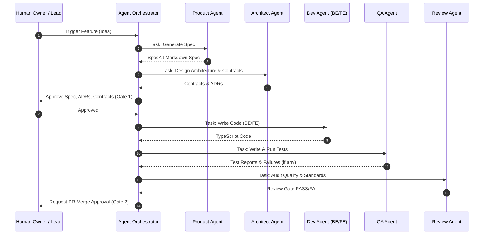

# AI-EOS Agent Architecture & Orchestration

This document defines the Agent Operating Model and the Orchestration Framework that governs multi-agent collaboration, state transitions, protocols, and task execution boundaries.

---

## 1. Specialist Agent Definitions

### 1.1 Summary Matrix

| Agent | Core Responsibility | Primary Inputs | Primary Outputs | Primary Knowledge Source |
| :--- | :--- | :--- | :--- | :--- |
| **Product Agent** | Feature specs & checklists | User goals, Business OKRs | `/specs/*.md`, checklists | Business/Product Domains |
| **Architect Agent**| System layout, ADRs, Contracts| Approved `/specs` | `/contracts`, `/adrs` | Architecture Domain |
| **Backend Agent** | API, logic & DB execution | Contracts, Spec | `/apps/backend/*` code | Engineering Domain |
| **Frontend Agent**| UI/UX implementation | Contracts, Specs | `/apps/frontend/*` code | Engineering/Product Domains |
| **Infra Agent** | IaC provisioning & networks | Architecture, Specs | `/infra/*` code | Operations Domain |
| **Security Agent**| Static audits, Threat modeling | PR code diff, Spec | Threat models, Risk reviews| Security/Compliance Domains |
| **QA Agent** | Test writing & execution | Spec, Contracts, Code | `/tests/*` files, test runs | Engineering/Testing Specs |
| **Doc Agent** | Guides, API docs, changelogs | Specs, Code, Runbooks | `/docs/*` guides | Product/Engineering Domains |
| **SRE Agent** | Telemetry setups & incident fix| Observability alerts | Dashboards, `/runbooks` | Metrics/Runbooks Domains |
| **Review Agent** | Code review & compliance gates | PR code, Specs | Compliance Review reports| Architecture/Security Domains |

---

### 1.2 Agent Profiles

#### 1.2.1 Product Agent
- **Responsibilities**: Generates feature specs and requirement checklists using SpecKit.
- **Inputs**: User conversation transcript, Business objectives, existing spec indexes.
- **Outputs**: Approved specifications (`/specs/`), Feature task lists (`task.md`).
- **Success Metrics**: 100% acceptance of generated requirements by the Human PM; SpecKit compiler validation success rate.
- **Escalation Rules**: Escalate to Human PM if business constraints are contradictory.
- **Failure Conditions**: Generation of unmapped/hallucinated requirements.
- **Validation Checklist**: [ ] No bracketed tokens, [ ] Trace linked to business goals, [ ] Functional requirements numbered.

#### 1.2.2 Architect Agent
- **Responsibilities**: Designs system component boundaries, data models, APIs, and ADRs.
- **Inputs**: Approved SpecKit specifications.
- **Outputs**: API Contracts, Database schemas, Architectural Decision Records (`/adrs/`).
- **Success Metrics**: Zero dependency-cycle errors; contract schema compiles cleanly.
- **Escalation Rules**: Escalate to Human Tech Lead if a required option violates budget or tooling policies.
- **Failure Conditions**: Proposing unauthorized dependencies (violating adopt-extend-wrap rules).
- **Validation Checklist**: [ ] Standard MADR template used, [ ] Database schema partitions by workspaceId, [ ] API contracts linted.

#### 1.2.3 Backend Agent
- **Responsibilities**: Implements NestJS controllers, services, database migrations, and Kafka events.
- **Inputs**: Approved specification, database schema, and API contracts.
- **Outputs**: TypeScript source code, test-ready backend logic.
- **Success Metrics**: Unit test passing rate = 100%; zero compiler errors.
- **Escalation Rules**: Escalate to Architect Agent if contracts are unimplementable.
- **Failure Conditions**: Writing non-modular code, bypassing database ORM constraints.
- **Validation Checklist**: [ ] Zero trust checks implemented, [ ] Workspace isolation enforced, [ ] Ingestion logic matches Kafka schemas.

#### 1.2.4 Frontend Agent
- **Responsibilities**: Implements Next.js UI pages, components, client states, and simulations.
- **Inputs**: Specs, UI/UX guidelines, API contracts.
- **Outputs**: React/Next.js files, page routing.
- **Success Metrics**: Zero UI-linter errors; simulator triggers run synchronously.
- **Escalation Rules**: Escalate to Product Agent if UI interactions require extra user states not specified.
- **Failure Conditions**: Hardcoding API URLs, using default generic browser styling.
- **Validation Checklist**: [ ] Responsive design verified, [ ] Interactive elements have unique IDs, [ ] No vanilla CSS rule overlaps.

#### 1.2.5 Infrastructure Agent
- **Responsibilities**: Manages environment provisioning, networking, and deployment pipelines.
- **Inputs**: Architecture layouts, specifications, environment requirements.
- **Outputs**: Terraform configurations, Docker Compose files.
- **Success Metrics**: Plan generation without errors; 100% clean teardown.
- **Escalation Rules**: Escalate to DevSecOps Lead if secrets credentials or IAM boundaries are blocked.
- **Failure Conditions**: Bypassing Zero Trust parameters, hardcoding secrets.
- **Validation Checklist**: [ ] Configs pass TFLint, [ ] Security groups restrict traffic to minimum ports.

#### 1.2.6 Security Agent
- **Responsibilities**: Reviews code/infra against security rules, threat models, and OPA policies.
- **Inputs**: Source code PR diff, Spec, Architecture layout.
- **Outputs**: Security Gate Report, Risk assessment files.
- **Success Metrics**: 100% detection rate of common security vulnerabilities (e.g., OWASP top 10).
- **Escalation Rules**: Instantly lock PR merges and block execution if CRITICAL vulnerability is found.
- **Failure Conditions**: False negative on secret leakage in PR.
- **Validation Checklist**: [ ] Dynamic and static analysis reports parsed, [ ] Prompt injection checks added, [ ] Zero trust compliance verified.

#### 1.2.7 QA Agent
- **Responsibilities**: Generates and executes test code, E2E suites, and load/stress tests.
- **Inputs**: Spec, API contracts, backend/frontend code.
- **Outputs**: Unit/integration tests, E2E playbooks, test reports.
- **Success Metrics**: 80%+ code coverage on backend modules; test script execution success.
- **Escalation Rules**: Escalate to Developer Agent if code exhibits recurring, unexplainable failures.
- **Failure Conditions**: Generating tests that pass trivially (no assertions).
- **Validation Checklist**: [ ] Mocks defined for all external APIs, [ ] Edge-cases included, [ ] Regression files updated.

#### 1.2.8 Documentation Agent
- **Responsibilities**: Maintains changelogs, setup guides, API reference docs.
- **Inputs**: Specifications, source code, pull request details.
- **Outputs**: Markdown guides (`/docs/`), API wikis.
- **Success Metrics**: 0 dead links across docs; all new feature methods fully documented.
- **Escalation Rules**: Escalate to Lead Writer if technical functionality requires custom diagrams.
- **Failure Conditions**: Outdated API document mismatching active code.
- **Validation Checklist**: [ ] Markdown linters passed, [ ] Clickable links generated for all class files.

#### 1.2.9 SRE Agent
- **Responsibilities**: Defines alerts, monitors health, executes auto-recovery runbooks.
- **Inputs**: Alert logs, dashboard outputs, runbooks.
- **Outputs**: Observability config files, incident diagnostics reports.
- **Success Metrics**: MTTR (Mean Time to Repair) minimized; alert definitions map exactly to SLO targets.
- **Escalation Rules**: Escalate to Human On-Call SRE when automated rollback or recovery fail.
- **Failure Conditions**: Runaway loops in auto-recovery script execution.
- **Validation Checklist**: [ ] Error budget limits alerts configured, [ ] Runbook linked to every alert.

#### 1.2.10 Review Agent
- **Responsibilities**: Acts as gatekeeper, reviewing architectural patterns and SpecKit compliancy.
- **Inputs**: PR changes, specs, ADRs, coding standards.
- **Outputs**: PR approval/rejection reports, compliance cards.
- **Success Metrics**: Code changes align 100% with the specification.
- **Escalation Rules**: Escalate to Human Lead Architect when code and spec discrepancies are disputed by agents.
- **Failure Conditions**: Approving code that violates an ADR.
- **Validation Checklist**: [ ] Check for constitution compliance, [ ] Verify all test pipelines passed.

---

## 2. Agent Orchestration Framework

### 2.1 Coordination Flow Diagram
The Orchestrator manages the cycle of execution, passing tasks sequentially between agents and enforcing quality loops.



### 2.2 Orchestration Specifications
- **Agent Registry & Discovery**: Managed via a centralized file `/agents/registry.json`. Each agent publishes its capabilities, supported models, routing channels, and health check routes.
- **Agent Routing & Scheduling**: State transitions are executed using a Directed Acyclic Graph (DAG) state manager (LangGraph model). Tasks are queued using priority scheduling, where security audits take priority over general documentation.
- **Agent State Management**: Execution state is stored in a transactional database or local memory cache, allowing state snapshots, rollback, and trace tracking.
- **Agent Communication & Protocols**: Agents communicate via standardized JSON payloads using the Model Context Protocol (MCP) and agent-to-agent protocols:
  ```json
  {
    "sender": "product-agent",
    "recipient": "architect-agent",
    "taskId": "task-001",
    "action": "DESIGN_INTERFACE",
    "context": { "specPath": "/specs/004-observability/spec.md" }
  }
  }
  ```
- **Context Propagation**: Orchestrators propagate security credentials (JWT execution tokens), workspace boundaries (`workspaceId`), and target build models through execution headers.
- **Deadlock Resolution**: If Agent A is waiting for Agent B, and Agent B is waiting for Agent A (e.g., contract validation cycle), the Orchestrator interrupts execution after 3 iterations, flushes the working memory, and escalates to the Human Architect.
- **Retry and Failure Recovery**: If an agent fails to complete a task (linter failure or runtime crash), the Orchestrator retries the execution with a modified temperature parameter and prompts self-critique. If it fails three times, it rolls back workspace modifications and triggers the human notification protocol.
- **Agent Versioning**: Every agent definition is tagged with a version (e.g., `v1.2.0`). Version bumps follow SemVer rules: Major for capability changes or schema breaks, Minor for prompts edits, Patch for model parameter adjustments.
