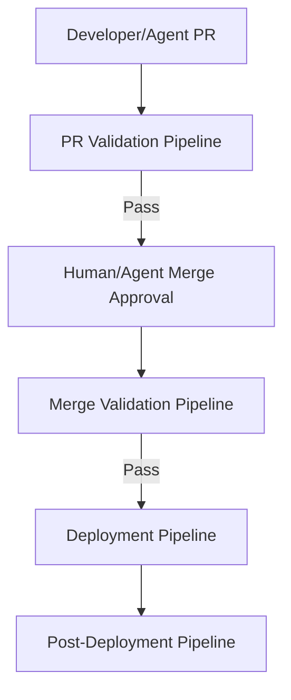
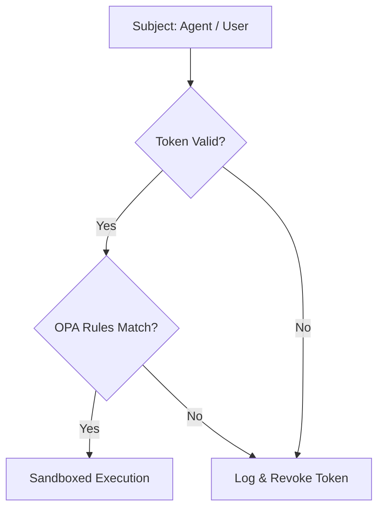

# AI-EOS CI/CD & Security Governance

This document establishes the automation specifications for CI/CD pipelines and defines the Security Governance policies for the AI Engineering Operating System.

---

## 1. CI/CD Governance Pipelines

To prevent unverified code or specifications from merging, the CI/CD pipeline enforces four sequential validation stages.

### 1.1 PR Validation Pipeline
- **Trigger**: Run on every Pull Request target branch.
- **Validation Blocks**:
  - **Spec Validation**: Checks that modified features have matching SpecKit files in `/specs/` and that the file passes the spec linter schema check.
  - **Contract Validation**: Verifies modified API files against schema models using OpenAPI/AsyncAPI linters. Rejects PR if breaking API changes occur without an approved ADR.
  - **Security Scan**: Executes static analysis security tools (SAST) and scans for exposed secrets (TruffleHog/GitGuardian).
  - **Doc Validation**: Validates markdown formatting and runs link checker scripts.
  - **Evaluation Validation**: Runs evals tests on modified prompts against the benchmark datasets in `/evals/`.

### 1.2 Merge Validation Pipeline
- **Trigger**: Run automatically when a PR is merged into `main`.
- **Validation Blocks**:
  - Compiles final build assets and runs the full unit/integration test suite.
  - Generates the updated system dependency graph and validates that it conforms to structural architecture guidelines.

### 1.3 Deployment Validation Pipeline
- **Trigger**: Run on deployment to staging/production.
- **Validation Blocks**:
  - Executes Terraform linting, static code analysis (tfsec), and validation check rules.
  - Verifies that deployment environment configuration values are fetched from the secure secrets manager (Vault).

### 1.4 Post-Deployment Validation Pipeline
- **Trigger**: Runs automatically immediately after deployment.
- **Validation Blocks**:
  - Runs automated synthetic E2E user tests against the staging/production endpoint.
  - If tests fail, it automatically triggers the Rollback procedure.

---

## 2. Security Governance

AI-EOS implements a strict Zero Trust model for both human engineers and autonomous agents.

### 2.1 Threat Model
- **Target Assets**: Code repositories, secrets database, data model catalogs, model weights/prompts.
- **Threat Vectors**:
  - **Prompt Injection**: Malicious input subverting agent system prompts and executing arbitrary commands.
  - **Knowledge Poisoning**: Attackers injecting corrupted nodes into the `/knowledge` folder to skew RAG context.
  - **Supply Chain Vulnerability**: Compromised open-source dependencies executed by agents.
  - **Privilege Escalation**: Specialist agent hijacking file-system/runbook execution commands to access non-authorized databases.

### 2.2 Zero Trust Policy
- No entity (agent, orchestrator, developer) has default trust. Every interface boundary (API, database, Kafka broker) requires session-based authentication.
- Agents operate using temporary, narrow-scoped OAuth tokens that expire automatically after 15 minutes.

### 2.3 Secrets Policy
- Under no circumstances may secrets, credentials, or API keys be committed to Git.
- In CI pipelines and local sandboxes, secrets must be injected as environment variables fetched dynamically from HashiCorp Vault or AWS Secrets Manager.

### 2.4 Access Control Policy
- **Least Privilege Access**: Agents only have read/write access to folders required for their specific role (e.g., Frontend Agent cannot write to `/infra/` or `/security/`).
- **Sandbox Environment**: All agent shell executions and commands are containerized in isolated Docker containers with restricted disk space, CPU limits, and no egress network routing except to pre-approved domains.

### 2.5 AI Safety & Guardrails
- **Input Filtering**: All user/external payloads are parsed by a Guardrails model to detect jailbreaks, prompt injection patterns, and SQL injections before passing to agents.
- **Output Sanitization**: System-prompt pipelines enforce structured output parsing. If an LLM output does not match the target JSON Schema (e.g., returns raw markdown when JSON is expected), the tool parser rejects the response.

### 2.6 Knowledge Poisoning Controls
- Changes to `/knowledge` require a signature hash and verification by the Knowledge Architect.
- RAG vector databases are periodically validated against the Git source catalog to ensure no rogue records exist.

### 2.7 Supply Chain Controls
- All dependencies must be locked using exact versions (`package-lock.json`, `poetry.lock`).
- Automated dependency scanners run weekly to verify all third-party libraries against the National Vulnerability Database (NVD).
