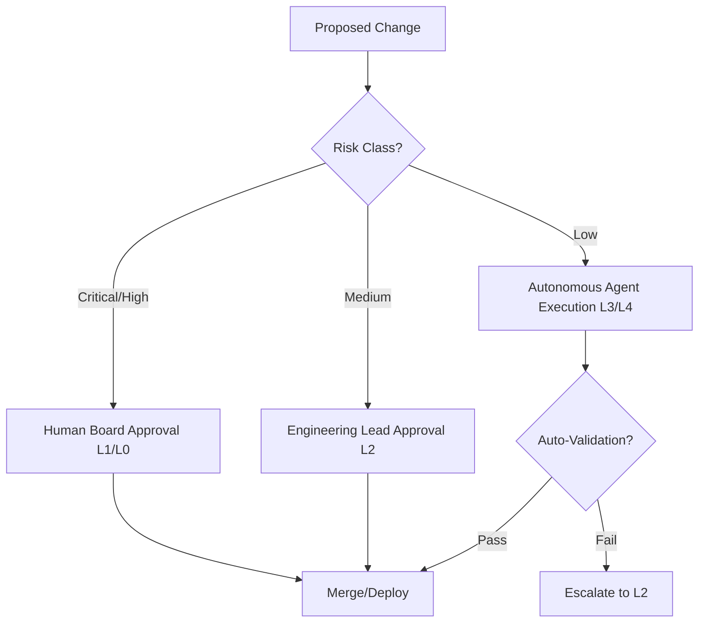

# AI Engineering Operating System (AI-EOS) Constitution

**Ratification Date:** 2026-06-17  
**Constitution Version:** v1.0.0  
**Status:** Ratified  

---

## 1. Core Principles

The AI-EOS is governed by ten mandatory AI-Native principles that apply to all human engineers and autonomous agents operating within the workspace.

| Principle | Description | Rationale |
| :--- | :--- | :--- |
| **Specification First** | No code may be written, refactored, or deployed without an approved, versioned specification. | Prevents scope drift, guarantees design alignment, and provides training/context boundary for agents. |
| **Contract First** | All service boundaries, APIs, events, and data models must define and publish strict schemas before implementation. | Allows parallel agent execution and mock-driven testing without tight integration coupling. |
| **Knowledge First** | Code is a byproduct of knowledge. Decisions, context, domain architectures, and runbooks must reside in the Knowledge Base. | Ensures context retrieval (RAG) is deterministic and agents do not hallucinate system capabilities. |
| **Evaluation First** | Evaluation metrics, regression suites, and test cases must be established before implementation. | Guarantees quality gates are objective, automated, and run against a "gold standard" comparison. |
| **Security First** | Zero Trust verification is required at every boundary (human-to-agent, agent-to-agent, agent-to-tool). | Mitigates prompt injection, model data poisoning, and unauthorized capability execution. |
| **Automation First** | Any repeatable process (checks, deployment, provisioning, validation) must be encapsulated in code-defined workflows. | Eliminates human error, guarantees repeatability, and enables agents to execute operational processes. |
| **Observability First** | Every system component must expose high-fidelity structured logs, traces, and metrics. | Enables automated drift detection, agent performance evaluation, and self-healing loops. |
| **Agent Discoverability First** | Code, architecture, specs, and operations must be self-describing and discoverable via machine-readable indexing. | Allows new autonomous agents to onboard, understand, and safely modify the codebase with zero human guidance. |
| **Deterministic Execution First** | Agent execution, tool invocations, and orchestration states must be traceable, reproducible, and verifiable. | Prevents wild-looping, runaway costs, and chaotic system state transitions. |
| **Human Accountability Always** | AI agents are execution entities; humans are the legal and operational authorities. Humans own final review. | Maintains regulatory compliance, quality governance, and operational safety. |

---

## 2. Governance & Authority Hierarchy

Governance in an AI-EOS project operates under a strict hierarchy of authority. This hierarchy defines which entity (human role or document) has final decision-making power over various project dimensions.

### 2.1 Authority Levels
1. **Human Executive Sponsor (Level 0)**: Ultimate veto and budget authority.
2. **Human Architecture Board (Level 1)**: Defines and approves core patterns, dependencies, and principles.
3. **Engineering Lead (Level 2)**: Approves implementations, specifications, and deployments.
4. **Primary Agent Orchestrator (Level 3)**: Coordinates task assignment, executes validation loops, and manages agent handoffs.
5. **Specialist AI Agents (Level 4)**: Execute individual domain tasks (e.g., Code generation, Testing, Documentation).

### 2.2 Decision Matrix

---

## 3. Ownership & Escalation Hierarchy

All files, configurations, and systems within the workspace have defined owners. When conflicts or failures occur, the escalation protocol is triggered automatically.

### 3.1 Ownership Model
- **Specs & ADRs**: Owned by the Human Architect / Product Owner. Agents can draft but never self-approve.
- **Source Code**: Co-owned by Specialist Agents (write/maintain) and Human Engineers (review/approve).
- **Runbooks & Operational Metrics**: Owned by Site Reliability Engineering (SRE) Agent and SRE Lead.
- **Knowledge Base**: Globally accessible, but schema validation and pruning are owned by the Knowledge Architect.

### 3.2 Escalation Protocol
1. **Agent Tool Failure**: Retry twice with backoff. If fail, log trace and escalate to the Agent Orchestrator.
2. **Orchestrator Deadlock**: Terminate execution state, rollback local workspace changes, and notify the Human On-Call Engineer.
3. **Spec/Code Misalignment**: Halt coding agent. Escalate to the human reviewer for clarification (using the specification as the ground truth).
4. **Security Alert / Abuse Detection**: Immediately revoke agent credentials, quarantine the workspace, and alert the Security Lead.

---

## 4. Source-of-Truth Hierarchy

When information in the repository is contradictory, agents and humans must resolve conflicts based on the following precedence list:

1. **Business Objectives** (High-level goals defined in the Project Constitution)
2. **Approved Specifications** (Individual feature specs in `/specs`)
3. **Architectural Decision Records (ADRs)** (Found in `/adrs` or `docs/architecture`)
4. **API and Data Contracts** (Found in `/contracts`)
5. **System Knowledge Base** (Found in `/knowledge`)
6. **Active Source Code** (Under `/apps` or `/src`)
7. **Generated Build Artifacts**
8. **Ephemeral Conversations** (PR comments, Slack logs, agent chat sessions)

> [!CAUTION]
> Under no circumstances may an agent override a higher-priority source (e.g., an Approved Specification) using information found in a lower-priority source (e.g., a Slack chat or source code comment).

---

## 5. Lifecycle Management & Repository Evolution Rules

### 5.1 Artifact Lifecycles
Every document, spec, or code block progresses through five distinct lifecycle states:
1. **Draft / Proposal**: Unapproved, open for discussion. Marked with `Status: Proposed`.
2. **Approved**: Reviewed and approved by the required authority level. Ready for implementation.
3. **Implemented / Active**: Code deployed, verified by CI/CD, and operational.
4. **Deprecated**: Still exists but scheduled for removal. No new dependencies may be established.
5. **Archived / Retired**: Removed from active workspace directories and moved to archive logs.

### 5.2 Repository Evolution Rules
- **No Orphaned Files**: Every file in the repository must be indexed in the Master Blueprint and have a declared owner.
- **Semantic Versioning**: All contracts, schemas, tools, and agents must increment using SemVer:
  - **Major**: Breaking API or governance protocol changes.
  - **Minor**: Non-breaking feature additions or principle expansions.
  - **Patch**: Document formatting, spelling fixes, non-functional optimization.
- **Zero Human Onboarding**: The repository must contain sufficient machine-readable metadata (`metadata.json`, Open Knowledge indexes) so that any newly initialized AI agent can clone the repo, run discovery, and begin executing tasks without human assistance.

---

## 6. AI Usage Policies & Human Accountability Rules

- **Code Signature**: Every change committed by an AI agent must be signed with the agent's unique ID and include a pointer to the specific issue/task ID and specification it was executing.
- **No Hallucinated References**: Agents are strictly forbidden from citing libraries, tools, or documents that do not exist or are not indexed in the Project Knowledge Base.
- **Human Gatekeeping**: All production-bound code merges, infrastructure deployments, and security policy changes require positive human confirmation (interactive approval).
- **Abuse and Runaway Limits**: Agents are subject to strict token, time, and budget quotas per execution thread. Runaway behaviors (e.g., infinite loop testing) will trigger automatic sandbox resource termination.
