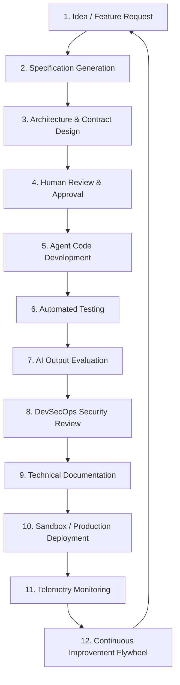

# AI-EOS Software Delivery Lifecycle & Quality Gates

This document defines the Software Delivery Lifecycle (SDLC) stages, details the nine Quality Gates that enforce system governance, and specifies the Testing & Evaluation standards.

---

## 1. Software Delivery Lifecycle (SDLC)

The SDLC operates as a strict, sequential pipeline. No stage may be skipped.

1. **Idea**: Raw requirements, business goals, and user stories are gathered.
2. **Specification**: Product Agent writes the SpecKit specification (`/specs`).
3. **Architecture**: Architect Agent drafts ADRs and API/Data Contracts (`/contracts`).
4. **Approval**: Human reviewer approves the specification and contracts.
5. **Development**: Backend and Frontend Agents generate application source code.
6. **Testing**: QA Agent generates and executes unit/integration/E2E tests.
7. **Evaluation**: Evals framework audits prompt-outputs against target benchmarks.
8. **Security**: Security Agent runs static scan and threat model verification.
9. **Documentation**: Doc Agent creates setup guides, wikis, and changelogs.
10. **Deployment**: CI/CD pipeline deploys application to sandbox/production.
11. **Monitoring**: SRE Agent traces telemetry, checks error budgets, and logs metrics.
12. **Improvement**: SRE Agent updates Knowledge base based on incident logs.

---

## 2. Quality Gates Matrix

Before code changes are merged into the main repository branch, they must pass through nine automated and human-supervised gates.

| Quality Gate | Evaluator | Entrance Prerequisite | Exit Criteria | Rollback Target |
| :--- | :--- | :--- | :--- | :--- |
| **1. Spec Completeness** | Product Agent / PM | Feature request raised | Frontmatter parsed; all AC defined | Redraft spec |
| **2. Arch Compliance** | Architect Agent | Approved Spec | No circular dependency; ADR written | Redraft architecture |
| **3. Contract Compliance** | Review Agent / CI | Approved Architecture | API schemas compile; Linter pass | Reject interface |
| **4. Test Coverage** | QA Agent / CI | Completed Source Code | Backend coverage $\ge 80\%$; zero fails | Re-run code dev |
| **5. Security Review** | Security Agent | Completed Source Code | No secrets exposed; OPA policy pass | Quarentine branch |
| **6. Doc Completeness** | Doc Agent / CI | Completed Source Code | Setup guides updated; zero dead links | Refine docs |
| **7. Observability Ready** | SRE Agent / CI | Completed Source Code | OpenTelemetry traces & metrics added | Reject PR merge |
| **8. Deploy Readiness** | DevSecOps Lead | Approved PR | Terraform plan passes; staging deploy | Abort deployment |
| **9. Post-Deploy Validation**| SRE Agent / Human | Active production | Health check passes; SLIs in range | Run rollback script |

---

## 3. Testing & Evaluation System

The AI-EOS enforces a comprehensive testing matrix divided between traditional code validation and AI model evaluations.

### 3.1 Test Classifications
- **Unit Tests**: Focuses on isolated function boundaries. Required for all business logic controllers.
- **Integration Tests**: Tests database transaction isolation, Kafka message delivery, and API integrations.
- **Contract Tests**: Verifies API endpoints adhere exactly to published OpenAPI/gRPC schemas (using tools like Prism/Dredd).
- **E2E Tests**: Tests full user journeys using headless browsers (Playwright).
- **Load Tests**: Validates system latency and throughput limits (using k6) under high concurrent traffic.
- **Security Tests**: Scans code dependencies for vulnerabilities (OWASP Dependency-Check, Snyk) and executes static application security testing (SAST).
- **Chaos Tests**: Inject failures (kill service containers, inject database latency) to verify system resilience.
- **AI Evaluation Tests**: Run prompt outputs against evaluation datasets to measure LLM accuracy, hallucinations, and safety.

### 3.2 Evaluation Requirements
- **Regression Suites**: Every bug fix must include a corresponding test case appended to the regression suite directory.
- **Benchmark Suites**: AI models and prompt pipelines are evaluated using standard datasets (e.g., test inputs with expected output JSON structures).
- **Failure Repositories**: A dedicated folder `/evals/failures/` archives past failed test executions and prompt outputs. The Orchestrator uses this repository to provide negative examples for few-shot prompting.
- **Gold Standard Comparisons**: Code output and spec text are compared against a human-approved "gold standard" version using semantic similarity metrics (sentence embeddings) to detect quality drift.
