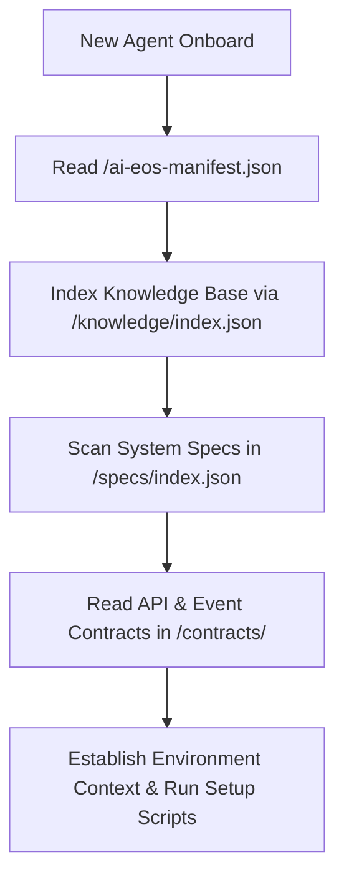
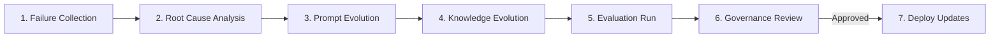

# AI-EOS Governance, Cost & Platform Engineering

This document specifies the system-wide governance for models, costs, human oversight, data, continuous learning, platform engineering, and autonomous agent onboarding.

---

## 1. Autonomous Agent Onboarding & Discovery (Phase 13)

To achieve "zero human onboarding", a new autonomous agent initialized in the workspace must discover the engineering environment automatically using the following machine-readable catalog:

- **Discovery Config**: The file `/ai-eos-manifest.json` provides the absolute map of the repository structure, pointing to:
  - **Specs Index**: `/specs/index.json`
  - **Contracts**: `/contracts/`
  - **Architecture Models**: `/architecture/map.json`
  - **Runbooks & Scripts**: `/runbooks/index.json`
  - **System Metrics & Dashboards**: `/observability/metrics.json`
  - **CI/CD Triggers**: `/ci/config.json`
  - **Operational Owners**: `/docs/ownership.json`

---

## 2. AI Economics & Cost Governance (Phase 14)

Managing operational and LLM token budgets is critical to prevent runaway compute costs.

### 2.1 Budget Allocation

| Task Classification | Token Budget (Max per call) | Context Budget | Retrieval Budget (Max Chunks) | Approved Model Tier |
| :--- | :--- | :--- | :--- | :--- |
| **Code Review** | 4,000 | 128,000 | 20 | Medium Tier |
| **Logic Gen (BE)** | 8,000 | 64,000 | 15 | High Tier |
| **Doc Update** | 2,000 | 32,000 | 10 | Low Tier |
| **Security Audit** | 8,000 | 128,000 | 40 | High Tier |

### 2.2 Cost Control Policies
- **Model Routing Rules**: Tasks are dynamically routed depending on complexity. Text corrections use Low-Tier models. Multi-file coding modifications require High-Tier reasoning models.
- **Cache Policies**: All system prompts, few-shot examples, and OKF static structures are configured to support LLM context caching to reduce input token cost.
- **Cost Allocation Rules**: Every token execution includes metadata tagging `taskId`, `projectID`, and `agentRole`. This allows real-time cost tracking dashboards per team.
- **Cost Optimization**: If an agent thread consumes $>50\%$ of its allocated monthly budget, the Orchestrator throttles execution speed, limits context depth, and alerts the Human Lead.

---

## 3. Model Governance (Phase 15)

Model governance controls the selection, verification, and lifecycle of the LLMs utilized by the agents.

- **Model Registry**: Centralized catalog at `/platform/models/registry.json` listing certified endpoints, performance benchmarks, input/output limits, and current operational status.
- **Benchmarking & Certification**: Models must pass a certification test before inclusion. The test validates compliance against prompt injection resilience, safety guidelines, output schema completeness, and reasoning accuracy.
- **Fallback Models**: If a primary High-Tier model is unavailable (timeout/provider down), the Orchestrator dynamically routes traffic to a certified fallback model (e.g., secondary cloud provider or local open-weights server) with a reduced context window.
- **Upgrade/Retirement Policy**: Model migrations (e.g., v1.1 to v1.2) are tested in a sandbox environment against the `/evals/` test suite. The old model is retired only after the new version achieves equivalent or better benchmark scores.

---

## 4. Human Oversight Framework (Phase 16)

Human accountability overrides agent autonomy. Every operation is classified by risk level, dictating the required approval gate.

| Risk Class | Threat Definition | Agent Autonomy | Approval Requirements |
| :--- | :--- | :--- | :--- |
| **Low** | Docs, spelling fixes, test formatting | Fully Autonomous | Automated Review Agent approval |
| **Medium** | Business logic modification, small UI | Autonomous write | Single Human Peer Review approval |
| **High** | DB Schema migration, API contract change | Draft only | Security Agent + Lead Architect approval |
| **Critical** | IAM modification, production deploy | No execution access| Executive Sponsor + Multi-Lead approvals |

---

## 5. Data Governance (Phase 18)

- **Data Classification**: All data types are tagged in `/data-governance/catalog.json` as: `Public`, `Internal`, `Confidential`, or `PII`.
- **Data Ownership**: System databases have declared human owners. Agents cannot alter database schemas or migrate data without owner sign-off.
- **Data Lineage**: Lineage maps record how telemetry streams propagate from API inputs, through Kafka topics, and into ClickHouse tables.
- **PII Policies**: PII data must be masked or anonymized before ingestion. Agents are strictly prohibited from parsing or storing unencrypted PII in execution logs or memory caches.
- **Retention Policies**: Telemetry databases auto-prune records after 30 days. Execution memory logs are archived after 90 days.

---

## 6. Continuous Learning System (Phase 19)

To ensure the AI-EOS continuously improves, the system operates a self-correcting learning loop:

1. **Failure Collection**: System crashes, test failures, or low review scores are captured.
2. **Root Cause Analysis**: SRE Agent analyzes logs to isolate if the failure was prompt-based, code-based, or model-based.
3. **Prompt Evolution**: Updated instructions or negative examples are added to prompt templates.
4. **Knowledge Evolution**: Missing context or architectural clarifications are committed to the `/knowledge` folder.
5. **Evaluation Run**: The modifications are run against the `/evals` regression suite.
6. **Governance Review**: The review agent compiles a comparison report for the Human Tech Lead to sign off.

---

## 7. Platform Engineering & Golden Paths (Phase 20)

Platform engineering provides developer self-service tooling and standard setups.

- **Golden Paths**: Standardized workflows for bootstrapping new features, setting up data pipelines, and implementing APIs. A developer or agent runs a single command (e.g., `/platform/bin/bootstrap-feature`) to scaffold the correct directories and write boilerplate configs.
- **Developer Portals**: Centralized UI dashboard showcasing system health, API contracts, current cost utilization, and active agent threads.
- **Self-Service Environment Provisioning**: Standard Docker Compose and Kubernetes manifests allow developer and agent sandboxes to spin up isolated, local environments containing Kafka, ClickHouse, and mock API servers with a single command.
- **Environment Validation**: Checks sandbox performance limits, network policies, and schema structures before allowing integration tests to execute.
