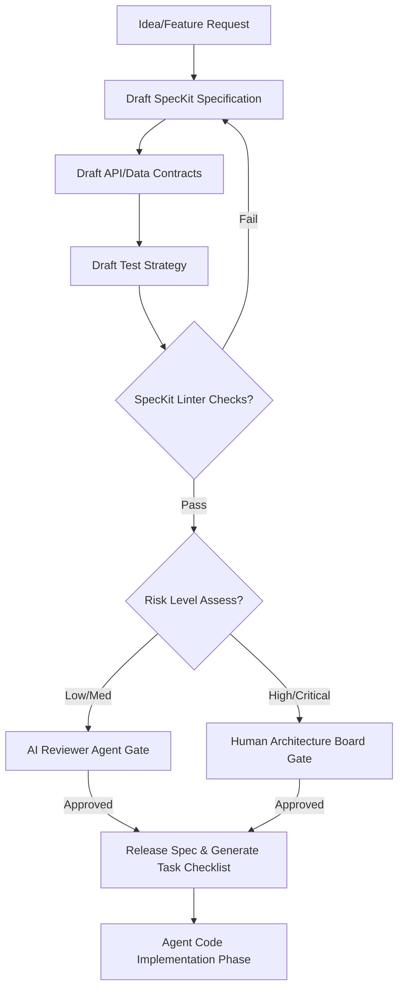

# AI-EOS Specification Governance System

This document outlines the Specification-Driven Development (SDD) governance layer powered by GitHub SpecKit. No development task (code write, edit, or refactor) may be executed without first ratifying the prerequisite specification, architecture, contract, and test strategy.

---

## 1. Governance Rules & Gatekeeping



---

## 2. Document Templates

### 2.1 Specification Template
Save at `/specs/[feature-id]-[feature-name]/spec.md`

```markdown
# Specification: [Feature Title]

---
**Spec ID:** [Unique ID]  
**Version:** v[Major].[Minor].[Patch]  
**Status:** [Draft / Under Review / Approved / Deprecated]  
**Author:** [Agent ID / Human Name]  
**Reviewers:** [Agent/Human IDs]  
**Ratification Date:** [YYYY-MM-DD]  
---

## 1. Business Objective
- **Problem Statement**: [What problem is this feature solving?]
- **Value Proposition**: [Why are we building this?]
- **Target Metrics**: [Which business metrics are expected to improve?]

## 2. Functional Requirements
- **FR-1**: [Detail FR 1]
- **FR-2**: [Detail FR 2]
- **FR-3**: [Detail FR 3]

## 3. Non-Functional Requirements
- **NFR-1 (Performance)**: [Latency, throughput targets]
- **NFR-2 (Scalability)**: [Volume limits, concurrent requests]
- **NFR-3 (Reliability)**: [Uptime targets, failure tolerances]

## 4. Acceptance Criteria
- **AC-1**: Given [Context], When [Action], Then [Expected Output].
- **AC-2**: Given [Context], When [Action], Then [Expected Output].

## 5. Data Contract
- **Schema Name**: [Name]
- **Fields**:
  | Field | Type | Required | Description | Constraints |
  | :--- | :--- | :--- | :--- | :--- |
  | `id` | UUID | Yes | Unique identifier | Version 4 UUID |

## 6. API Contract
- **Protocol**: [REST / GraphQL / gRPC]
- **Endpoints / Methods**:
  - `POST /api/v1/resource`
    - **Request Payload**:
      ```json
      { "field": "value" }
      ```
    - **Success Response (201 Created)**:
      ```json
      { "id": "uuid", "status": "active" }
      ```
    - **Error Responses**: `400 Bad Request`, `401 Unauthorized`.

## 7. Test Strategy
- **Unit Testing**: [Coverage goals, critical paths]
- **Integration Testing**: [Mock requirements, boundary cases]
- **E2E Testing**: [Playwright/Selenium test scenarios]
- **Chaos Testing**: [Simulated node/database failure parameters]

## 8. Monitoring & Observability Strategy
- **Key Metrics (SLIs)**: [Metric name, dashboard location]
- **Alert Conditions**: [Trigger conditions for on-call SREs]
- **Traces**: [Required transaction boundaries for distributed tracing]

## 9. Rollback Strategy
- **Trigger Condition**: [What failure criteria mandate rollback?]
- **Rollback Procedure**: [Step-by-step commands or automated triggers]
- **Data Cleanup**: [Pruning temporary tables/records generated during failure]
```

---

### 2.2 RFC (Request For Comments) Template
Save at `/docs/rfcs/[rfc-id]-[title].md`

```markdown
# RFC: [RFC Title]

---
**RFC ID:** [Unique ID]  
**Date:** [YYYY-MM-DD]  
**Author:** [Author]  
**Status:** [Proposed / In Discussion / Approved / Rejected]  
---

## 1. Summary
[A brief explanation of the proposed change.]

## 2. Motivation & Background
[Why is this change necessary? What problem are we addressing?]

## 3. Detailed Proposal
[Detailed description of the engineering change, design decisions, APIs, and changes to flow.]

## 4. Drawbacks & Alternatives
[What are the negative consequences? What alternative solutions were considered?]

## 5. Security & Privacy Implications
[Impact on Zero Trust policies, PII data handling, threat models.]

## 6. Open Questions
[Unresolved questions for the team.]
```

---

### 2.3 ADR (Architectural Decision Record) Template
Save at `/adrs/adr-[id]-[title].md`

```markdown
# ADR: [Decision Title]

---
**ADR ID:** [Unique ID]  
**Date:** [YYYY-MM-DD]  
**Author:** [Author]  
**Status:** [Proposed / Accepted / Deprecated / Superseded by ADR-X]  
---

## 1. Context & Problem Statement
[Describe the technical situation or problem we need to resolve.]

## 2. Decision Drivers
- [Driver 1]
- [Driver 2]

## 3. Considered Options
- **Option 1**: [Description, pros, cons]
- **Option 2**: [Description, pros, cons]

## 4. Decision Outcome
Chosen Option: **[Option Name]** because [Rationale].

### 4.1 Consequences
- **Positive**: [Impact]
- **Negative**: [Impact]
```

---

### 2.4 AI Review Template
Save at `/evals/ai_reviews/review-[spec-id]-[timestamp].md`

```markdown
# AI Review Report: [Spec/PR Target]

---
**Reviewer Agent:** [Agent ID]  
**Review Target:** [Spec ID / PR ID]  
**Audit Timestamp:** [ISO-8601 Timestamp]  
**Verdict:** [PASS / CONDITIONAL / FAIL]  
---

## 1. Compliance Audit

| Policy Check | Status | Findings |
| :--- | :--- | :--- |
| Specification Complete | [PASS/FAIL] | [Comment] |
| Zero Trust Compliance | [PASS/FAIL] | [Comment] |
| Contract Integrity | [PASS/FAIL] | [Comment] |
| Test Coverage Adequate | [PASS/FAIL] | [Comment] |
| No Hallucinations | [PASS/FAIL] | [Comment] |

## 2. Complexity & Risk Scan
- **Code Complexity Rating**: [Low / Medium / High]
- **Architectural Debt Introduced**: [Description]

## 3. Required Modifications
1. [Target Item] - [Instruction to resolve]
```

---

### 2.5 Architecture Review Template
Save at `/architecture/reviews/arch-review-[spec-id].md`

```markdown
# Architecture Review: [System/Component Name]

---
**Review Date:** [YYYY-MM-DD]  
**Lead Architect:** [Human/Agent ID]  
**Target Spec/Contract:** [Spec Link]  
**System Class:** [Monolithic Component / Microservice / Orchestrator]  
---

## 1. Component Boundaries
[Describe the input/output boundaries and verify no circular dependencies are introduced.]

## 2. Resource Utilisation Estimate
- **Estimated IOPS**: [Calculated storage impact]
- **Estimated Memory Footprint**: [Target allocation per container]
- **Network Traffic**: [Estimated payload sizes and frequency]

## 3. Single Point of Failure (SPOF) Analysis
- **Identified SPOFs**: [Item list]
- **Mitigation plan**: [Failover / redundancy plan]
```

---

### 2.6 Risk Assessment Template
Save at `/security/risk-assessments/risk-[spec-id].md`

```markdown
# Risk Assessment: [Feature Name]

---
**Date:** [YYYY-MM-DD]  
**Evaluator:** [Security Agent / Lead]  
**Risk Level:** [LOW / MEDIUM / HIGH / CRITICAL]  
---

## 1. Threat Scenarios

| Threat Agent | Threat Vector | Risk Level | Mitigation Control |
| :--- | :--- | :--- | :--- |
| External Attacker | Prompt Injection via Input Form | High | Strict Output Structuring & Context Delimiting |
| Malicious Agent | Unauthorized API calls | Critical | Context-Bounded Execution Token & IAM gates |

## 2. Data Risk Classification
- **PII Elements Accessed**: [List PII or state "None"]
- **Encryption in Transit**: [Enforced?]
- **Encryption at Rest**: [Enforced?]

## 3. External Dependencies Risk
- **Libraries/Packages added**: [List packages and vulnerability scan result]
```
