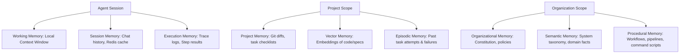

# AI-EOS Knowledge & Memory Architecture

This document defines the Open Knowledge Format (OKF) schema and the Multi-Tier Enterprise Memory Architecture for autonomous agents and engineering teams.

---

## 1. Knowledge Architecture (Open Knowledge Format)

All repository documentation, decisions, and operations reside in the `/knowledge` directory, structured using a markdown-native, agent-readable, and search-optimized format.

### 1.1 OKF Metadata Schema
Every knowledge artifact must start with a YAML frontmatter block validating the following schema:

```yaml
---
id: "KND-DOM-001"           # Format: KND-[Domain]-[NumericID]
title: "Title of Knowledge Node"
domain: "Business"          # One of the 12 domains listed below
owner: "architect-agent"    # User ID or Agent ID responsible
last_updated: "2026-06-17"  # ISO Date
status: "active"            # active | deprecated | draft
relations:                  # Array of linked files/nodes
  - "KND-ARCH-005"
  - "/specs/004-observability/spec.md"
tags:                       # Index keywords for vector chunking
  - "observability"
  - "clickhouse"
  - "events"
---
```

### 1.2 Knowledge Domains Matrix

| Domain | Scope & Contents | Ownership | Update Rule | Validation Gate |
| :--- | :--- | :--- | :--- | :--- |
| **Business** | High-level goals, monetization, customer profiles. | Human Sponsor | Quarter Review | Verify link to OKR sheets |
| **Product** | User personas, feature workflows, mapping rules. | Product Agent | Monthly Review | SpecKit linter pass |
| **Architecture** | System layouts, database topologies, interfaces. | Architect Agent | On ADR Merge | Mermaid rendering check |
| **Engineering** | Code standards, libraries, coding patterns. | Tech Lead | Weekly Review | Link checking script |
| **Security** | Threat scenarios, compliance controls, IAM rules. | Security Agent | Bi-weekly Audit | Security review tag check |
| **Operations** | Infrastructure setup, cloud billing, scaling. | SRE Agent | On Infra change | TFLint check |
| **Data** | Data dictionary, classifications, schemas. | Data Architect | On Contract modification | Schema registry validation |
| **Compliance** | SOC2, GDPR rules, audit criteria. | Compliance Lead | Annual Audit | Policy parsing validation |
| **Runbooks** | Emergency recover procedures, failover. | SRE Agent | Post Incident | Command execution dry-run |
| **Incidents** | Post-mortems, failure root cause logs. | SRE Agent | 48h post incident | RCA template validation |
| **Metrics** | SLOs, dashboards links, monitoring configs. | SRE Agent | On Dashboard edit | Metric schema matching |
| **Glossary** | Taxonomy, abbreviations, system terms. | Knowledge Lead | Ad-hoc | Duplicate entry validation |

### 1.3 Update, Validation, and Retrieval Rules
- **Update Rules**: Edits are handled through PRs. Agents can draft updates to operational metrics or incidents, but architecture and business updates require human approval.
- **Validation Rules**: Standard PR pipeline executes a validation script verifying:
  1. Valid YAML frontmatter.
  2. No dead file links in `relations` or body text.
  3. No raw PII in content text.
- **Retrieval Rules**: RAG pipeline splits OKF markdown files using recursive character parsing (chunk size 1000 tokens, overlap 150). Frontmatter is appended to every chunk to preserve global context. Search queries first run keyword matching against `tags`, followed by cosine similarity in the vector database.

---

## 2. Memory Architecture

Agents use nine distinct memory layers to manage state, historical context, and learned behaviors.



### 2.1 Memory Layer Configurations

| Memory Layer | Storage Strategy | Retention Policy | Expiration Rule | Retrieval Strategy | Access Control |
| :--- | :--- | :--- | :--- | :--- | :--- |
| **Working** | LLM Context Window (RAM) | Ephemeral (Session) | Erased on agent task completion | Direct payload injection | Agent Private |
| **Session** | Redis / local JSON | Task Duration | Pruned after 24h idle | Session Key lookup | Agent & Orchestrator |
| **Project** | Git Repository / `/specs` | Permanent | Active until project retirement | SpecKit parse index | Globally Readable |
| **Organizational**| Read-only System files | Permanent | Explicit constitutional amendment | Keyword mapping | Globally Readable |
| **Semantic** | Graph Database / Neo4j | Permanent | Dynamic consolidation | Vector search + Graph queries | Globally Readable |
| **Episodic** | Vector DB (e.g., Qdrant) | 90 Days | Auto-prune low-rated executions | Similarity match on error code | Read/Write for Orchestrator |
| **Procedural** | Files in `/scripts` & `/ci` | Permanent | Versioned in git | CLI directory index | Executable by Agent/CI |
| **Execution** | OpenTelemetry Trace Collector| 30 Days | Moved to cold storage | Trace ID query | Read-only for SRE & Audit |
| **Vector** | Vector DB (e.g., Chroma) | Synced to Git | Updated on Git commit hooks | Cosine similarity | Globally Readable |

### 2.2 Expiration and Validation Controls
- **Pruning**: Episodic memory logs are pruned if their success evaluation score is 1.0 (no errors occurred, simple task) to avoid vector DB pollution. Attempt failures (score < 0.5) are permanently retained to build negative-feedback loops.
- **Access Controls**: Agents operate within sandbox namespaces. No Agent (except the Security Agent) has write access to the Organizational Memory or Security Knowledge domain.
