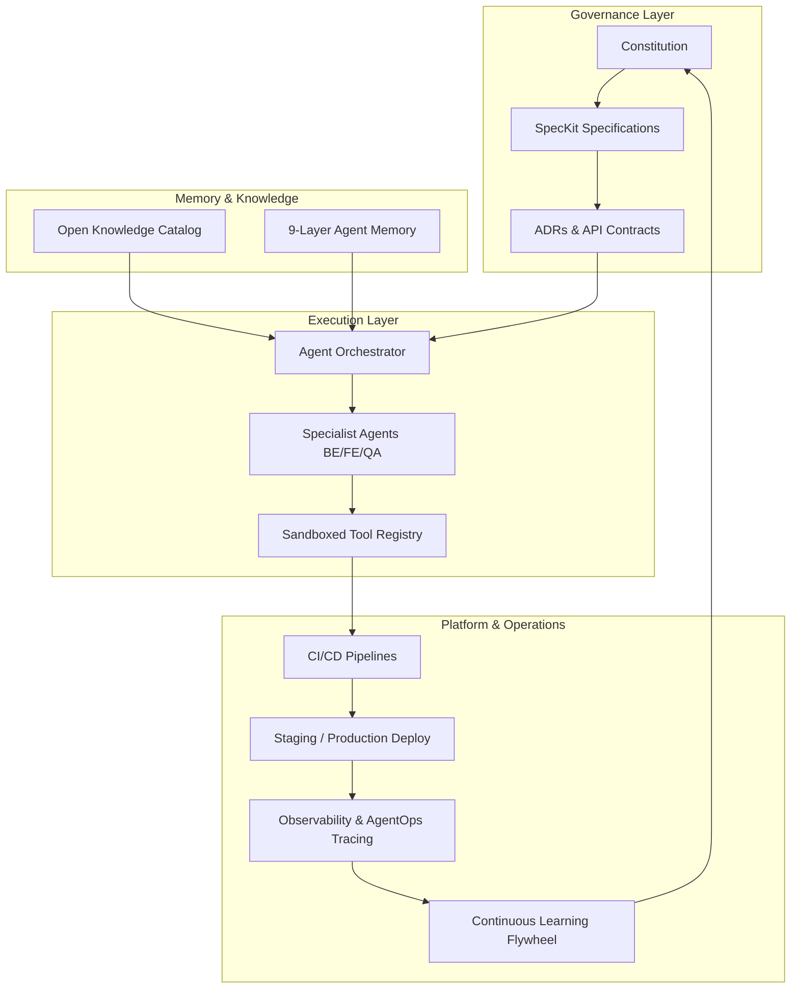

# AI-EOS Master Blueprint (Executive Summary)

Welcome to the **AI Engineering Operating System (AI-EOS)** specification. This repository houses the blueprint, rules, architectures, and templates that govern software engineering projects using specification-driven, agent-native, enterprise-grade engineering models.

---

## 1. System Components Directory

This directory maps the components of the AI-EOS. Click the links below to access the full specifications:

- **[AI-EOS Constitution](file:///c:/Users/rajaj/Projects/Fluxora_SocialMediaBlast/docs/ai-eos/constitution.md)**  
  *Phase 0 (Core Principles, Governance Authority, Escalation Protocol, and Source-of-Truth Hierarchy).*

- **[Repository Operating System](file:///c:/Users/rajaj/Projects/Fluxora_SocialMediaBlast/docs/ai-eos/repository_architecture.md)**  
  *Phase 1 (Purpose, Ownership, Lifecycle, and Validation rules for each of the 20 repository directories).*

- **[Specification Governance System](file:///c:/Users/rajaj/Projects/Fluxora_SocialMediaBlast/docs/ai-eos/governance_framework.md)**  
  *Phase 2 (SpecKit integration rules, and templates for Specifications, ADRs, RFCs, and Reviews).*

- **[Knowledge & Memory Architecture](file:///c:/Users/rajaj/Projects/Fluxora_SocialMediaBlast/docs/ai-eos/knowledge_and_memory.md)**  
  *Phase 3 & 3A (Open Knowledge Format schema, Domains matrix, RAG splits, and the 9-layer Memory hierarchy).*

- **[Agent Architecture & Orchestration](file:///c:/Users/rajaj/Projects/Fluxora_SocialMediaBlast/docs/ai-eos/agent_architecture.md)**  
  *Phase 4 & 4A (Profiles of the 10 core specialist agents, LangGraph/CrewAI collaboration diagrams, protocols, and deadlocks).*

- **[Prompting, Context & Tool Governance](file:///c:/Users/rajaj/Projects/Fluxora_SocialMediaBlast/docs/ai-eos/prompting_and_tools.md)**  
  *Phase 5, 6 & 6A (9-stage prompt pipeline, structured output, delimited context, and the Tool Registry / permissions).*

- **[Delivery, Quality Gates & Testing](file:///c:/Users/rajaj/Projects/Fluxora_SocialMediaBlast/docs/ai-eos/delivery_and_quality.md)**  
  *Phase 7, 8 & 9 (Strict SDLC execution stages, the 9 Quality Gates, and the Test & Evals framework).*

- **[CI/CD & Security Governance](file:///c:/Users/rajaj/Projects/Fluxora_SocialMediaBlast/docs/ai-eos/cicd_and_security.md)**  
  *Phase 10 & 11 (PR/Merge/Deploy pipelines, Threat modeling, Zero Trust authorization, and prompt injection controls).*

- **[Observability & AgentOps](file:///c:/Users/rajaj/Projects/Fluxora_SocialMediaBlast/docs/ai-eos/observability_and_agentops.md)**  
  *Phase 12 & 17 (Metrics, JSON logging format, tracing, SLOs, agent heartbeats, performance tracking, and drift detection).*

- **[Governance, Cost & Platform Engineering](file:///c:/Users/rajaj/Projects/Fluxora_SocialMediaBlast/docs/ai-eos/governance_cost_platform.md)**  
  *Phase 13-16, 18-20 (Zero-onboarding agent manifests, token/context budgets, model registries, data lineages, learning flywheels, and Golden Paths).*

- **[Implementation Roadmap](file:///c:/Users/rajaj/Projects/Fluxora_SocialMediaBlast/docs/ai-eos/roadmap.md)**  
  *Phase 20 (part) (Gantt chart timeline, milestones, and success metrics for the 30/60/90 day roll-out).*

---

## 2. Global Architectural Overview

---

## 3. High-Priority System Policies
1. **Never Skip Gates**: No code commits or configurations may bypass the 9 Quality Gates.
2. **Context Precedence Rules**: Specifications are the primary source of truth. Code or Slack chat context cannot override approved spec files.
3. **Strict Zero Trust**: Agents are sandboxed without access to host filesystems or external domains unless explicitly registered in `/platform/tools/registry.json`.
