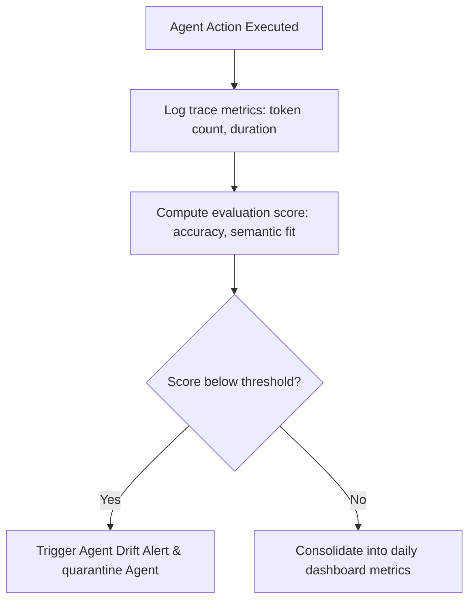

# AI-EOS Observability & AgentOps

This document outlines the System Observability design and defines the AgentOps Framework used to trace, audit, and evaluate autonomous agents.

---

## 1. System Observability

To maintain high availability and diagnose performance bottlenecks, AI-EOS implements OpenTelemetry-native telemetry across all layers.

### 1.1 Metrics, Logs & Traces
- **Metrics**: Standardized system metrics are scraped in Prometheus format:
  - System performance: CPU utilization, Memory usage, network I/O.
  - Database telemetry: Connection pool size, read/write latency, slow query count.
  - Queue telemetry: Kafka consumer lag, message publication rate.
- **Logs**: All logs are emitted as structured JSON to stdout, structured with standard fields:
  ```json
  {
    "timestamp": "2026-06-17T12:30:00.000Z",
    "level": "INFO",
    "service": "analytics-api",
    "traceId": "t123456789",
    "spanId": "s987654321",
    "workspaceId": "ws-corporate",
    "message": "Processed telemetry batch successfully",
    "duration_ms": 142
  }
  }
  ```
- **Traces**: Every user or agent action triggers a unique `traceId` which propagates across all service boundaries, Kafka brokers, and database operations.

### 1.2 SLOs, SLIs, and Error Budgets

| Service Domain | Service Level Indicator (SLI) | Service Level Objective (SLO) | Error Budget (Monthly) | Alert Action |
| :--- | :--- | :--- | :--- | :--- |
| **API Ingestion** | Latency of `POST /telemetry` | $\le 1500$ms for 99% of requests | $1\%$ of requests can exceed threshold | Trigger warning alert on Slack |
| **Analytics Query**| Latency of `GET /performance` | $\le 500$ms for 95% of queries | $5\%$ of queries can exceed threshold | Page SRE agent on duty |
| **Kafka Pipeline** | Consumer lag on telemetry queue | $\le 10,000$ messages lag | Lag exceeds limit for $> 10$ mins | Scale consumer replicas |
| **System Uptime** | Availability of public portal | $\ge 99.9\%$ uptime | $43.8$ minutes downtime | Trigger critical P0 incident page |

---

## 2. AgentOps Framework

AgentOps extends standard system observability to monitor LLM costs, agent health, and prompt output performance.



### 2.1 Agent Health & Reliability Metrics
- **Heartbeat Status**: Agents register a periodic heartbeat (every 30 seconds) in the Agent Registry. If an agent fails to ping twice, the Orchestrator marks it as `unhealthy` and spawns a replacement instance.
- **Runaway Loop Detection**: Monitor the number of sequential tool calls within a single task thread. If an agent makes $>10$ calls without resolving the state, it is terminated to prevent infinite loops.
- **Task Success Rate**: The percentage of assigned tasks that pass the Review Agent Quality Gate. Target: $\ge 90\%$.

### 2.2 Agent Observability & Tracing
- All LLM inputs, system prompts, retrieved context blocks, and raw model completions are structured as sub-spans under the primary execution trace.
- Traces register:
  - **Prompt Token Count**: Number of context tokens sent.
  - **Completion Token Count**: Number of output tokens received.
  - **Model Name**: The exact endpoint and version string used.
  - **Execution Time**: The wall-clock duration of the model invocation.

### 2.3 Agent Drift Detection
- **Task Latency Drift**: If an agent's average execution time for standard tasks increases by $>30\%$ over a rolling 7-day window, trigger a performance review.
- **Quality Score Drift**: Check the similarity score of output code against the "gold standard" templates. A drop of $>15\%$ in average evaluation ratings triggers a drift alert.
- **Behavior Drift**: Track the ratio of tool calls to task completions. If the ratio shifts significantly, it indicates prompt/model behavior changes.

### 2.4 Agent Auditing & Failure Analysis
- **Execution Log Audit**: All agent commits, file edits, and tool executions are compiled into `/memory/agent_audit.json`. This log provides immutable verification of what actions an agent performed.
- **Failure Root Cause Analysis (RCA)**: When an execution fails, the SRE Agent runs an automated analysis to classify the failure:
  - `MODEL_TIMEOUT`: Provider was unreachable.
  - `PROMPT_INJECTION`: Malicious payload blocked.
  - `SYNTAX_ERROR`: Code generated failed compilation.
  - `CONTEXT_LIMIT`: Input size exceeded model capabilities.
- **Performance Evaluation Matrix**: Performance cards are updated daily for each agent role, compiling success rates, token usage costs, execution times, and human feedback ratings.
