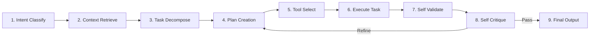

# AI-EOS Context, Prompting & Tool Governance

This document establishes the rules of precedence for system context, standardizes LLM prompt engineering pipelines, and enforces governance policies on tools executed by autonomous agents.

---

## 1. Context & Authority System

### 1.1 Precedence Priority Levels
When resolving contradictions or determining tasks, agents must evaluate context in this exact order:

1. **Business Objectives** (Defined in Project Constitution)
2. **Approved Specifications** (Located in `/specs/`)
3. **Architectural Decision Records (ADRs)** (Located in `/adrs/`)
4. **Contracts (APIs, Schemas, Events)** (Located in `/contracts/`)
5. **Knowledge Base (OKF)** (Located in `/knowledge/`)
6. **Active Source Code** (Located in `/apps/` or `/src/`)
7. **Generated Build & Test Artifacts**
8. **Conversations** (PR reviews, chat logs, user queries)

### 1.2 Conflict Resolution Procedures
If an agent detects a discrepancy between two context sources:
- **Rule 1 (Highest Precedence Wins)**: If the conflict is between an Approved Specification and Active Source Code, the agent must treat the Specification as correct.
- **Rule 2 (Log and Halt)**: If a conflict arises between two sources at the same priority level, the agent must halt execution, generate a conflict log highlighting the discrepant lines/nodes, and alert the Orchestrator.
- **Rule 3 (No Auto-Overrides)**: Under no circumstances may an agent modify or overwrite a higher-priority file (e.g., a spec) based on findings in a lower-priority file (e.g., code comments or test outputs).

---

## 2. Prompt Engineering Standard

All agents must follow a unified prompt pipeline and abide by formatting standards to ensure deterministic outputs.

### 2.1 The Mandatory 9-Stage Prompt Pipeline

1. **Intent Classification**: Identify the type of task (e.g., Code write, test audit, spec review, bug fix).
2. **Context Retrieval**: Run RAG/Keyword queries on the OKF knowledge base and fetch relevant workspace files.
3. **Task Decomposition**: Split complex objectives into atomic sub-tasks.
4. **Planning**: Construct a dependency-ordered execution plan.
5. **Tool Selection**: Determine which registry tools (file read, command execution, API calls) are required.
6. **Execution**: Run the tool calls and compile intermediate results.
7. **Self-Validation**: Test findings against the feature acceptance criteria (AC) and test suites.
8. **Self-Critique**: Evaluate outputs for code quality, formatting, security policy alignment, and compliance. If issues are found, return to Phase 4 (Planning) to refine.
9. **Finalization**: Package outputs in the specified format with complete citations.

### 2.2 Formatting Requirements
- **Role Prompting**: Every agent prompt must begin with a system role block defining domain, constraints, and authority boundaries (e.g., `You are acting as the QA Agent...`).
- **Structured Outputs**: All API responses and agent handoffs must use strict JSON Schema structures.
- **Delimited Context**: Reference materials and code snippets must be wrapped in XML-style tags with clean identifiers (e.g., `<SOURCE_CODE path="/src/app.ts">...</SOURCE_CODE>`).
- **Retrieval-Augmented Reasoning**: Prompt templates must enforce a thoughts-generation step (e.g., `<thought>` tag processing) before emitting answers.
- **Citation Requirements**: Every factual statement, class reference, or code modification must cite its source (e.g., "Modified method X to support feature Y, as defined in [spec.md:L45]").

### 2.3 Prohibited Practices
- **No Unverified Assumptions**: If a parameter or constraint is missing, the agent must ask the Orchestrator/User, not guess.
- **No Spec/Contract Violations**: Do not write code or tests that bypass approved specifications or contract parameters.
- **No Hallucinated References**: Never cite non-existent files, libraries, or functions.

---

## 3. Tool Governance

All tools (compilers, file operations, web scrapers, command runners) must be registered and controlled.

### 3.1 Tool Registry Model

| Tool ID | Purpose | Risks Class | Permission Scope | Approved Agents | Sandbox Constraint | Audit Level |
| :--- | :--- | :--- | :--- | :--- | :--- | :--- |
| **`read_file`** | Reads file content | LOW | Read-only | All Agents | Workspace Directory | Minimal |
| **`write_file`**| Creates/edits files | MEDIUM | Read/Write | Dev, QA, Doc, SRE | Workspace Directory | High |
| **`run_cmd`** | Runs terminal commands| HIGH | Shell Execute | Dev, QA, SRE | Containerized Sandbox | Critical |
| **`http_req`** | Fetches external URLs| MEDIUM | Network Out | SRE, Doc, Security | Whitelisted domains | High |

### 3.2 Sandbox & Execution Rules
- **Container Isolation**: Critical and High-risk tools (e.g., `run_cmd` compiling code or running tests) must execute within a temporary, isolated Docker container or sandboxed VM.
- **Network Restrictions**: Agents cannot access the public internet unless executing whitelisted URLs (e.g., package registry for auditing, API endpoints specified in the integration config).
- **Access Tokens**: Tools run using short-lived OAuth tokens tied to the specific Agent executing the task.

### 3.3 Tool Approval, Revocation, and Monitoring
- **Approval Process**: Adding a new tool to `/tools/` requires an ADR and a Security Agent review.
- **Revocation Protocol**: If an agent executes a tool that triggers a security violation (e.g., attempting to read a path outside the workspace), the security controller instantly revokes the agent's execution token and terminates the container.
- **Monitoring**: All tool invocations are logged as structured JSON traces in `/memory/execution_traces.jsonl` recording: `agent_id`, `tool_name`, `arguments`, `exit_code`, and `data_size`.
