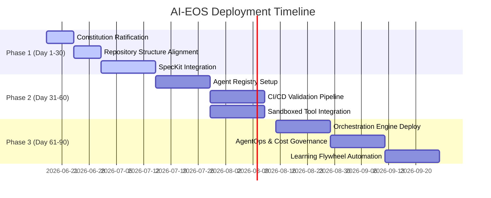

# AI-EOS 30/60/90 Day Implementation Roadmap

This document outlines the phased roll-out plan for adopting the AI Engineering Operating System (AI-EOS) within an enterprise organization.

---

## 1. Roadmap Overview

---

## 2. Phase 1: Days 1–30 (Foundation & Governance Setup)

**Objective:** Establish the governance constitution, repository directory structure, and initialize the SpecKit-based development loops.

### 2.1 Key Deliverables
- **Day 1–7 (Constitution & Taxonomy)**: Ratify the Project Constitution and align team naming taxonomies. Add the metadata schema validation script to pre-commit hooks.
- **Day 8–15 (Repository Operating System Alignment)**: Initialize the 20 folders specified in the Repository Architecture. Move existing code under `/apps/` or `/src/` and verify that no files are orphaned.
- **Day 16–30 (SpecKit Governance Integration)**: Deploy the SpecKit command-line validation tools. Author templates for Specifications, ADRs, and RFCs. Enforce the rule that no code changes can be merged without an approved SpecKit file in `/specs`.

### 2.2 Success Metrics
- 100% of new features have matching Approved Specifications.
- Zero markdown syntax or link compilation errors in the `/knowledge` folder.
- Pre-commit hooks block raw secrets or invalid frontmatter from entering Git.

---

## 3. Phase 2: Days 31–60 (Agent Registry & Security Sandboxing)

**Objective:** Configure individual specialist agent profiles, prompt registries, sandboxed tools, and integrate them into basic CI verification.

### 3.1 Key Deliverables
- **Day 31–45 (Agent Registry & Manifests)**: Create the agent registry file `/agents/registry.json`. Author the system prompts, capabilities, and token budgets for the 10 specialist agents.
- **Day 46–60 (Sandboxed Tool Integrations & CI Checks)**: Set up the containerized command execution sandboxes for agents. Integrate the PR Validation pipeline into GitHub Actions, checking Spec/Contract matching and running dependency scans.

### 3.2 Success Metrics
- 100% of agent execution commands run inside sandboxed Docker containers.
- 0 exposed API keys or credentials in PR logs.
- PR validation pipeline executes and runs automated security scans on every commit.

---

## 4. Phase 3: Days 61–90 (Multi-Agent Orchestration & Learning Flywheel)

**Objective:** Enable full multi-agent orchestration, deploy cost/drift dashboards, and automate the continuous learning flywheel.

### 4.1 Key Deliverables
- **Day 61–75 (Orchestration Engine)**: Deploy the LangGraph/CrewAI-style orchestrator DAGs to coordinate agent handoffs. Enable agent-to-agent protocols using Model Context Protocol (MCP).
- **Day 76–85 (AgentOps & Cost Management)**: Connect execution traces to OpenTelemetry collectors. Configure real-time dashboards to audit token costs and monitor prompt drift.
- **Day 86–90 (Continuous Learning Flywheel)**: Launch the automated feedback loops, saving execution failures and incorporating post-mortem RCAs into the agent few-shot prompts.

### 4.2 Success Metrics
- Multi-agent handoffs run autonomously from specification approval to test report generation.
- Real-time token usage costs are visible and mapped to individual features/projects.
- Agent task success rate achieves $\ge 90\%$.
- New agents self-onboard and execute tasks using only `/ai-eos-manifest.json` and the `/knowledge` index with zero human direction.
