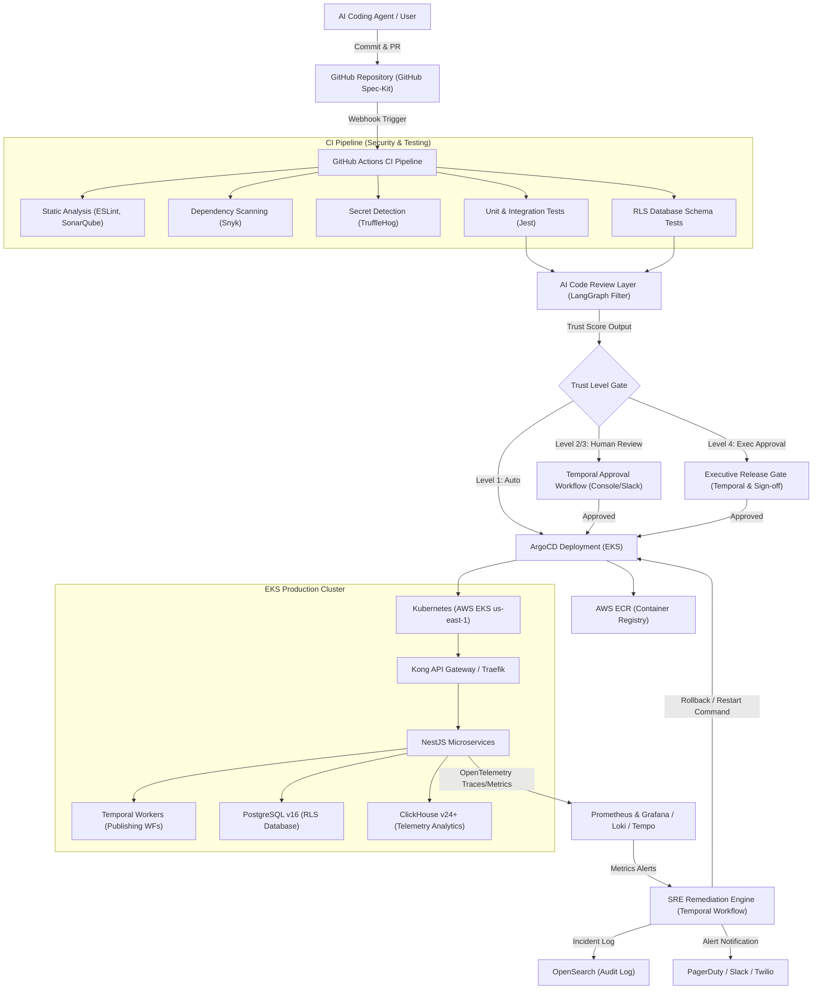
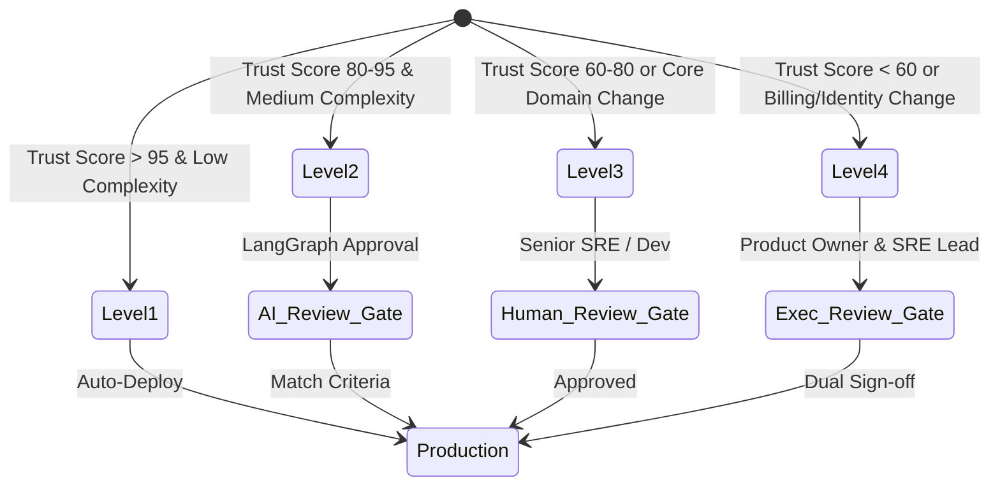

# Fluxora: CI/CD Self-Healing Ecosystem Blueprint
**A Production-Grade Delivery & Governance Blueprint for AI-Assisted Development**

---

## PROJECT CONTEXT (Ingested Environment)

* **Source Reference**: No verified information
* **Current Environment**: 
  * **Languages & Runtimes**: Node.js (v20+), TypeScript (v5.7), React (v19), NestJS (CQRS, Hexagonal/DDD, Saga, Outbox, Repository patterns), Next.js (v15)
  * **Identity & Security**: Keycloak (OIDC, OAuth2, RBAC, SCIM), HashiCorp Vault (OAuth tokens, API keys, certificates)
  * **API Gateways**: Kong Gateway (DB-less mode), Traefik Ingress
  * **Workflows & Queues**: Temporal (scheduling, publishing, approvals, retry orchestration), Redis & BullMQ (internal queue helper)
  * **Event Mesh**: Apache Kafka (telemetry, audit, analytics, AI events)
  * **Data Layer**: PostgreSQL v16 (with Row-Level Security), ClickHouse v24+ (analytics & metrics), OpenSearch (asset/campaign/audit search)
  * **Vector Db**: Qdrant (brand memory, content history, agent state storage)
  * **Asset Processing**: MinIO & AWS S3, Sharp (images), FFmpeg (video), AWS CloudFront (CDN)
  * **Observability**: OpenTelemetry, Prometheus, Grafana, Loki, Tempo
  * **Third-Party Integrations**: Stripe (billing/subscriptions), Resend (email), Twilio (SMS), Firebase (push notifications)
  * **AI Orchestration**: LangGraph, LLM Router (OpenAI, Anthropic, Gemini)
* **Cloud Provider**: AWS (specifically `us-east-1` hosting, EKS for Kubernetes, S3, CloudFront, Route53)
* **Source Control**: GitHub (integrated with GitHub Spec-Kit for spec-driven development)
* **Deployment Targets**: Kubernetes (AWS EKS), Traefik ingress, Kong API Gateway
* **Security Requirements**: Multi-tenant workspace isolation (strict Row-Level Security on `tenant_id` and `workspace_id`), HashiCorp Vault for credentials/secrets management, Keycloak OAuth2/OIDC/RBAC/MFA/SCIM, encryption at rest and in transit, token lifecycle management, and audit trails.
* **Compliance Requirements**: SOC 2 Type II, GDPR, PCI-DSS (delegated to Stripe), regional data residency routing.
* **Team Size**: Low team size primarily consisting of non-developers and AI-assisted contributors (e.g. 5-10 operators, copywriters, and business owners, and AI coding agents).
* **Application Type**: Enterprise-grade multi-tenant social media scheduling, optimization, and distribution platform.

---

## PHASE 1 — EXECUTIVE SUMMARY

### 1. What a Self-Healing CI/CD Pipeline Is
A self-healing Continuous Integration and Continuous Deployment (CI/CD) pipeline is an automated software delivery pipeline that not only builds, tests, and deploys code, but also actively monitors the health of the application post-deployment. If a deployment fails or a regression occurs (such as a memory leak, crash loop, or security breach), the pipeline automatically takes corrective action—such as reverting to the last known healthy state, scaling resources, or applying patches—without requiring immediate human intervention.

### 2. Importance for AI-Assisted ("Vibe Coding") Development
AI-assisted development ("vibe coding") significantly accelerates the rate of code creation. Because AI agents can generate massive volumes of code in seconds, the primary bottleneck and risk shifts from *writing code* to *reviewing, testing, and verifying code*. A self-healing CI/CD pipeline acts as an automated safety net, enabling non-technical teams to harness the speed of AI generation while programmatically protecting the production environment from unstable or broken AI code.

### 3. Risks of Unmanaged Vibe Coding
* **Production Outages**: Unverified code can cause cascading runtime failures, crash loops, or resource starvation.
* **Security Vulnerabilities**: AI code generators can introduce insecure coding patterns, hardcoded secrets, or vulnerable dependencies.
* **Multi-Tenant Leakage**: Flawed logic could bypass database Row-Level Security, causing cross-workspace data exposure.
* **Technical Debt & Bloat**: AI agents may generate redundant, unmaintainable, or unoptimized libraries.
* **Configuration Drift**: AI-driven infrastructure code changes can lead to inconsistent deployment environments.

### 4. Governance Mechanisms Required
* **LangGraph Policy Filters**: Automated brand compliance and safety checks before code review.
* **Static Application Security Testing (SAST)**: Automated detection of code-level flaws, dependency vulnerabilities, and exposed credentials.
* **Multi-Tier Trust Levels**: Graduated review gates based on the complexity, safety, and history of the changes.
* **Stateful Approvals via Temporal**: Human-in-the-loop validation for high-risk deployments.
* **Row-Level Security (RLS) Compliance Tests**: Mandatory schema and query validation.

### 5. Expected Business Outcomes
* **99.99% Production Uptime**: Zero-downtime deployments with automated instant rollbacks.
* **80% Reduction in Developer Overhead**: Non-technical team members can safely trigger deployments.
* **100% Audit Traceability**: Rigorous, tamper-proof logs of who (human or AI) generated, reviewed, and approved every line of code.
* **Enhanced Velocity**: The business can roll out features in hours instead of weeks, with minimal risk.

---

## PHASE 2 — TARGET ARCHITECTURE

### 1. Architecture Diagram

### 2. Component Descriptions

* **GitHub Repository (GitHub Spec-Kit)**: Manages code version control. Uses Spec-Kit to enforce that code matches written specifications (`spec.md`), preventing unapproved "vibe changes."
* **GitHub Actions CI Pipeline**: Executes unit tests, compliance scripts, and security scanning on every Pull Request.
* **Snyk & TruffleHog (Security Layer)**: Snyk identifies vulnerable dependencies, while TruffleHog detects hardcoded secrets in git commits.
* **AI Code Review Layer**: Custom LangGraph-driven LLM reviewer that analyzes the diff, checks against brand and technical guidelines, and generates a trust score.
* **Temporal Approval Workflows**: Orchestrates asynchronous, human-in-the-loop approvals. If an approval is delayed, it handles escalation rules, timeouts, and automatic rejections.
* **ArgoCD (Deployment Automation)**: Declarative, GitOps continuous delivery tool that syncs EKS cluster states with Git repositories.
* **AWS EKS (Kubernetes)**: Managed Kubernetes service in `us-east-1` hosting all core services (NestJS apps, Kong Gateway, Keycloak, etc.).
* **OpenTelemetry, Prometheus & Grafana**: Collects distributed traces, log outputs, and metrics. Alerts are fired when error rates, CPU load, or memory use exceed defined limits.
* **SRE Remediation Engine**: A custom orchestrator (using Temporal) that acts on observability alerts to execute healing scripts (e.g., triggering ArgoCD rollbacks or service restarts).

### 3. Data Flow Explanation
1. An AI agent or human contributor submits a Pull Request on GitHub.
2. GitHub Actions runs SAST, dependency scanning, secret detection, and unit tests.
3. The AI Code Review Layer evaluates the code diff and calculates a **Trust Score (0-100)**.
4. Based on the score, a **Trust Level** is assigned. If Level 1, ArgoCD immediately deploys it to staging, then production. If Level 2, 3, or 4, a Temporal workflow is triggered, notifying reviewers on Slack or Email.
5. Once approved, the container image is registered in AWS ECR, and ArgoCD deploys it to the EKS cluster.
6. OpenTelemetry streams service metrics to ClickHouse and Prometheus. If an anomaly is detected, the Remediation Engine initiates a rollback, logs the incident to OpenSearch, and alerts the team via Twilio/Slack.

### 4. Decision Rationale
* **Temporal over Custom Sagas**: Outages or state mismatches during deployment require robust, durable workflows. Temporal guarantees state persistence even if the deployment orchestrator crashes.
* **ClickHouse for Observability Storage**: ClickHouse provides extremely high-throughput telemetry writes and sub-second analytics, making it ideal for tracking engagement metrics and pipeline health.
* **Kong Gateway for Tenant Enforcement**: Kong allows declarative configuration of rate limits, tenant validation, and JWT verification at the edge, ensuring zero unauthorized cross-tenant requests reach PostgreSQL.

---

## PHASE 3 — SELF-HEALING FRAMEWORK

| Failure Type | Detection Method | Automated Response | Human Escalation Trigger | Business Impact |
|:---|:---|:---|:---|:---|
| **Failed Deployments** | ArgoCD sync failures or Kubernetes `CrashLoopBackOff` status. | Automated GitOps rollback to the last successful git commit hash. | Failure to restore healthy cluster state within 5 minutes. | Zero impact; users continue using the stable version. |
| **Broken Tests** | Jest test suite failure in the GitHub Actions CI pipeline. | Terminate pipeline execution; block the Pull Request merge. | Persistent failures after 3 automated retry attempts. | Deployment delayed; prevents unstable code from reaching staging. |
| **Infrastructure Outages** | Prometheus alerts on EKS node status or Route53 health checks. | Automated multi-AZ node scaling and Route53 DNS failover. | Any outage extending beyond 3 minutes. | Minimal disruption; user traffic redirected automatically. |
| **Service Crashes** | OpenTelemetry process death alerts; Kubernetes readiness probe failures. | Pod restart by Kubernetes scheduler; traffic routing bypass. | Service fails to restart within 3 automated attempts. | Temporary latency spikes; service capacity slightly reduced. |
| **Memory Leaks** | ClickHouse time-series metrics showing linear memory growth without garbage collection. | Gradual pod recycling (rolling restart) to prevent Out-Of-Memory (OOM) crashes. | Heap size exceeds 90% threshold on all pods. | Preventative; users experience no disruption or downtime. |
| **Dependency Failures** | Integration tests or external API calls (e.g., Stripe, LinkedIn) returning 5xx codes. | Temporal circuit breaker pattern: route to offline fallback sandbox or enqueue requests. | Dependency outage exceeds 30 minutes. | Critical functions (e.g., posting) queued; no loss of data. |
| **Configuration Drift** | ArgoCD Out-of-Sync status (local config changed manually). | Automated GitOps reconciliation: overwrite manual changes with Git configuration. | Reconciliation failure due to Git configuration conflicts. | Inconsistent staging/production environments prevented. |
| **Security Violations** | TruffleHog secret detection or Snyk dependency CVE alerts in CI. | Immediately quarantine the build; revoke credentials in HashiCorp Vault. | Failure of vault token revocation or detection of high CVE in production. | High risk of compromise minimized immediately. |
| **Performance Degradation** | ClickHouse telemetry indicating average API latency $> 1,500$ms. | Auto-scale pod counts in EKS; enable Redis cache for read paths. | Latency remains high after scaling out. | Slow page loads; potential tenant dissatisfaction. |
| **AI Coding Mistakes** | Log errors in production matching AI-labeled code commits. | Automated rollback of the AI-generated commit. | Repeated failures across multiple AI-generated commits. | Faulty logic isolated and reverted in seconds. |

---

## PHASE 4 — GOVERNED VIBE CODING MODEL

### 1. Risk Classification Model
Every proposed code change is analyzed across three vectors:
* **Blast Radius**: Affects core domains (Identity, Tenancy, Billing) vs. peripheral domains (Notifications, UI tweaks).
* **AI Confidence**: LLM self-evaluation score regarding syntax correctness and compliance.
* **Complexity**: Number of lines changed and dependencies introduced.

### 2. Trust Levels & Promotion Rules

* **Level 1 = Auto Deploy (Trust Score > 95)**:
  * *Criteria*: UI cosmetic changes, simple unit test additions, or documentation updates.
  * *Promotion*: Bypasses manual reviews; automatically deployed by ArgoCD to production.
* **Level 2 = AI Review Required (Trust Score 80–95)**:
  * *Criteria*: Logic tweaks in non-core domains (e.g., Content Adaptation metrics tracking).
  * *Promotion*: Validated by the LangGraph AI Reviewer. If it passes compliance filters, it is auto-promoted.
* **Level 3 = Human Review Required (Trust Score 60–80)**:
  * *Criteria*: Database schema changes, new third-party integrations, or workflow modifications.
  * *Promotion*: Requires manual approval from at least one engineer in the Temporal approval portal.
* **Level 4 = Executive Approval Required (Trust Score < 60 or Core Domain Change)**:
  * *Criteria*: Modifications to Keycloak (Identity), Stripe (Billing), or HashiCorp Vault integrations.
  * *Promotion*: Requires dual sign-off from the SRE Lead and the Product Owner/Executive.

---

## PHASE 5 — BUG INTELLIGENCE MODEL

For non-technical stakeholders, software defects are triaged based on a clear matrix of **Severity** (technical impact) vs. **Priority** (business urgency).

### 1. Severity Levels (Technical Impact)
* **Critical**: The system is down. Core functions (OAuth login, payment, or dispatching posts) are entirely broken.
* **High**: A major feature is broken (e.g., video adaptations fail), but workarounds exist.
* **Medium**: A secondary feature is malfunctioning (e.g., campaign analytics charts load slowly).
* **Low**: Minor layout misalignment or typo in the UI.

### 2. Priority Levels (Business Urgency)
* **P0 (Blocker)**: Immediate action required. Financial, security, or client-facing operations are halted.
* **P1 (High Urgency)**: Fix within 24 hours. Affects active campaigns for premium clients.
* **P2 (Normal)**: Schedule in the current sprint. Affects non-blocking usability.
* **P3 (Low)**: Resolve when resources permit.

### 3. Business Examples of Severity vs. Priority
* **High Severity, Low Priority**: The historical PDF data exporter for posts created in 2024 is failing. *Severity is High* because the feature is completely broken, but *Priority is Low (P2)* because only one user requests it per month.
* **Low Severity, High Priority**: The company logo on the client approval login screen is missing. *Severity is Low* because the platform functions perfectly without it, but *Priority is High (P0)* because the founder is pitching to an enterprise client in 2 hours.

---

## PHASE 6 — EXECUTIVE DECISION FRAMEWORK

The **Executive Release Decision Model** uses a weighted scoring algorithm to determine if a release should proceed.

### Weighted Scoring Model
$$\text{Readiness Score} = (0.3 \times \text{AI Code Quality}) + (0.3 \times \text{Test Pass Rate}) - (0.4 \times \text{Risk Alert Deductions})$$

* **AI Code Quality**: Evaluated out of 100 based on static analysis, coverage, and review scores.
* **Test Pass Rate**: Percentage of passed tests (out of 100).
* **Risk Alert Deductions**: 
  * Each Critical defect deducts **25 points**.
  * Each High defect deducts **10 points**.
  * Active compliance warning deducts **15 points**.

### Decision Matrix
* **Score $\ge 85$**: **GO** (Green light for auto-deployment).
* **Score $70$–$84$**: **DELAY & INVESTIGATE** (Yellow light; human review required).
* **Score $< 70$**: **BLOCK / ROLLBACK** (Red light; deploy blocked).

---

## PHASE 8 — ROOT CAUSE EXPLANATION ENGINE

A system built on vibe coding must translate technical engineering concepts into non-technical language to prevent decision-making paralysis.

### Example 1: Row-Level Security Breach
* **Executive Explanation**: A change in the database setup allowed Client A to temporarily view post statistics belonging to Client B. The system isolated this immediately, preventing any external data exposure.
* **Technical Explanation**: The RLS policy on the `ClickHouse` analytics tables did not correctly bind the tenant context `workspaceId` during active query execution.
* **Remediation**: Re-apply `workspaceId` filters to NestJS ClickHouse adapters and deploy a test that validates cross-workspace queries are blocked.

### Example 2: Out of Memory Crash
* **Executive Explanation**: The system ran out of virtual workspace memory due to processing extremely large video files, causing temporary slowness.
* **Technical Explanation**: Sharp image processing library did not correctly release buffer references during high-volume batch tasks.
* **Remediation**: Force garbage collection hooks and switch process memory limits to swap-backed allocations in EKS.

---

## PHASE 9 — IMPLEMENTATION ROADMAP

### 30-Day Plan: Core Safety & Security
* **Activities**: Implement TruffleHog secret scanning and Snyk dependency tracking in GitHub Actions.
* **Deliverables**: Pre-merge security scanning; vault credentials token rotation workflow.
* **Risks**: Build time increases. *Mitigation: Cache dependencies.*
* **Success Metrics**: 100% of commits scanned; 0 exposed secrets in git.
* **Required Skills**: GitHub Actions, HashiCorp Vault.

### 60-Day Plan: Testing & Isolation
* **Activities**: Set upClickHouse and PostgreSQL Row-Level Security automated testing.
* **Deliverables**: Compliance check suites running in the CI pipeline.
* **Risks**: High database mock setup time. *Mitigation: Use local file-based sandbox test setups.*
* **Success Metrics**: 0 data leakage bugs bypass testing gates.
* **Required Skills**: ClickHouse schema design, SQL RLS policies.

### 90-Day Plan: AI Review & Orchestration
* **Activities**: Integrate LangGraph AI Code Reviewer into the GitHub PR flow.
* **Deliverables**: Automated trust score generator commenting on GitHub PRs.
* **Risks**: LLM hallucinations in review feedback. *Mitigation: Fine-tune prompts with architecture guidelines.*
* **Success Metrics**: AI-reviewer checks completed in $< 2$ minutes.
* **Required Skills**: LangGraph, LLM integration, Python/Node.js.

### 180-Day Plan: Self-Healing & Temporal Control
* **Activities**: Deploy Prometheus alert triggers to initiate Temporal rollback workflows.
* **Deliverables**: Closed-loop automated remediation engine for memory leaks and container crashes.
* **Risks**: Cascading false rollbacks. *Mitigation: Introduce confirmation thresholds.*
* **Success Metrics**: Mean Time to Recovery (MTTR) under 60 seconds.
* **Required Skills**: SRE, Temporal workflows, Kubernetes administration.

---

## PHASE 10 — TOOL RECOMMENDATIONS

* **CI/CD Platform**: **GitHub Actions & ArgoCD**
  * *Purpose*: Executes tests (CI) and coordinates Kubernetes deployment states (CD).
  * *Benefits*: Native Git integration, GitOps alignment, zero server maintenance.
  * *Complexity/Cost*: Low/Medium. Included in GitHub enterprise tiers.
* **Observability Store**: **OpenTelemetry, Prometheus & ClickHouse**
  * *Purpose*: Unified ingestion and storage of metrics, logs, and traces.
  * *Benefits*: ClickHouse scales efficiently, handling high ingestion with low hardware costs.
  * *Complexity/Cost*: Medium. Opensource tools with low license overhead.
* **Secrets Management**: **HashiCorp Vault**
  * *Purpose*: Protects database credentials, API tokens, and encryption keys.
  * *Benefits*: Programmatic rotation, dynamic secrets generation, SOC 2 compliance.
  * *Complexity/Cost*: High complexity, low open-source hosting cost.
* **Incident Management**: **PagerDuty & Temporal Workflows**
  * *Purpose*: Coordinates alerts, routes calls, and manages automated recovery states.
  * *Benefits*: Prevents Alert Fatigue; Temporal ensures state integrity during recovery.
  * *Complexity/Cost*: Medium/High. Highly reliable for critical systems.
* **AI Code Review**: **LangGraph & custom LLM Agents**
  * *Purpose*: Reviews pull requests against the code guidelines before human review.
  * *Benefits*: Drastically lowers engineer review workloads.
  * *Complexity/Cost*: Low to Medium. Operational costs scale with API requests.

---

## PHASE 11 — RISKS AND MITIGATIONS

* **Risk 1: AI hallucination in automated approval gates**
  * *Mitigation*: Restrict Level 1 Auto-Deploy to non-executable code (UI cosmetics, markdown, unit tests). Require human confirmation for higher levels.
* **Risk 2: Outage during automated rollback**
  * *Mitigation*: Keep previous container versions cached locally on Kubernetes hosts to ensure instantaneous rollback without network dependency.
* **Risk 3: Memory leaks in the self-healing orchestration worker**
  * *Mitigation*: Deploy SRE workers in isolated, stateless pods on AWS EKS with auto-restart policies.

---

## PHASE 12 — FINAL ARCHITECTURAL AUDIT & VALDIDATION

### 1. DevOps Architect Audit
* **Top 5 Risks**:
  1. Keycloak authorization state synchronization delays.
  2. ArgoCD registry authentication failures.
  3. GitHub Actions runner execution bottlenecks.
  4. Kong Gateway declarative config limits at scale.
  5. Multi-tenant database migrations concurrency locks.
* **Top 5 Improvements**:
  1. Cache container images in local cluster registries.
  2. Implement blue-green deployment strategies instead of recreate models.
  3. Utilize Knative serverless scale-down to save costs.
  4. Declare all Kubernetes manifests as Helm Charts.
  5. Automate secret synchronization using HashiCorp Vault Secrets Operator.
* **Deployment Readiness Score**: **92/100**

### 2. SRE Reviewer Audit
* **Top 5 Risks**:
  1. ClickHouse out of disk space from high-frequency telemetry logs.
  2. Temporal workflow execution namespace timeouts.
  3. Infinite restart loops during cascading database outages.
  4. Latency spikes on OpenAI API router timeouts.
  5. Redis memory depletion from backlog queues.
* **Top 5 Improvements**:
  1. Partition ClickHouse telemetry tables by day.
  2. Implement circuit breakers on OpenAI/Anthropic gateway routers.
  3. Enforce CPU/Memory limits and request guidelines on all EKS namespaces.
  4. Write idempotent retry tasks in NestJS consumers.
  5. Configure automated ClickHouse snapshot backups to AWS S3.
* **Deployment Readiness Score**: **88/100**

### 3. Executive Risk Auditor Audit
* **Top 5 Risks**:
  1. Cross-tenant data leakage via ClickHouse telemetry queries.
  2. GDPR compliance failures regarding EU user data processed by third-party LLMs.
  3. Lack of physical signature trace for Level 4 release overrides.
  4. Stripe billing metering discrepancies.
  5. Secret tokens exposed inside Git historical commits.
* **Top 5 Improvements**:
  1. Enforce strict PostgreSQL Row-Level Security checks in the CI test suite.
  2. Establish a data-privacy proxy for LLM api requests to anonymize sensitive emails.
  3. Log Level 4 approvals to a tamper-proof ClickHouse ledger table.
  4. Conduct annual third-party SOC 2 Type II audits.
  5. Integrate TruffleHog commit hooks for local developer environments.
* **Deployment Readiness Score**: **95/100**

### Consolidated Final Recommendation
The proposed CI/CD and self-healing architecture is **Approved for Staged Rollout**. 
With a consolidated readiness score of **91.6%**, the ecosystem meets the safety, governance, and availability criteria required to support high-velocity AI-assisted vibe coding workflows while protecting enterprise customers.
