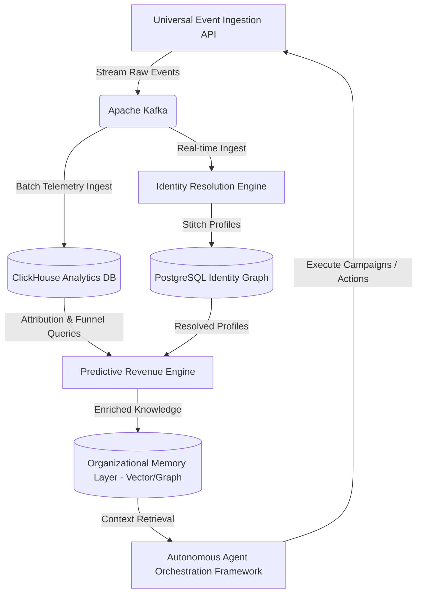
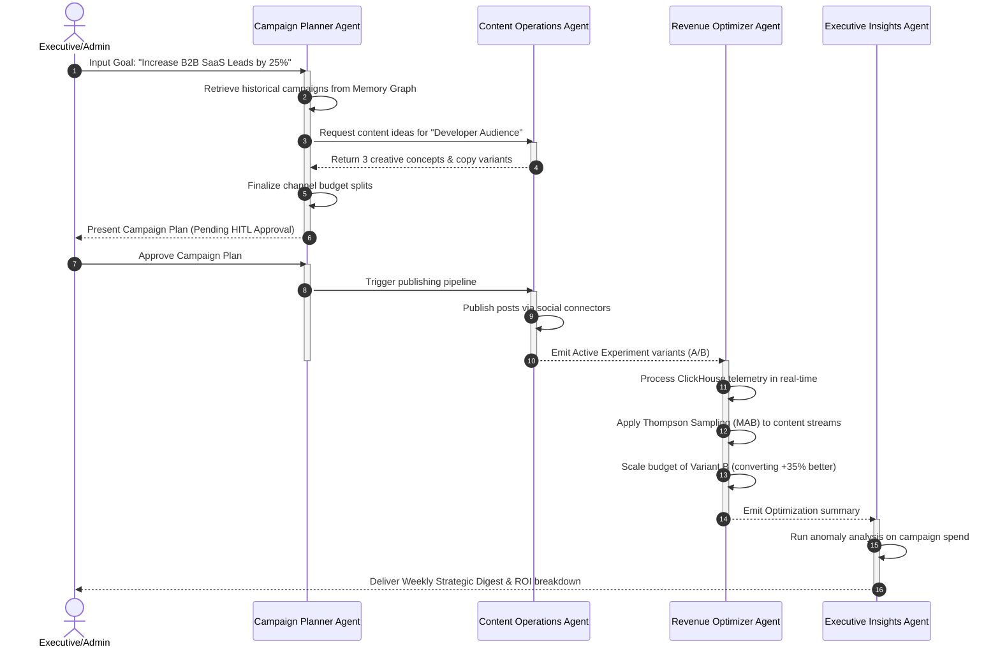

# Feature Specification: Fluxora Growth Operating System (Growth OS)

**Feature Branch**: `005-growth-operating-system`  
**Created**: 2026-06-15  
**Status**: Planning / Design Phase  
**Author**: Principal Product Architect & AI Systems Strategist

---

## 1. Executive Summary

This specification defines the architectural blueprint to transition Fluxora from a social publishing and marketing platform into an autonomous, AI-powered **Growth Operating System (Growth OS)**. 

The core objective is to build a self-reinforcing enterprise system where AI agents plan, execute, analyze, and optimize business growth metrics under human supervision. Instead of using static dashboards and manual execution workflows, the Growth OS establishes a closed-loop system powered by:
- A **Unified Customer Data Platform (CDP)** that stitches user behavior across channels.
- An **Autonomous Multi-Agent Orchestration Framework** that executes growth campaigns.
- A **Predictive Revenue Intelligence Engine** that connects marketing spend directly to financial outcomes.
- An **Organizational Memory Layer** that ensures the platform learns from every campaign, experiment, and revenue outcome.

---

## 2. Strategic Opportunity Analysis

### Capability Evaluation

| Capability | Revenue Impact | Competitive Differentiation | Data Moat Potential | Enterprise Value | AI Defensibility | Network Effects | Time-to-Value |
| :--- | :--- | :--- | :--- | :--- | :--- | :--- | :--- |
| **Customer Data Platform (CDP)** | High | Medium (High with Graph) | Very High | Critical | Medium | Low | Medium (3-6m) |
| **Autonomous Marketing Agents** | Very High | High | High | High | High | Low | Short (1-3m) |
| **Predictive Revenue Intelligence** | High | High | Medium | High | Medium | Low | Medium (3-6m) |
| **Enterprise AI Command Center** | Medium | High | Low | High | Medium | Low | Short (1-2m) |
| **Growth Experimentation Platform**| High | High | High | High | High | Medium | Medium (3-6m) |
| **Community Operating System** | Medium | Medium | Medium | Medium | Low | High | Long (6-12m) |
| **Marketplace Ecosystem** | High | Very High | Medium | High | Low | Extreme | Long (12-24m) |
| **Organizational Intelligence** | High | High | Extreme | High | High | Low | Medium (3-6m) |

### Shared Platform Primitives
1. **Identity Resolution Engine**: Stitching behavioral logs, CRM contacts, cookie identifiers, and social handles into a single profile.
2. **Universal Event Ingestion API**: A high-throughput telemetry endpoint streaming to Apache Kafka and persisting in ClickHouse.
3. **Growth Knowledge Graph Schema**: Neo4j / PostgreSQL pgvector mapping of campaign concepts, copy variants, performance metrics, and budgets.
4. **Temporal-Driven Agent Workflows**: Reusable state machines coordinating agent actions, message passing, and Human-in-the-Loop (HITL) approval states.

### Build vs. Buy Decisions
- **Build**: Identity Graph resolution logic, inter-agent orchestration state, multi-armed bandit simulation controllers, and the marketing memory graph.
- **Buy / Adopt**: Apache Kafka (message streaming), ClickHouse (analytics database), pgvector (vector embeddings), Temporal.io (stateful workflow orchestration), and foundation LLMs (Gemini, Anthropic, OpenAI) accessed via unified API clients.

---

## 3. Foundational Platform Architecture

The Growth OS rests on four technical primitives that ingest data, resolve identity, store learnings, and coordinate agents.



### A. Unified Customer Identity Graph
A graph schema stored in PostgreSQL (optionally using `pg_vector` or graph extensions like `Apache AGE`) to represent identifiers as nodes and linkages as edges.

- **Nodes**: Represent identifiers (e.g., `EMAIL`, `COOKIE_ID`, `SOCIAL_HANDLE`, `PHONE`, `CRM_ID`).
- **Edges**: Represent linkages established deterministically (e.g., login event) or probabilistically (e.g., matching IP and browser footprint within a time window).
- **Attribution Reconciliation**: When a user goes from anonymous to known, the edge creation triggers a retroactive update of telemetry events in ClickHouse to attach the resolved `profile_id`.

### B. Universal Event & Attribution Pipeline
Telemetry data is collected at scale and processed through Kafka into ClickHouse.

1. **Ingestion API**: An endpoint `/api/v1/telemetry/event` that accepts events matching a strict JSON schema.
2. **Attribution Engine**: ClickHouse performs SQL-based multi-touch attribution calculations:
   - **First-Touch / Last-Touch**: Resolved via `argMin(utm_source, timestamp)` or `argMax(utm_source, timestamp)`.
   - **Linear / Position-Based**: Window functions dividing attribution weights across touchpoints within a 30-day conversion window.
   - **Data-Driven (Shapley Value)**: Calculated via nightly background jobs that evaluate conversion path combinations.

### C. Knowledge Graph & Organizational Memory Layer
Retains structured and unstructured memories of platform activity.

- **Unstructured Memory (Embeddings)**: Post copy, campaign briefs, creator pitches, and user reviews are vectorized using text-embedding models (e.g., `text-embedding-004`) and stored in PostgreSQL with `pgvector` indexing.
- **Structured Memory (Knowledge Graph)**: Entity relations representing what campaigns were executed, the budget allocated, target demographics, and the statistical performance.
- **Query Strategy**: Hybrid search combining Vector Similarity (Cosine distance) and SQL relations to provide agents with contextual campaign templates.

### D. Autonomous Agent Orchestration Framework
An asynchronous multi-agent engine powered by Temporal.io and LangGraph.

- **Communication Architecture**: Agents communicate via an event-driven pub/sub queue over Kafka (`fluxora.agents.commands` and `fluxora.agents.events`).
- **Memory Systems**:
  - *Short-Term (Episodic)*: Stored in Redis as JSON representing the current state of a task run.
  - *Long-Term (Semantic)*: Read from the Organizational Memory Layer.
- **Approval Workflows**: For critical actions (e.g., budget adjustments exceeding limits, social publishing), agents transition to a `PENDING_HUMAN_APPROVAL` state, emitting a webhook to the Slack adapter / web frontend. The task remains paused in Temporal until an approval token is submitted.

---

## 4. Unified Customer Identity Graph Design

### Data Schema (PostgreSQL)

```sql
-- Represents a stitched user profile
CREATE TABLE resolved_profiles (
    id UUID PRIMARY KEY DEFAULT gen_random_uuid(),
    workspace_id VARCHAR(255) NOT NULL,
    traits JSONB DEFAULT '{}'::jsonb,
    created_at TIMESTAMP WITH TIME ZONE DEFAULT CURRENT_TIMESTAMP,
    updated_at TIMESTAMP WITH TIME ZONE DEFAULT CURRENT_TIMESTAMP
);

-- Nodes in the identity graph representing specific identifier keys
CREATE TABLE identity_nodes (
    id UUID PRIMARY KEY DEFAULT gen_random_uuid(),
    workspace_id VARCHAR(255) NOT NULL,
    identifier_type VARCHAR(50) NOT NULL, -- 'EMAIL', 'COOKIE', 'TWITTER_HANDLE', 'CRM_ID', 'IP'
    identifier_value VARCHAR(512) NOT NULL,
    resolved_profile_id UUID NOT NULL REFERENCES resolved_profiles(id) ON DELETE CASCADE,
    created_at TIMESTAMP WITH TIME ZONE DEFAULT CURRENT_TIMESTAMP,
    UNIQUE(workspace_id, identifier_type, identifier_value)
);

-- Edges tracking linkages and confidence levels
CREATE TABLE identity_edges (
    id UUID PRIMARY KEY DEFAULT gen_random_uuid(),
    workspace_id VARCHAR(255) NOT NULL,
    source_node_id UUID NOT NULL REFERENCES identity_nodes(id) ON DELETE CASCADE,
    target_node_id UUID NOT NULL REFERENCES identity_nodes(id) ON DELETE CASCADE,
    link_type VARCHAR(50) NOT NULL, -- 'DETERMINISTIC_LOGIN', 'PROBABILISTIC_BEHAVIOR'
    confidence_score NUMERIC(3, 2) NOT NULL, -- 0.00 to 1.00
    created_at TIMESTAMP WITH TIME ZONE DEFAULT CURRENT_TIMESTAMP,
    updated_at TIMESTAMP WITH TIME ZONE DEFAULT CURRENT_TIMESTAMP,
    UNIQUE(source_node_id, target_node_id)
);

CREATE INDEX idx_identity_nodes_val ON identity_nodes(workspace_id, identifier_value);
CREATE INDEX idx_resolved_profiles_ws ON resolved_profiles(workspace_id);
```

### Identity Resolution Engine Logic

```typescript
export interface Identifier {
  type: 'EMAIL' | 'COOKIE' | 'TWITTER_HANDLE' | 'CRM_ID' | 'IP';
  value: string;
}

export class IdentityResolutionEngine {
  // Deterministic stitch on incoming identifiers
  async resolveIdentifiers(workspaceId: string, identifiers: Identifier[]): Promise<string> {
    // 1. Fetch existing nodes for these identifiers
    const existingNodes = await this.db.findNodes(workspaceId, identifiers);
    
    // 2. Collect unique resolved_profile_ids associated with these nodes
    const profileIds = [...new Set(existingNodes.map(n => n.resolved_profile_id))];

    if (profileIds.length === 0) {
      // Create a brand new resolved profile
      const newProfileId = await this.db.createProfile(workspaceId);
      for (const ident of identifiers) {
        await this.db.createNode(workspaceId, ident.type, ident.value, newProfileId);
      }
      return newProfileId;
    }

    if (profileIds.length === 1) {
      // Connect any new identifiers to this profile
      const targetProfileId = profileIds[0];
      const existingIdents = new Set(existingNodes.map(n => `${n.type}:${n.value}`));
      for (const ident of identifiers) {
        if (!existingIdents.has(`${ident.type}:${ident.value}`)) {
          await this.db.createNode(workspaceId, ident.type, ident.value, targetProfileId);
        }
      }
      return targetProfileId;
    }

    // Merge conflict: Multiple profiles match these identifiers (e.g., anonymous user logs in)
    const primaryProfileId = profileIds[0];
    const profilesToMerge = profileIds.slice(1);

    await this.db.mergeProfiles(workspaceId, primaryProfileId, profilesToMerge);
    
    // Stitch new nodes and update existing node foreign keys
    for (const ident of identifiers) {
      await this.db.upsertNode(workspaceId, ident.type, ident.value, primaryProfileId);
    }
    
    // Emit Profile Merge Event to Kafka to trigger retroactive event updates in ClickHouse
    await this.kafka.publishMergeEvent(workspaceId, primaryProfileId, profilesToMerge);

    return primaryProfileId;
  }
}
```

---

## 5. Autonomous Agent Ecosystem

The execution loop is powered by five collaborative agents, each containing a specialized prompt profile, tool access schema, and validation constraints.

### Agent Definitions

#### 1. Campaign Planning Agent
- **Responsibilities**: Design quarterly campaign briefs, define target buyer personas, select optimal marketing channels, and recommend budget splits.
- **Inputs**: Growth goals, historic campaign data, industry trends.
- **Outputs**: Campaign Blueprint (JSON).
- **Tools**: `TrendAnalyzer`, `CDPSegmentFinder`, `CompetitorSpy`.
- **Metrics**: Projected ROI vs. Actual ROI, Planning Time Reduction.

#### 2. Content Operations Agent
- **Responsibilities**: Write marketing copy, adapt content styles for LinkedIn/Twitter/Facebook, structure assets, and format templates.
- **Inputs**: Campaign Blueprint, brand voice embeddings.
- **Outputs**: Creative Assets (Post text, image prompts, scheduled drafts).
- **Tools**: `AssetManager`, `CopyWriterLLM`, `ContentScheduler`.
- **Metrics**: Engagement Rate, Content Relevance Score.

#### 3. Audience Growth Agent
- **Responsibilities**: Monitor social channels, engage automatically in high-niche discussions, spot micro-influencers, and draft outreach emails.
- **Inputs**: Real-time social streams, target demographic vectors.
- **Outputs**: Engagement drafts, influencer shortlists, outreach triggers.
- **Tools**: `SocialListeningStream`, `InfluencerScraper`, `OutreachEngine`.
- **Metrics**: Share of Voice (SOV), Organic Audience Growth Rate.

#### 4. Revenue Optimization Agent
- **Responsibilities**: Track conversion loops, manage Multi-Armed Bandit weights, update digital bidding targets, and redirect budget from low to high performing paths.
- **Inputs**: ClickHouse conversion funnels, real-time CPA/LTV trends.
- **Outputs**: Budget adjustments, variant weights.
- **Tools**: `BudgetAdjuster`, `MABWeightController`.
- **Metrics**: Customer Acquisition Cost (CAC), Return on Ad Spend (ROAS).

#### 5. Executive Insights Agent
- **Responsibilities**: Scan execution logs, run anomaly detection, build business reviews, and flag operational risks (e.g. ad spending spikes).
- **Inputs**: ClickHouse analytics, agent event logs, financial ledgers.
- **Outputs**: Slack Alert notifications, PDF Business Performance Reports.
- **Tools**: `AnomalyDetector`, `NLReportGenerator`.
- **Metrics**: Time-to-Detect (TTD) anomalies, Report Utility Rating.

### Campaign Coordination Workflow (Multi-Agent Interaction)



---

## 6. Predictive Revenue Intelligence Architecture

Connecting brand marketing to actual balance sheet changes.

### Core Mathematical Formulations

#### 1. Customer Lifetime Value (LTV) Prediction
We leverage a hybrid BTYD (Buy Till You Die) model combined with a gradient boosted regression on behavioral features. Let $LTV_i(t)$ be the predicted value of customer $i$ over timeframe $t$:

$$LTV_i(t) = \sum_{\tau=1}^{t} E[N_i(\tau)] \times \text{Margin}_i(\tau) \times (1 + d)^{-\tau}$$

Where:
- $E[N_i(\tau)]$ is the expected transactions calculated via Pareto/NBD model.
- $\text{Margin}_i(\tau)$ is the predicted basket margin using historical transactions.
- $d$ is the monthly discount rate.

#### 2. Marketing Mix Modeling (MMM)
To determine true attribution across offline, organic, and paid channels:

$$Y_t = \alpha + \sum_{m=1}^{M} \beta_m \text{Adstock}(X_{t,m}; \theta_m, \lambda_m) + \sum_{c=1}^{C} \gamma_c Z_{t,c} + \epsilon_t$$

Where:
- $Y_t$ is the revenue at time $t$.
- $X_{t,m}$ is the marketing spend on channel $m$.
- $\text{Adstock}$ represents memory effects (decay parameter $\lambda_m$) and saturation (shape parameter $\theta_m$).
- $Z_{t,c}$ represents control variables (seasonality, economic index).

### Scenario Simulation Architecture
Allows the executive or Campaign Agent to run Monte Carlo simulations:
- **Input parameters**: Channel spend changes ($\pm X\%$), conversion rate trends, seasonality shifts.
- **Output distributions**: Probability distribution curves showing predicted revenue, CAC intervals, and target acquisition.
- **Explainability**: Output features SHAP (SHapley Additive exPlanations) values to explain why a scenario predicts specific outcomes (e.g., "Seasonality represents 42% of the drop").

---

## 7. Growth Experimentation Platform Design

### Multi-Armed Bandit (MAB) System
To maximize conversion without wasting traffic on underperforming creatives, we implement **Thompson Sampling** for dynamic distribution.

```
       [Raw Event Stream]
               │
               ▼
   [ClickHouse Conversion logs]
               │
               ▼
   [Read Variant Alpha & Beta params]
               │
               ▼
[Thompson Sampling: Draw probability from Beta Distribution]
               │
               ▼
   [Update dynamic routing weights]
```

#### Algorithm Loop
For each creative variant $j$ in a campaign:
1. Maintain success count $\alpha_j$ (clicks/conversions) and failure count $\beta_j$ (impressions without clicks).
2. For each incoming content impression, draw a sample $\theta_j \sim \text{Beta}(\alpha_j + 1, \beta_j + 1)$.
3. Display the variant $j^*$ with the highest sample value: $j^* = \arg\max_j \theta_j$.
4. Periodically update $\alpha_j, \beta_j$ in ClickHouse and adjust routing configurations.

### Growth Knowledge Repository
Every experiment is indexed in the memory layer with:
- **Context Metadata**: Niche, audience tags, baseline performance.
- **Test Variables**: Dynamic parameters (e.g. CTA placement, tone, color scheme).
- **Statistical Results**: p-values, sample sizes, confidence intervals.
- **Playbook Generator**: An automated agent reads historical experiments and synthesizes a structured Markdown playbook (e.g. *"For B2B Enterprise Developers, direct technical hooks yield 40% higher CTR than benefit-focused copy"*).

---

## 8. Organizational Intelligence Layer

The memory architecture of Fluxora records every event, outcome, and decision to build a compounding intelligence moat.

```
                    [Campaign Actions / Telemetry]
                                 │
                                 ▼
                     [Enrichment Pipelines]
                                 │
                                 ▼
                  [Vector / Graph Storage Layer]
            ┌────────────────────┴────────────────────┐
            ▼                                         ▼
[Vector Store (pgvector)]                 [Graph DB (Postgres/Neo4j)]
- Unstructured Content Copy               - Campaign Node -> Variant Node
- Dynamic Asset Embeddings                - Segment Node -> Audience Edge
- Narrative Decision Logs                 - Outcome Node -> Revenue Edge
```

### Knowledge Accumulation Mechanism
1. **Campaign Execution**: When a campaign finishes, the platform extracts performance telemetry (clicks, revenue, conversion paths).
2. **LLM Synthesis**: The *Executive Insights Agent* creates a summary of the campaign (e.g., "Why it succeeded", "What failed").
3. **Embedding Generation**: The summary text is converted into vector embeddings.
4. **Graph Insertion**: A node is created representing the campaign, with directed edges linking it to the target segment, specific creatives used, and the absolute revenue return.
5. **Retrieval**: When a new planning goal is requested, the system performs a hybrid query. The nearest neighbors in vector space provide creative inspirations, while graph traversal identifies the exact channels that yielded the highest attribution weight for the target segment.

---

## 9. Marketplace Ecosystem Strategy

The marketplace opens the platform to third-party developers, accelerating features while maintaining strict boundaries.

### Marketplace Architectural Divisions
- **Plugin Marketplace**: Integrates external SaaS platforms (e.g., custom CRMs, unique ad networks) into the Event Pipeline.
- **Agent Marketplace**: Third-party specialized agents that can be integrated into the orchestration framework (e.g., a "TikTok Viral Video Producer Agent").
- **Template Marketplace**: Community-created campaign plays, identity graphs rules, and simulation templates.

### Security and Governance
1. **Isolated Execution Sandbox**: Third-party agents run in secure, stateless sandboxes (e.g., AWS Lambda or isolated Node.js VM2 contexts) with zero direct access to the main database.
2. **Fine-Grained Scoped API Tokens**: Marketplace components request OAuth scopes (e.g., `events:read`, `analytics:aggregate`, `campaigns:write`).
3. **Workspace Isolation (RLS)**: PostgreSQL Row Level Security and ClickHouse tenant partitioning are enforced. Third-party agents can only issue queries bounded by the runtime container's `workspaceId` token.
4. **Monetization & Rev-Share**: An API gateway tracks consumption billing (credits per execution). Fluxora retains a 30% platform fee, distributing 70% to the developer.

---

## 10. Enterprise AI Command Center

The executive dashboard features a natural language interface backed by RAG and semantic routing.

```
                  [User Natural Language Query]
                                │
                                ▼
                       [Semantic Router]
            ┌───────────────────┼───────────────────┐
            ▼                   ▼                   ▼
       [RAG Memory]      [NL-to-ClickHouse]    [Scenario Sim]
            │                   │                   │
            ▼                   ▼                   ▼
    [Vector Retrieve]     [Aggregate SQL]      [Run Monte Carlo]
            └───────────────────┬───────────────────┘
                                ▼
                   [Synthesis & Output Panel]
```

### Strategic Risk & Opportunity Engines
- **Anomalous Spend Detection**: Continuously runs isolation forests on ClickHouse telemetry to identify ad account spikes.
- **Trend Ingestion**: Scans social API streams, cross-referencing with workspace content topics to flag missing trend opportunities (e.g. *"Topic X is trending in your niche, but you have no active campaigns"*).

---

## 11. Implementation Roadmap & Milestones

```
Phase 1: Foundational Primitives (Months 0-6)
├─ Deploy Kafka topics & ClickHouse batch consumer
├─ Implement Identity Graph database schema & resolution service
└─ Build vector storage pipelines for campaign memory

Phase 2: Core Autonomous Agents & Systems (Months 6-18)
├─ Deploy Temporal workflows for multi-agent coordination
├─ Launch the Campaign, Content, Growth, and Revenue Agents
└─ Deploy Thompson Sampling MAB engine & Predictive Revenue models

Phase 3: Ecosystem & Interface (Months 18-36)
├─ Launch the Marketplace sandbox and OAuth permission gateway
└─ Deliver the Enterprise AI Command Center (NL-to-SQL + Risk suite)
```

---

## 12. Verification & Testing Framework

### Verification Scenarios

#### Scenario 1: Identity Graph Resolution Test
- **Setup**: Inject two isolated behavioral events: one from Cookie ID `cook-889` (anonymous), one from Email `alice@corp.com` (form submit).
- **Trigger**: Alice logs in, associating `cook-889` with `alice@corp.com`.
- **Expected Outcome**:
  - The Identity Resolution Engine creates a single `resolved_profile_id` linking both nodes.
  - An asynchronous process triggers ClickHouse to retroactively update the profile ID on all historical event rows containing `cook-889` in under 1,500ms.

#### Scenario 2: Agent Budget Escalation Test
- **Setup**: Configure Revenue Optimization Agent with a daily campaign budget limit of $1,000.
- **Trigger**: Simulate a model decision where the agent attempts to increase budget to $2,500 due to a conversion spike.
- **Expected Outcome**:
  - The tool execution layer intercepts the request.
  - The state transitions to `PENDING_HUMAN_APPROVAL`.
  - A webhook notification is dispatched to the channel, and the transaction is blocked until an explicit JWT token signature is received.
