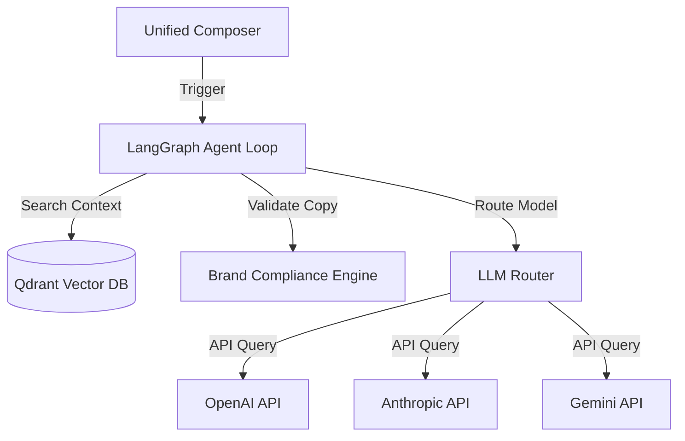

# AI Agent Guide

This page details the AI-agent orchestrations, compliance filters, semantic brand memory, and LangGraph-driven loops implemented in Fluxora.

---

## 🤖 AI Platform Architecture & Principles

Fluxora follows a strict **Adopt & Wrap** model for foundation models, integrated using the LangGraph orchestration framework.

### 3 Core Non-Negotiable AI Rules:
1. **Never Build Foundation Models**: Adopt Gemini, OpenAI, and Anthropic APIs directly.
2. **Stateful Agent Loops**: Use **LangGraph** to coordinate multi-agent routing.
3. **Semantic Memory**: Store all brand voices, copy histories, and profiles in **Qdrant Vector DB**.

---

## 🔍 Brand Compliance Validation Engine

The `BrandComplianceService` (`apps/backend/src/ai/brand-compliance.service.ts`) executes validations on post copies before scheduling. It scans copies against workspace brand rules:

* **Toxicity / Compliance Check**: Prevents posting offensive or non-compliant content.
* **Tone Validation**: Scores post copy alignment with workspace guidelines.
* **Vocabulary Alignment**: Compares keywords against forbidden vocabulary lists.

If a violation is discovered, the post variant is flagged with detailed feedback.

---

## 👤 Personal Hub & Digital Twin Engine

Fluxora includes a **Personal Hub** module enabling users to create and refine an AI "Digital Twin" that automates copywriting in their specific voice.

### 1. Ingestion Engine
The `IngestionService` consumes past writing samples, articles, and posts, converting them into chunked embeddings saved in Qdrant.

### 2. Knowledge Graph Service
The `KnowledgeGraphService` manages semantic associations between topics, expertise levels, and industries, formatting a graph representation of the user's professional network.

### 3. Digital Twin Service
The `DigitalTwinService` generates post copy suggestions using dynamic prompts built from tone guidelines, vocab restrictions, and formality levels.
