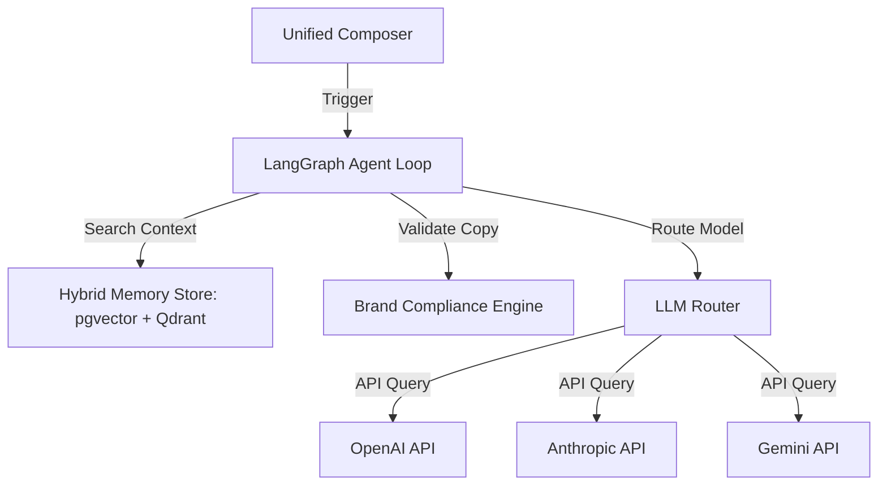
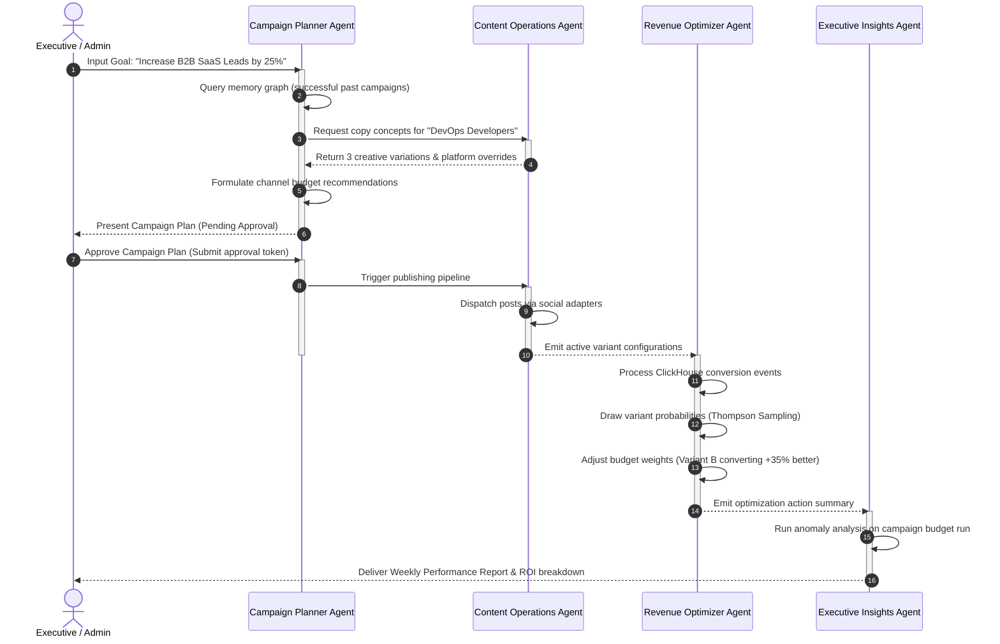

# AI Agent Guide

This page details the AI-agent orchestrations, compliance filters, semantic brand memory, and LangGraph-driven loops implemented in Fluxora.

---

## 🤖 AI Platform Architecture & Principles

Fluxora follows a strict **Adopt & Wrap** model for foundation models, integrated using the LangGraph orchestration framework.

### 3 Core Non-Negotiable AI Rules:
1. **Never Build Foundation Models**: Adopt Gemini, OpenAI, and Anthropic APIs directly.
2. **Stateful Agent Loops**: Use **LangGraph** to coordinate multi-agent routing.
3. **Semantic Memory**: Store all brand voices, copy histories, and profiles in **PostgreSQL (pgvector)** with a **Qdrant Vector DB** remote fallback.

---

## 👥 Autonomous Agent Ecosystem (Growth OS)

The core execution loop of Fluxora's Growth OS is driven by five collaborative, specialized AI agents:

### 1. Campaign Planning Agent
* **Responsibilities**: Designs quarterly campaign briefs, outlines target buyer personas, selects marketing channels, and recommends optimal budget splits.
* **Inputs**: Business growth goals, historic campaign performance data, target audience attributes.
* **Outputs**: Campaign Blueprint (JSON).
* **Tools**: `TrendAnalyzer`, `CDPSegmentFinder`, `CompetitorSpy`.
* **Primary Metrics**: Projected ROI vs. Actual ROI.

### 2. Content Operations Agent
* **Responsibilities**: Crafts personalized marketing copy, adapts content styles for different platforms (LinkedIn, Facebook, X), formats media item metadata, and schedules drafts.
* **Inputs**: Approved Campaign Blueprint, brand voice embeddings, target platform constraints.
* **Outputs**: Platform-specific Post Variants and scheduled publishing actions.
* **Tools**: `AssetManager`, `CopyWriterLLM`, `ContentScheduler`.
* **Primary Metrics**: Engagement Rate, Brand Consistency Score.

### 3. Audience Growth Agent
* **Responsibilities**: Monitors social feeds for niche keyword discussions, drafts automatic engagement responses, identifies micro-influencers, and creates outreach templates.
* **Inputs**: Live social streams, target demographic vector profiles.
* **Outputs**: Engagement drafts, outreach queues, influencer shortlists.
* **Tools**: `SocialListeningStream`, `InfluencerScraper`, `OutreachEngine`.
* **Primary Metrics**: Share of Voice (SOV), Organic Audience Growth.

### 4. Revenue Optimization Agent
* **Responsibilities**: Tracks customer conversion loops, manages Multi-Armed Bandit (MAB) variants, redirects ad spend dynamically to top-converting variants, and adjusts bids.
* **Inputs**: Real-time ClickHouse conversion telemetry, CPA/LTV metrics.
* **Outputs**: Budgets adjustments, variant weight routing updates.
* **Tools**: `BudgetAdjuster`, `MABWeightController`.
* **Primary Metrics**: Return on Ad Spend (ROAS), Customer Acquisition Cost (CAC).

### 5. Executive Insights Agent
* **Responsibilities**: Performs anomaly detection on ad spend, compiles weekly and quarterly business reviews, and flags budget or delivery risks.
* **Inputs**: ClickHouse analytics telemetry, agent event logs, financial variables.
* **Outputs**: Real-time Slack notifications, executive digest reports.
* **Tools**: `AnomalyDetector`, `NLReportGenerator`.
* **Primary Metrics**: Time-to-Detect (TTD) anomalies, Report Utility.

---

## 🔄 Campaign Coordination & Sequence Flow

The following sequence highlights how these agents interact under human supervision, executing a campaign loop:

### 🔒 Human-in-the-Loop (HITL) Guardrails
For critical actions—such as budget adjustments exceeding limits, publishing live posts, or altering database configurations—agents transition into a `PENDING_HUMAN_APPROVAL` state. The task execution pauses in Temporal until a signed JSON Web Token (JWT) approval token is submitted from the admin dashboard or via slack automation.

---

## 🧠 Organizational Memory & Knowledge Graph

Fluxora integrates unstructured and structured memories into a single multi-tenant lookup system:

1. **Unstructured Memory (Embeddings)**: 
   Saves campaign summaries, creative drafts, and brand guides. Texts are vectorized using Gemini `text-embedding-004` (or OpenAI `text-embedding-3-small`) and stored directly in PostgreSQL using **pgvector** columns, with a fallback lookup to **Qdrant**.
2. **Structured Memory (Knowledge Graph)**:
   Maintains entity relationships representing campaigns, variants, audiences, and performance results. For example:
   $$\text{CampaignNode(Q1 Launch)} \xrightarrow{\text{TARGETS}} \text{AudienceNode(DevOps)}$$
   $$\text{CampaignNode(Q1 Launch)} \xrightarrow{\text{GENERATED}} \text{RevenueNode(\$12.5k)}$$
3. **Hybrid Search Strategy**:
   Combines semantic cosine similarity queries (retrieving text concepts) and graph traversal (retrieving related conversions and targeting parameters) to assemble rich context inputs for agent prompt templates.

---

## 📊 Thompson Sampling (Multi-Armed Bandit) Loop

To optimize content distribution, the **Revenue Optimization Agent** runs a Thompson Sampling loop for creative variant A/B tests.

For each variant $j$ in a campaign:
1. Maintain success count $\alpha_j$ (conversions) and failure count $\beta_j$ (impressions without conversion) in ClickHouse.
2. For each incoming content impression, draw a sample probability $\theta_j$ from a Beta distribution:
   $$\theta_j \sim \text{Beta}(\alpha_j + 1, \beta_j + 1)$$
3. Route the user to the variant with the maximum sample value:
   $$j^* = \arg\max_j \theta_j$$
4. Periodically update $\alpha_j, \beta_j$ and scale the traffic routing weights.

---

## 📈 Predictive Revenue Intelligence Core Formulations

Fluxora connects social media engagement metrics directly to corporate financial outcomes using two advanced mathematical systems:

### 1. Customer Lifetime Value (LTV) Prediction
We leverage a hybrid Buy-Till-You-Die (BTYD) model combined with a regression model on workspace behavioral variables. The predicted value $LTV_i(t)$ of customer $i$ over timeframe $t$ is formulated as:

$$LTV_i(t) = \sum_{\tau=1}^{t} E[N_i(\tau)] \times \text{Margin}_i(\tau) \times (1 + d)^{-\tau}$$

Where:
* $E[N_i(\tau)]$ is the expected transactions calculated via a Pareto/NBD model.
* $\text{Margin}_i(\tau)$ is the predicted basket margin using historical transactions.
* $d$ is the monthly discount rate.

### 2. Marketing Mix Modeling (MMM)
To determine true attribution across organic, paid, and social channels:

$$Y_t = \alpha + \sum_{m=1}^{M} \beta_m \text{Adstock}(X_{t,m}; \theta_m, \lambda_m) + \sum_{c=1}^{C} \gamma_c Z_{t,c} + \epsilon_t$$

Where:
* $Y_t$ is the revenue at time $t$.
* $X_{t,m}$ is the marketing spend on channel $m$.
* $\text{Adstock}$ represents memory effects (decay parameter $\lambda_m$) and saturation (shape parameter $\theta_m$).
* $Z_{t,c}$ represents control variables (seasonality, economic index).

---

## 🔍 Brand Compliance Validation Engine

The `BrandComplianceService` executes validations on post copies before scheduling. It scans copies against workspace brand rules:

* **Toxicity / Compliance Check**: Prevents posting offensive or non-compliant content.
* **Tone Validation**: Scores post copy alignment with workspace guidelines.
* **Vocabulary Alignment**: Compares keywords against forbidden vocabulary lists.

If a violation is discovered, the post variant is flagged with detailed feedback.

---

## 👤 Personal Hub & Digital Twin Engine

Fluxora includes a **Personal Hub** module enabling users to create and refine an AI "Digital Twin" that automates copywriting in their specific voice.

### 1. Ingestion Engine
The `IngestionService` consumes past writing samples, articles, and posts, converting them into chunked embeddings saved in pgvector/Qdrant.

### 2. Knowledge Graph Service
The `KnowledgeGraphService` manages semantic associations between topics, expertise levels, and industries, formatting a graph representation of the user's professional network.

### 3. Digital Twin Service
The `DigitalTwinService` generates post copy suggestions using dynamic prompts built from tone guidelines, vocab restrictions, and formality levels.
