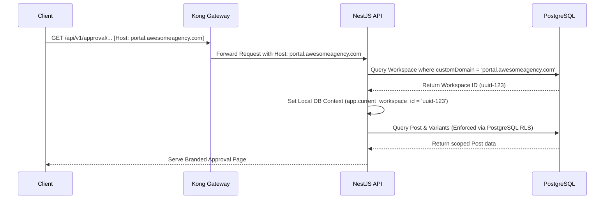

# Administrator Guide

This guide details tenant administration, workspace modes, and white-labeled custom domain configurations.

---

## 🏢 Workspace Provisioning & Licensing Modes

Fluxora supports workspace categorization via the `mode` field on the `Workspace` entity. These modes restrict tenant limits and custom domains:

| Workspace Mode | Target Segment | Tenant / Account Limits | Custom Domains Allowed |
| :--- | :--- | :--- | :--- |
| **INDIVIDUAL** | Solo Creators | 1 Workspace / 3 Accounts | No |
| **TEAM** | Small Marketing Teams | 3 Workspaces / 10 Accounts | No |
| **AGENCY** | Boutique Agencies | 25 Workspaces / 100 Accounts | Yes (White-labeled routing) |
| **ENTERPRISE** | Mid-Market Enterprises | Unlimited Workspaces & Accounts | Yes (Dynamic SSL termination) |

---

## 🌐 Custom Domains Mapping & Reverse Proxy Routing

For digital agencies, white-labeling is a core requirement. Admins can configure custom domains (e.g. `portal.awesomeagency.com`) for a client workspace.

### Resolution Interceptor
The `TenantInterceptor` (`apps/backend/src/tenant/tenant.interceptor.ts`) intercepts incoming requests and extracts the `Host` header:
1. Strips host ports (e.g. `portal.awesomeagency.com:3000` -> `portal.awesomeagency.com`).
2. Checks if the hostname is a platform-reserved host (e.g., `localhost` or `api.fluxora.io`).
3. If not, queries the database for a matching `customDomain`.
4. Binds the resolved `workspaceId` and `tenantId` to the request context to activate PostgreSQL RLS.
