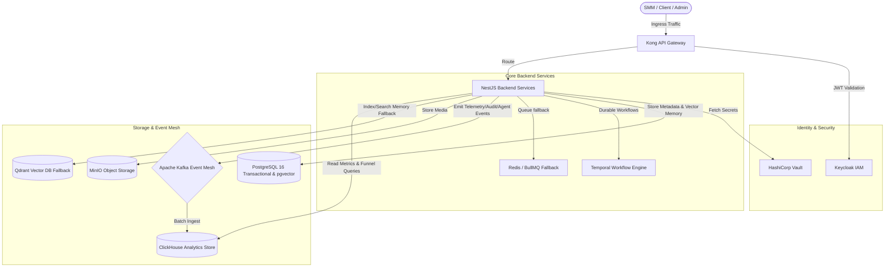

# Architecture Overview

This page provides an in-depth view of the Fluxora architectural system context, core domain boundaries, and the component catalog.

---

## 🗺️ System Context & Core Domains

Fluxora is built on **Hexagonal (Ports & Adapters) Architecture** and is structured around **13 Domain Boundaries** to prevent service-to-service spaghetti.

---

## 📦 Component Catalog

The Fluxora Platform adopts, extends, and wraps industry-standard components before building custom code.

| Component | Category | Scope / Responsibilities |
| :--- | :--- | :--- |
| **Keycloak** | Identity & Access | OIDC Realm, Single Sign-On (SSO), RBAC/ABAC mappings, User synchronization via Webhooks. |
| **Kong Gateway** | API Gateway | DB-less ingress, JWT validation, rate limiting, and tenant resolution mapping from custom host headers. |
| **HashiCorp Vault** | Secrets Management | Secure OAuth access tokens, refresh tokens, and Dynamic DB credentials storage using transit encryption. |
| **Temporal** | Workflow Orchestration | Durable scheduling of posts, approval loop state machines, token refresh orchestration, and media transcoding pipelines. |
| **Apache Kafka** | Event Mesh | High-throughput telemetry event pipeline (`fluxora.telemetry.events`), transaction outbox audit logs (`fluxora.audit.log`). |
| **PostgreSQL 16** | Transactional & Vector Data | Metadata storage for Tenants, Workspaces, Connected Accounts, and local pgvector semantic memory. |
| **Qdrant** | Vector Memory | Multi-tenant semantic memory storage for brand compliance, content history, and AI Agent memory (remote fallback). |
| **ClickHouse** | Analytics Database | High-performance columnar storage for time-series telemetry metrics, aggregations, and attribution funnels. |
| **MinIO** | Object Storage | AWS S3 compatible asset repository for raw and transcoded media files. |
| **OpenTelemetry** | Observability | Unified metrics, distributed traces, and log collection across NestJS services. |

---

## 🛡️ The 13 Domain Boundaries

All code inside the `apps/backend/src` directory is strictly partitioned into one of the following business domains:

1. **Identity Domain**: User accounts, credentials, RBAC/ABAC mappings, SSO, user profiles, personas, and the resolved Identity Graph (`apps/backend/src/identity`).
2. **Tenant Domain**: Tenancy configuration, billing boundaries, workspace assignments, and PostgreSQL RLS binding (`apps/backend/src/tenant`).
3. **Content Domain**: Social posts metadata, channel variants, drafts, and override presets (`apps/backend/src/publishing`).
4. **Asset Domain**: Media files metadata, minio bucket links, and processing configurations (`apps/backend/src/asset`).
5. **Publishing Domain**: Integration adapters executing social platform updates (LinkedIn, Facebook, Twitter/X) (`apps/backend/src/publishing`).
6. **Distribution Domain**: Anti-ban account staggering, IP proxy routing, and rate-limit backoff rules (`apps/backend/src/publishing`).
7. **Workflow Domain**: Temporal workflow implementations for approvals, scheduling, and lifecycle loops (`apps/backend/src/publishing`).
8. **Analytics Domain**: Real-time event consumption, ClickHouse analytical aggregation endpoints, and predictive revenue intelligence models (`apps/backend/src/analytics`).
9. **AI Domain**: LangGraph autonomous agent orchestration loops, organizational memory (documents, nodes, edges), and brand compliance validations (`apps/backend/src/ai`).
10. **Billing Domain**: Stripe subscription integration, billing cycles, and entitlement engines.
11. **Agency Domain**: Custom domains, white-label client portals, and secure approval link tokens (`apps/backend/src/publishing`).
12. **Governance Domain**: Policy checks, outbox pattern interception, and Kafka audit streaming (`apps/backend/src/observability`).
13. **Observability Domain**: OpenTelemetry middleware and Prometheus exporter endpoints (`apps/backend/src/observability`).
