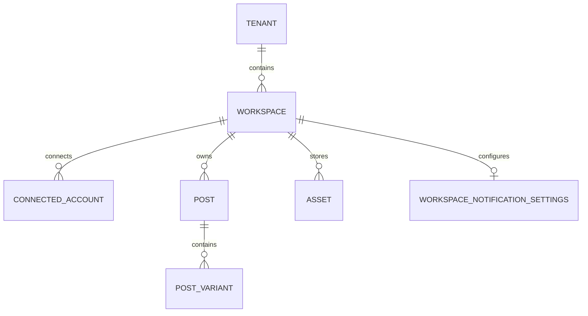

# Data Model Guide

This guide details the schemas and storage engines used by Fluxora, separating transactional metadata (PostgreSQL) from high-throughput analytical events (ClickHouse).

---

## 💾 Transactional Database Schema (PostgreSQL)

Fluxora uses PostgreSQL 16 managed via Prisma ORM. The schema is optimized for multi-workspace partitioning.

### Schema Entity Relationship Diagram



### Core Models Definitions

* **Tenant**: The highest billing and administrative boundary.
* **Workspace**: The isolation boundary representing a client brand. All workspace entities contain a `workspaceId`.
* **ConnectedAccount**: Connected social profiles. Clear-text credentials (access tokens) are stored in **HashiCorp Vault**. The database only stores a Vault path reference (e.g., `vault:secret/data/workspaces/accounts/account-[id]`).
* **Post**: Main publication container. Integrates status transitions (`Draft`, `PendingApproval`, `Scheduled`, `Published`, `Failed`).
* **PostVariant**: Platform overrides. Contains platform-specific text adaptations and asset URL links.
* **WorkspaceNotificationSettings**: Custom notification routing configurations for client approval alerts.

---

## 🔒 Row-Level Security (RLS) Policy Execution

Every query issued against PostgreSQL must enforce tenant/workspace separation using Row-Level Security (RLS). The system utilizes session configuration parameters set at runtime by the database driver.

```sql
-- Step 1: Enable RLS on core tables
ALTER TABLE "Workspace" ENABLE ROW LEVEL SECURITY;
ALTER TABLE "ConnectedAccount" ENABLE ROW LEVEL SECURITY;
ALTER TABLE "Post" ENABLE ROW LEVEL SECURITY;
ALTER TABLE "Asset" ENABLE ROW LEVEL SECURITY;

-- Step 2: Establish Workspace Isolation Policy
CREATE POLICY workspace_isolation_policy ON "Post"
  USING (workspace_id = current_setting('app.current_workspace_id'));

CREATE POLICY account_isolation_policy ON "ConnectedAccount"
  USING (workspace_id = current_setting('app.current_workspace_id'));

-- Step 3: API Gateway context binding
-- The NestJS TenantInterceptor executes the following query before executing transaction queries:
-- SET LOCAL app.current_workspace_id = 'resolved-workspace-uuid';
```

---

## 📊 Analytics Telemetry Schema (ClickHouse)

Telemetry events are ingested via Kafka and persist in ClickHouse to decouple heavy performance dashboards from PostgreSQL.

### Table Schema

```sql
CREATE TABLE IF NOT EXISTS telemetry_events (
    id UUID,
    workspaceId String,
    postId String,
    platform String,
    eventType String,
    timestamp DateTime64(3, 'UTC')
) ENGINE = MergeTree()
ORDER BY (workspaceId, eventType, timestamp);
```

### Fields Inventory

| Field | ClickHouse Type | Description |
| :--- | :--- | :--- |
| `id` | `UUID` | Unique event tracking identifier. |
| `workspaceId` | `String` | Tenancy routing scoping parameter (index key). |
| `postId` | `String` | Mapped Post resource reference. |
| `platform` | `String` | Target network name (`linkedin`, `facebook`, `twitter`). |
| `eventType` | `String` | Action type (`post.publishing`, `post.dispatched`, `click`, `view`). |
| `timestamp` | `DateTime64` | UTC microsecond event epoch. |

### Indexing Rationale

* **Engine**: `MergeTree()` supports high-velocity append-only inserts.
* **Order By**: Sorting by `(workspaceId, eventType, timestamp)` ensures dashboard queries filtering by `workspaceId` and range-matching by `timestamp` read minimal database blocks, achieving sub-500ms dashboard aggregation latency.
