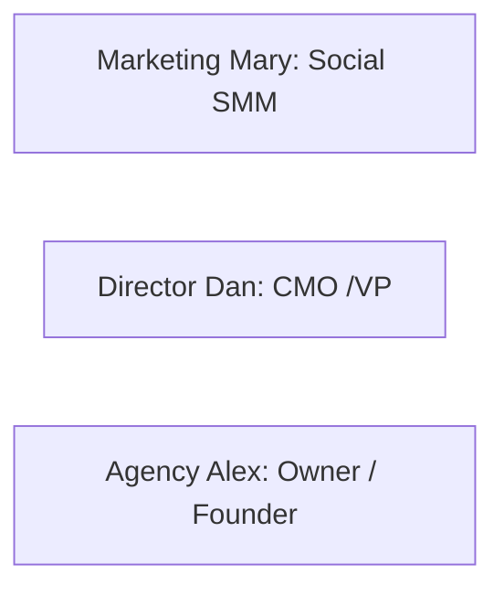

# Product Guide

This guide introduces the core product strategy, target customer personas, and proprietary differentiators that define Fluxora.

---

## 🎯 Product Purpose & Business Objectives

Fluxora is an enterprise-grade multi-tenant social media scheduling, optimization, and distribution platform. The platform is designed to collapse the friction between omnichannel content composition, programmatic scheduling, asset transcoding, and analytics feedback.

### Key Target Business Objectives:
* **Agency Scaling**: Enable boutique agencies to manage dozens of clients (requiring workspace isolation) and hundreds of brand accounts without increasing operations headcount.
* **Omnichannel Automation**: Schedule high-volume, organic distribution loops across LinkedIn, Facebook, X, and TikTok, with built-in bot protection.
* **Zero-Friction Approvals**: Move client reviews out of email and Google Slides into a white-labeled Client Portal.

---

## 👤 Target Personas

Fluxora is designed around the needs of three key personas:

### 1. Marketing Mary (The Social Media Manager)
* **Role**: Daily content creator and scheduler.
* **Pain Points**: Managing passwords, manually resizing images for different platforms, and copying/pasting variants across tabs.
* **Fluxora Value**: Unified composer, platform-specific previews, auto-cropping variants via the Sharp engine, and automated staggering to avoid spam flags.

### 2. Director Dan (The VP of Marketing)
* **Role**: Brand protector and ROI tracker.
* **Pain Points**: Siloed analytics reports, brand policy violations, and sharing corporate social credentials.
* **Fluxora Value**: Sub-second ClickHouse performance dashboards, secure credentials stored in HashiCorp Vault, and automated compliance checking.

### 3. Agency Alex (The Agency Owner)
* **Role**: Scaling operations and client retention.
* **Pain Points**: Workspace leaks (Client A viewing Client B's posts), credentials disconnection, and manual client approval loops.
* **Fluxora Value**: Strong database multi-tenant RLS, white-labeled domains, and tokenized Client Portal links for review approvals.
