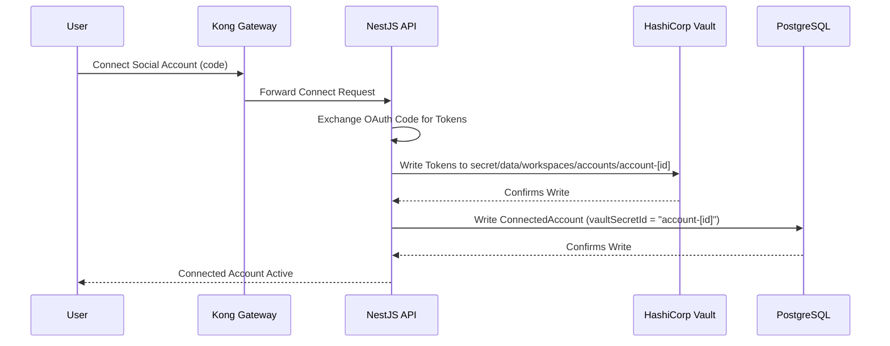

# Security Guide

This page details the security architecture, data isolation, credentials vaulting, and identity workflows in Fluxora.

---

## 🔒 Sacred Tenant Isolation

Fluxora implements multi-tenant isolation at every level of the stack:

1. **API Gateway Scoping**: The Kong API Gateway parses the user's JWT and injects `X-Tenant-ID` and `X-Workspace-ID` headers.
2. **PostgreSQL RLS**: Row-Level Security (RLS) is enabled on all core tables. The `TenantInterceptor` sets the current workspace session parameter (`app.current_workspace_id`) before query execution.
3. **ClickHouse Analytics Scoping**: All telemetry ingestion tables and dashboard queries filter strictly on `workspaceId`.
4. **MinIO Object Isolation**: Asset files are stored in workspace-scoped paths (`/workspaces/[workspace_id]/assets/[file_id]`).

---

## 🗝️ Secrets Vaulting Lifecycle

Sensitive OAuth credentials (access and refresh tokens) are never stored in PostgreSQL as cleartext.

* **Storage**: Secrets are stored in HashiCorp Vault via the Key-Value (KV-v2) secret engine mounted at `secret/`.
* **Access Control**: Backend servers authenticate to Vault using a secure app role token.
* **Fallback Encryption**: If Vault is unreachable in developer sandbox mode, the backend encrypts tokens in PostgreSQL using AES-256-GCM Transit equivalent helper classes.

---

## 👤 Identity & Access Control (Keycloak)

Authentication and authorization are delegated to **Keycloak**:

* **OIDC & SAML SSO**: Supports identity provider federation.
* **RBAC Roles**: Roles are mapped at the workspace level:
  * `WorkspaceAdmin`: Manage users, workspaces, and connected profiles.
  * `WorkspaceCreator`: Draft and schedule post variants.
  * `ClientReviewer`: Access the white-labeled approval portal via secure JWT approval tokens.
* **SCIM Provisioning**: Synced via User-Created webhooks which automatically create corresponding user profile references in PostgreSQL.
