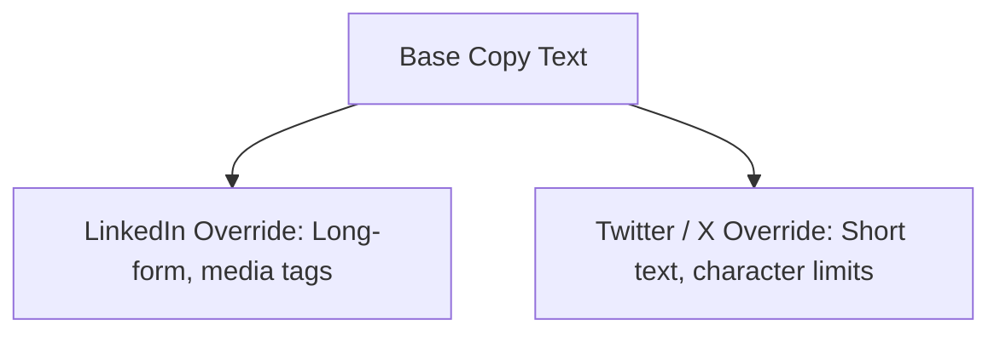

# User Guide

This guide introduces the core publishing, approvals, and metrics workflows for content creators, editors, and client reviewers in Fluxora.

---

## 🔗 Connecting Brand Profiles

To schedule distribution, a Workspace user must connect social accounts:
1. Navigate to the **Connected Accounts** tab.
2. Select a target platform (LinkedIn, Facebook, or X/Twitter).
3. Complete the platform's OAuth redirection consent loop.
4. Once connected, the profile is marked `ACTIVE` and tokens are saved securely in Vault.

---

## ✍️ Omnichannel Content Composition

Fluxora includes a **Unified Composer** supporting variant overrides:

1. **Write Base copy**: Composed copy applies to all selected social networks by default.
2. **Add Overrides**: Customize text overrides and character limits (e.g. 280 characters for X/Twitter).
3. **Upload Media**: Upload images or videos. The asset engine automatically transcodes and crops assets for social guidelines.

---

## 👥 Client Approval Workflow Loop

For digital agencies, all scheduled posts can be routed through client reviews:

1. **Submit for Approval**: In the composer, the creator clicks **Submit for Review**.
2. **Post Transitions**: The post status changes to `PendingApproval`.
3. **Email Notification**: The system generates a cryptographically signed approval token and emails a tokenized link to the client:
   `https://<agency-domain>/approval/<secure-token>`
4. **Client Review**: The client opens the link (white-labeled portal) and reviews the post variants.
5. **Decision**:
   * **Approve**: The post transitions to `Scheduled` status and enters the Temporal schedule queue. SMM is notified via email.
   * **Reject**: The client provides rejection feedback. The post returns to `Draft` status, and the creator receives an email with the comments.
